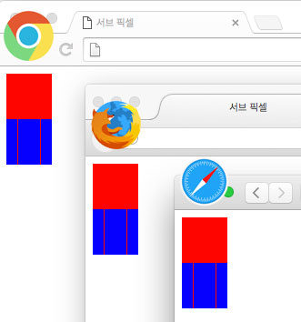

###### Front-End Develop SCHOOL

# DAY 09

### 그리드 시스템 제작

- 가로 폭이 1380px인 12 컬럼 그리드
- 컬럼:거터 비율이 3:1 이상인 시스템 제작

-

### Sub Pixel Problems In CSS

아래와 같이 50px 너비를 가진 div에 4개의 `<div>` 요소에 float을 설정했을 때
흥미로운 결과가 브라우져 별로 다르게 나온다는 것을 발견하고 그것에 대해서 얘기를 하고 있습니다.

```css
float: left;
width: 25%;
```

##### Opera vs Safari vs IE vs Firefox, Windows 2008


##### Chrome vs Firefox, Safari, MacOS 2016



```css
.container {
  width: 50px;
  height: 50px;
  background: red;
}

.demo {
  background: green;
}

.test {
  float: left;
  width: 25%;
  height: 50px;
  background: red;
  font-size: 10px;
  font-family: Arial;
  color: black;
}

.inner {
  float: left;
  width: 12px;
  height: 50px;
  background: blue;
}
```

```html
<div class="container"></div>
<div class="container demo">
    <div class="test"><div class="inner"></div></div>
    <div class="test"><div class="inner"></div></div>
    <div class="test"><div class="inner"></div></div>
    <div class="test"><div class="inner"></div></div>
</div>
```

##### 1. Opera 9, Safari 3
전체 50px에서 48px만 채우는 것을 볼 수 있다. 오른쪽을 보면 2px(초록색으로 표시된부분)이
부족한 걸 알 수 있다.<br>네비게이션 작업 할 때 이렇게 작업할 경우 다 채우지 못하는 걸 알아야 한다.

##### 2. IE 6,7
**IE의 경우는 2px이 넘치는 경우가 발생**하고 위와 같이 레이아웃이 깨지는 것을 볼 수 있다.

##### 3. FF 2, FF 3
FF의 경우는 각 `<div>`가 12px과 13px의 사이의 값을 보여주고 있다.

-

다음의 경우를 모질라 개발자들과 David Baron은 아래와 같이 설명하고 있다.

- 인접한 엘리멘트가(너비가 25%인) 박스의 시작부터 끝까지 정확하게 끝이 나야 하고 확장 또는 넓어지는 px 값은 생기면 안된다.
- 엘리멘트 들은 항상 논리적으로 맞닿아야 하고, 라운딩 에러 때문에 픽셀이 넘치거나 적은 문제가 일어나면 안된다.
- 똑같은 너비를 가진 엘리멘트 들은 똑같은 너비를 가지고 있어야 한다.
- 엘리멘트의 외곽 부분은 불 명확하지 않고 명확한 외곽라인을 가지고 있어야 한다.

특이하게도 위와 같은 내용이라면 정확히 맞아야 하지만 그렇지 못하다.이것은 렌더링 엔진이 CSS지원을
제대로 하지 못하고 있고 이것을 해결하는 방법에 대해 정확히 말할 순 없지만 업무를 할때
이것에 대해 알고 해야 할 것 같다.

-

- [Sub Pixel Problems In CSS](http://ejohn.org/blog/sub-pixel-problems-in-css/)
- [Fluid Grid Rounding Errors](http://johnalbin.github.io/fluid-grid-rounding-errors/)

---

### Isolate Float 테크닉

#### 테크닉 원리

__isolate 테크닉에 요구되는 사항__<br>
※ 테크닉 사용시 혼란이 올 수 있으니, 음수 마진 값 설정에 대한 이해가 요구됨.

- 개별 레이아웃 요소는 `margin-left` 값을 통해 정확한 위치를 설정.
- 개별 레이아웃 요소는 `margin-right: -100%;`를 사용하여 뒤에 오는 요소를 끌어(pull) 당긴다.

-

###### STEP 1

__3 컬럼 레이아웃__을 디자인한다고 가정.


-

###### STEP 2

아이템1에 `margin-left: 0;`을 설정하여 왼쪽 끝 시작 점에 맞춤. 이어서 `margin-right: -100%;` 값을 설정하여 아이템2를 시작점으로 끌어옴.


-

###### STEP 3

아이템2 요소에 `margin-left` 속성 값을 퍼센트(%)로 설정하여 3번째 컬럼의 위치( 컬럼x2 + 거터x2 )로 이동시킴.


이어서 아이템2 요소에 `margin-right: -100%`를 설정하여 아이템3 요소를 끌어 당김.


그러면 아이템3 요소는 시작점으로 이동하게 됨.


-

###### STEP 4

아이템3 요소에 `margin-left` 속성 값을 퍼센트(%)로 설정하여 5번째 컬럼의 위치( 컬럼x4 + 거터x4 )로 이동시킴.


※ 이와 같은 패턴으로 각각의 레이아웃 요소에 정확한 레이아웃을 설정하면 Sub Pixel 문제에서 벗어날 수 있음. 이와 같은 레이아웃 방법을 Isolate 레이아웃이라고 함.

-

###### STEP 5

만약 아이템3 요소를 다음 행(Row)의 시작점에 위치하여 레이아웃을 설정하고자 한다면, 먼저 `clear: left` 속성을 설정하여 Clear 영향권에서 벗어남.


그리고 `margin-left: 0`을 설정하여 시작점으로 이동시킴.


```html
<div class="grid-container show-grid">
  <div class="grid">
    <div class="box box-float">1</div>
    <div class="box box-float">2</div>
    <div class="box box-float">3</div>
    <div class="box box-float">4</div>
  </div>
</div>
<div class="grid-container show-grid">
  <div class="grid">
    <div class="box box-isolate isolate-order-1">A</div>
    <div class="box box-isolate isolate-order-2">B</div>
    <div class="box box-isolate isolate-order-3">C</div>
    <div class="box box-isolate isolate-order-4">D</div>
  </div>
</div>
```
```css
.grid {
  margin-bottom: calc( 27px * 1 );
}
.box {
  float: left;
  width: calc( 12.8% * 0.81 );
  height: calc( 27px *2 );
  text-align: center;
  line-height: calc( 27px * 2 );
  background: #aaa;
  color: #fff
}

/* 본래 사용하는 float 방식 */
.box-float {
  margin-right: calc( 12.8% * 0.19 );
}

.box-isolate {
  /* 핵심 코드 */
  margin-right: -100%;
}

.isolate-order-1 { margin-left: calc( 12.8% * 0 )}
.isolate-order-2 { margin-left: calc( 12.8% * 1 )}
.isolate-order-3 { margin-left: calc( 12.8% * 2 )}
.isolate-order-4 { margin-left: calc( 12.8% * 3 )}
```

#### 장점
 - 오더 값 주기 좋다
 - 서브 픽셀 렌더링 버그 해결

-

### 참고 자료

- [Responsive Design’s Dirty Little Secret](https://www.palantir.net/blog/responsive-design-s-dirty-little-secret)

- [저작권 걱정없는 무료 한글 글꼴 라이센스 총정리](http://blog.naver.com/messinger00/220831856850)
- [코드로 디자인하기 | spoqa.github.io](https://spoqa.github.io/2015/01/16/design-with-code.html)

---

## 오전시간
#### (지난 시간에 이어서) onclick 함수 내용
### <자바 스크립트 이벤트 핸들링>

~~~css
.toggle-button-set{
  position: fixed;
  z-index: 100;
  top: 0;
  left: 0;
  right:0;
  padding: 1rem;
  background: #000;
  color: #fff;
}
.toggle-button-set button{
  border: none;
  cursor: pointer;
  padding: 0.7rem 1.4rem;
  color: inherit;
  background: #787878;
}
~~~

~~~html
<body class="this-is-body container">
<div class="toggle-button-set" role-"group">
<button type="button" class="btn--show-grid">show grid</button>
<button type="button" class="btn--hide-grid">hide grid</button>
</div>
~~~

###### 1. 먼저 문서에서 제어하고자 하는 요소들을 각각 변수(적절한 이름)에 참조한다.  (2개 버튼을 찾아서 이벤트 버튼을 각각 걸어주는 것)
>
~~~js
var container        = document.querySelector('.container');
var show-grid-button = document.querySelector('.btn--show-grid');
var hide-grid-button = document.querySelector('.btn--hide-grid');
>
console.log('container:', container);
console.log('show-grid-button:', show-grid-button);
console.log('hide-grid-button:', hide-grid-button);
~~~

###### 2. 이제 원하는 요소들은 모두 선택 완료! 참조한 문서 객체의 이벤트 속성에 함수(이벤트 핸들러)를 연결한다.
>
~~~js
show-grid-button.onclick = function(){
  console.log('clicked show grid button');
}
hide-grid-button.onclick = function(){
  console.log('clicked hide grid button');
}
~~~

&#42; 이때 대입하는 함수는 이름이 없는 함수 (함수 리터럴, 무명, 익명 함수, 함수 표현식) 등으로 불린다.
<br>이제 이벤트가 연결되면 클릭한 후에 각각의 텍스트가 출력된다.<br>
&#8594; hide_grid_button을 클릭했을 때 'clicked hide grid button' 이라고 출력된다.

###### 3. `.container` 요소에 `show-grid` 클래스 속성을 추가/제거 한다.

속성을 추가하려면 이전 클래스 속성을 메모리 해야 한다.
그 뒤에 새로운 클래스 이름(show_grid)을 추가한다.

~~~js
var pre-assigned-class = container.getAttribute('class');
console.log(pre-assigned-class); //(= container를 의미)
container.setAttribute('class', pre-assigned-class + ' ' + 'show-grid');
~~~

이렇게 하면 body 요소의 클래스 안에 container와 함께 show-grid가 추가된다.
제거하려면 현재 어떤 클래스 값이 적용되었는지를 확인해야 한다.

```js
var pre-assigned-class = container.getAttribute('class');
console.log(pre-assigned-class);
```

아까 추가된 속성(show-grid)을 제거한다.

```js
var removed-class = pre-assigned-class.replace('show-grid',' ');
container.setAttribute('class', removed-class.trim());
```

&#42; .trimRight() 메소드 : 오른쪽에 있는 공백을 제거

##### 위의 코드를 정리하면, #####
---
```js
show-grid-button.onclick = function() {
var pre-assigned-class = container.getAttribute('class');
console.log(pre-assigned-class);
container.setAttribute('class', pre-assigned-class + ' ' + 'show-grid')
};
hide-grid-button.onclick = function() {
var pre-assigned-class = container.getAttribute('class');
var removed-class = pre-assigne-class.replace('show-grid',' ');
  container.setAttribute('class', removed-class.trim());
};
```
---

###<형 변환>###
- Boolean()은 !!로도 쓸 수 있다.
- undefined, null 값 :


1) !!를 붙이면 false가 됨


2) ' ' 안에 넣으면 String 값으로 출력됨


3) null + 숫자 = 숫자, undefined + 숫자 = NaN


4) Number 함수에 null을 넣으면 숫자, undefined를 넣으면 NaN
- NaN = Not A Number
isNaN( ) &#8594; 안에 숫자를 넣으면 값은 false
헷갈리니까 앞에 ! 를 붙여서 역으로 만들면 편함 &#8594;  !isNaN ( )


- 리터럴(literal)이란?
앞서 배운 정보 유형 상수. 즉 우리가 쉽게 바로 쓸 수 있는 '값' 그 자체!

---

##오후시간##
###<퀴즈 풀이>###

- style 속성과 getComputedStyle의 차이점?
style 속성은 html에 직접 입력된 스타일 값을 가져오고,  getComputedStyle은 웹 브라우저가 해석한 스타일 속성을 가져온다. (css 파일에 있는 속성도 포함)


- 가상요소 before와 after는 항상 자식 요소로 생성된다.
(before는 첫번째 자식 요소, after는 마지막 자식 요소)


- trasform-style : 3D에 사용


- translate에 %를 주는 경우, 기준은 자기 자신이다.
반면 margin, padding, top, left 등은 부모 요소가 기준이 된다.


- float 속성의 영향에 미치지 않기 위해 사용되는 모듈 clearfix :
```css
.clearfix { content : ' '; display: block; clear: both; }
```

- 콘텐츠 이미지와 배경 이미지를 사용하는 경우?
콘텐츠 이미지는 자주 바뀌는 요소일 때, 읽혀야 하는 컨텐츠일 때,
배경 이미지는 유동적이지 않고 거의 바뀌지 않는 이미지일 때 사용한다.


- 아웃라인 알고리즘 : 섹션을 감싸는 계층구조가 명확하지 않다면
암묵적으로 계층 구조가 생성된다.

---

>
#[과제]

매주 목요일은 각자 시험문제  10개씩 만들기
 **구글 드라이브 > 내 드라이브 > 오른쪽 마우스 > 더보기 > 구글 설문지**
문제의 범위는 배운 내용 안에서 제한 없이 무작위로!
단, 객관식으로만 10문항 만들기!
보내기 링크로 주소 복사
>

---

### z-index

- z-index는 포지션 값이 있어야만 적용할 수 있음

- z-index는 부모 관계에서 먼저 형성,
  부모 계층에서 값이 커서 위에 올라오게 되면 자식 값이 낮더라도 위에 올라옴
  예를 들어 마크업 순서 상 부모 1이 부모 2 보다 나중에 선언되면
  부모 1이 부모 2보다 아래쪽으로 깔리게 되고,
  그 상황에서는 자식 1이 자식 2보다 z-index값을 높게 가지더라도
  위로 올라오지 않는다. (부모 계층에서 이미 밑에 깔렸기 때문에)

- 자식에게 z-index -1을 주고 부모의 아래쪽에 위치하게 하려면
부모 요소에게 0을 줘야 한다.

---

###<그리드 시스템>

- 웹 개발은 디자인과 밀접한 관계, 그리드 시스템은 디자이너의 도구 중 하나이지만 체계적/효율적이고 유지보수가 쉽기 때문에 훨씬 좋은 결과를 가져올 수 있다.


- 프론트엔드의 주 경쟁력 : 디자인을 동적으로 구현하는 것


- 그리드 시스템 : 베이스라인, 컬럼, 이미지 모듈 등으로 구성됨
  &#42; 거터(Gutter): 컬럼 사이의 간격


- Unit = (Canvas - ((Total Units - 1) x Gutter)) / Total Units
Baseline = font-size + leading


- 고정적인 형태의 레이아웃 구현시에는 그리드가, 유동적인 레이아웃 구현시에는 플렉스가 편함

**&#42; 참고 : 스포카 회사의 기술 블로그 https://spoqa.github.import**

---

### push/pull 모듈

push, pull 모듈은 `position: relative`를 가져야 한다.
그리고 옆으로 밀기를 원하는 값 만큼 `push-N` 클래스를 주면 됨

>
```css
[class*="push"],
[class*="pull"]{ position: relative; }
.push-1{ left: 120px; }
.push-2{ left: 240px; }
.push-3{ left: 360px; }
```
**&#8594; 위의 방법으로 옆으로 밀면
push나 pull을 줬을 때 원래 그 자리에 있었던 요소가 덮여서 안보이는 문제가 발생함.
해결하기 위한 방법은?**

### Prefix, Suffix 모듈

- prefix는 앞에, suffix는 뒤에 공간을 주는 것

```css
.prefix-1 { margin-left: 120px;  }
.suffix-1 { margin-right: 120px; }
```
>

이렇게 주고 요소에 클래스 값을 주면,
옆에 있는 블록들도 함께 옆으로 움직임

---

###<그리드 시스템 제작>

    예시)
    가로 폭이 1380px인 12컬럼 그리드
    컬럼:거터 비율이 3:1 이상인 시스템 제작

######1. 1380/12 값을 구한다
여기서 값이 정수로 떨어지는 컬럼 개수여야 함

######2. 1380/12 에서 거터값을 임의로 잡아서 뺀다.

거터를 양쪽에 주는 방식으로 하면, 앞/뒤 양쪽에 들어가야 하므로
소수점이 나오지 않도록 거터값을 할당한다.

`1380/12 - (14*2) = 87`

&#42; 포토샵 > view > New guide layout 들어가서 값을 입력하면 그리드가 그려짐

##### 위 설계를 코드로 정리하면,

>
페이지 폭 : 1380px
컬럼 개수 : 12
컬럼 폭 : 87px
거터 폭 (14*2) = 28px

######3. 여기까지 디자이너와 협의된 가이드를 정해 놓고, 이제 작업 시작하기!

>
// 컨테이너 모듈 //
```css
.container { width: 1380px; margin-left: auto; margin-right: auto; }
```
>
// 로우 & 클리어 픽스 모듈 //
```css
.row::after, .clearfix::after { content:''; display: block; clear: both; }
```
>
// 컬럼 모듈 //
```css
[class*="col-"] {
  float: left;
  margin-left: 14px;
  margin-right: 14px;
 }
 ```
>
```css
.col-1 { width : 87px; }
.col-2 { width : 202px; }
.col-3 { width : 317px; }
.col-4 { width : 432px; }
```
&#8594; 두번째 컬럼부터 width 값은 **컬럼 넓이 + 그 사이에 있는 거터 값**이 됨
 함수로 만들면

```js
function calcWidth(x){
  return (87 * x) + ((14*2) * (x-1));
}

// x 값에 컬럼 개수를 대입하면 각각의 width 값을 구할 수 있음
calcWidth(2); // 202
calcWidth(3); // 317
```

---

>
#[과제]
>
조별 과제 (aware 페이지)의 wide 버전 제작

---

### < ISOLATE 테크닉 >

- 같은 코드를 서로 다른 브라우저에서 실행했을 때, 경우에 따라 레이아웃이 다르게 나오거나 무너지는 경우가 발생 (동일하게 구현되지 않음)
- 원인은 소수점! 정수로 떨어지게 만들면 이런 문제가 발생하지 않는다.
 (소수점이 나오면 브라우저마다 처리하는 방식이 다름)
- 위의 문제를 완벽히 해결하기 위한 방법이 isolate 테크닉
