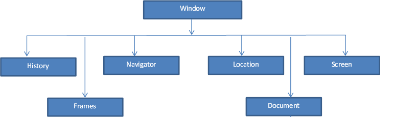

###### Front-End Develop SCHOOL

# DAY 20
## 1. BOM(Browser Object Model) : 브라우저 객체 모델

### 1.1. window : Global Object
'window.'은 안적어도 동작은 가능하나, 속도이슈와 이름충돌 이슈가 있으니 가능한 명시적으로 적어 사용하는 것이 좋다
- 1.1.1. window.__navigator__
> 웹 브라우저의 정보를 가진 객체
> - window.navigator.__platform__
>    - OS 정보 확인
        ```
          // navigator 속성 보기
          console.dir(global.navigator);
          var navigator = global.navigator;
          var platform = navigator.platform;
          var is_mac = platform.toLowerCase().indexOf('mac') > -1;
          var is_win = platform.toLowerCase().indexOf('win') > -1;
          var html = window.document.documentElement;
          html.className = is_mac ? 'mac' : 'win';
        ```
> - window.navigator.__userAgent__
>   + 사용자 에이전트의 식별자를 통해 기기 판별 응용  
>
      ```
        (function(global){
          'use strict';
>
          var navigator = global.navigator;
          var userAgent = navigator.userAgent.toLowerCase();  // 브라우저 식별자(판별)
>
          console.log('userAgent:', userAgent);
>
          function isDevice(device) {
            if(typeof device !== 'string') { throw new Error('전달인자는 문자열 요구됨'); }
            return userAgent.indexOf(device) > -1;
          }
>
          function checkDevices(devices) {
            // 배열 화
            if(typeof decives === 'string') {
              devicees = devices.split(' ');
            }
            if(!(devices instanceof Array)) {
              throw new Error('전달인자는 배열 또는 문자유형이어야 합니다.');
            }
            // 기기의 식별자를 가진 배열을 순환
            for(var i=0, l=devices.length; i<l; i++) {
              var device = devices[i];
              if(isDevice(device)) { console.log(device); }
            }
          }
          // 모듈 공개
          // global.checkDevicees = checkDevices;
>
          // iPhone, Android, iPad 감지
          if(isDevice('iphone')) {
            console.log('iphone');
          }
          if(isDevice('android')) {
            console.log('android');
          }
          if(isDevice('ipad')) {
            console.log('ipad');
          }
        })(this);
      ```

- 1.1.2. window.__screen__
> 사용자의 스크린에 관한 정보를 제공하는 객체  
> console에 'window.screen' 을 찍어보면 관련 속성 정보가 나온다.
> - window.screen.__width__ / window.screen.__height__
>   + 전체 화면의 너비와 높이 값 제공
> - window.screen.__availWidth__ / screen.__availHeight__
>   + 사용자의 가용 가능한 스크린 해상도 (작업표시줄을 제외한.)
> - window.screen.__availTop__
>   + 사용 가능한 기준이 되는 top의 위치
> - window.screen.__avail_left__
>   + 사용 가능한 기준이 되는 left의 위치
> - window.screen.__orientation__
>      - 모바일 등의 화면 회전, 기울기 등을 감지하는 정보 제공
>      - Desktop 등 orientation 미지원 상태에서는 angle값이 '0'으로 고정된다.
> - window.screen.__colorDepth__ / window.screen.__pixelDepth__
>      - 사용자 모니터가 표현 가능한 색상, 픽셀 정보 제공


- 1.1.3. window.__location__
> 웹 브라우저의 주소 창의 정보를 가지고 있는 객체
> - window.location.__hash__
>   + URL에 hash값(#에 명시된 값)
>   + HTML 마크업의 ID와 연결 되므로 내용을 바꿀 수도 있다.
>   + 예시) http://iwantadmin.tistory.com#top
>
      ```
        // location.hash: <a>를 클릭했을 때 hash를 통해 목표 요소를 스타일링하는 응용 예제
        (function(global) {
          'user strict';
>
          var document = global.document;
          var location = global.location;
          var setTimeout = global.setTimeout;
          var bg_color = '#8b73ba';
          var duration = 1000;
>
          // 페이지 로드 시에 주소창의 hash 값을 가져와서 해당 요소를찾아 스타일링.
          var stylingHashElement = function() { //  2
            // console.log('window loaded');
            var hash = location.hash; //  3
            var target_element = null;  //  4
>
            // 임의 정의된 hash 값이 있다면
            if(hash) {  //  5
              target_element = document.querySelector(hash);  //  6
            }
>
            if(target_element) {  //  7
              // 스타일 추가
              target_element.style.background = bg_color; //  8
              target_element.style.transition = 'background 1s';
              // 특정 시간이 지나면 스타일 제거
              // setTimeout(removeStyleTargetElement, duration); //  9
              setTimeout(function() {
                target_element.style.background = 'transparent';
              }, duration);
            }
          };
>
          var removeStyleTargetElement = function(){  //  10
            console.log('try setTimeout');  //  11
          };
          // window 객체의 load 이벤트가 발생하면 styleHashElement 함수 실행.
          global.onload = stylingHashElement; //  1
        })(this);
      ```
> - window.location.__host__
>   + 도메인 명 반환
> - window.location.__href__
>   + URL 반환
> - window.location.__pathname__
>   + URL 경로 반환
> - window.location.__protocol__
>   + 프로토콜 반환
> - window.location.__search__
>   + URL에 붙은 매개변수 반환 (물음표(?) 뒤의 값들)
> - window.location.__reload()__
>   + 현재 페이지 새로고침
> - window.location.__replace()__
>   + 다른 페이지로 대체 변경
>   + 현재 페이지를 덮어 씌우기 때문에 이전 페이지로 이동 불가능

- 1.1.4. window.__history__
> 사용자가 현재 윈도우에서 탐색한 페이지를 기억하는 객체<br>
> - window.history.__length__
>   + 뒤로 갈 수 있는 횟수 (방문기록된 수)
> - window.history.__back()__
>   + 이전 방문한 페이지로 이동
> - window.history.__forward()__
>   + 다음 방문한 페이지로 이동
> - window.history.__go(_number_)
>   + 특정 페이지로 (_number_가 -2이면 2단계 이전 페이지로 이동)

- 1.1.5. window.__document__


## 2. DOM(Document Object Model) : 문서 객체 모델


\-문서(document)
- 노드의 집합

\-노드 트리
- 루트 노드 = html
  + 노드의 시작
- 노드
  + 연결망의 특정 지점

### 2.1. DOM Level 0
> \- 초창기 문서객체 모델  
> \- 자바스크립트를 통해 제작자가 웹 문서의 특정요소(하이퍼링크, 이미지, 폼 필드)에 접근  
> \- 해당 요소의 속성을 교체할 수 있는 API 제공  
> \- name 값을 사용  
> \- 가능한 상호작용은 폼 유효성 검사, 이미지 마우스 오버 효과 버튼 제작이 전부.  
> - anchors[]
> - links[]
> - images[]
> - forms[]
> - elements[]

### 2.2. 중급 문서 객체 모델(Intermediate DOM)
> \- 불완전한 CSS  
> \- 브라우저 호환성 서로 호환되지 않게 고안

### 2.3. DOM Level 1
> \- W3C와 넷스케이프, 마이크로소프트와 함께 DOM 표준화 재정
> - 참고 사이트 : <https://www.w3.org/TR/REC-DOM-Level-1/cover.html>

### 2.4. DOM Level 2
> \- 현재 사용되는 진보된 DOM Event Model을 최초로 제시.
> - 참고 사이트 1(xml) : <https://www.w3.org/TR/DOM-Level-2-Core/>
> - 참고 사이트 2(html) : <https://www.w3.org/TR/DOM-Level-2-HTML/html.htm>

### 2.5. DOM Level 3
> \- DOM Level 2 확장판  
> \- 많은 브라우저에서 지원하지 못하나 주요 기능은 대부분 모든 브라우저에서 지원.  
> \- 일부는 현재 DOM 스크립트의 핵심 담당        

### 2.6. W3C 문서 객체 모델
- 2.6.1. 노드 인터페이스(Node Interface)
> - 모든 객체는 생성될 때 노드를 생성한다.
> - 공백도 __node__이다. (text node)
> - 노드.nodeName
>   + 노드의 이름을 반환
>   + 텍스트 노드의 경우 #text를 반환
> - 노드.nodeType
>   + 노드의 유형을 정수로 반환
> - type
>   + __1 : 요소노드__(document.ELEMENT_NODE)
>    + 2 : 속성노드(document.ATTRIBUTE_NODE)
>    + __3 : 텍스트 노드__(document.TEXT_NODE)
>    + 8 : 주석 노드(document.COMMENT_NODE)
> - 노드.nodeValue
>   + 노드의 값을 반환
>   + 요소는 값이 없으므로 null 반환
> - 자식 노드 찾기
>   + 노드.children
>      - 모든 자식 노드
>   + 노드.childNodes
>      - 노드의 직계 자식노드들을 노드리스트(배열)로 반환
>   + 노드.firstChild
>      - 노드의 첫번째 자식노드를 반환
>   + 노드.lastChild
>      - 노드의 마지막 자식노드를 반환
>      - 노드.last[a.legnth - 1]
> - 형제 노드 찾기
>   + 노드.previousSibling
>      - 노드의 이전 위치에 자리한 형제노드를 반환
>   + 노드.nextSibling
>      - 노드의 다음 위치에 자리한 형제노드를 반환
> - 부모 노드 찾기
>   + 노드.parentNode
>      - 노드의 부모노드(요소)를 반환
>      - parentNode가 모두 element이지는 않다. ->  document일 수 있다. 
>
>
 __example :__
>
      ```
        <body>
          <p><strong>hello</strong>how are you doing</p>
        </body>
      ```
>
> \- p : 부모 요소
>
> \- strong(:first-child), how are you doing?(:last-child) : p의 자식요소 
>
> \- hello(:first-child) : strong의 자식노드 
>
> \- p, strong은 element node 
>
> \- hello, how are you doing?은 text node    
>
>
> - __아래는 크로스 브라우징이 안됨(IE 9+)
> - 노드.firstElementChild
>   + 노드의 첫번째 자식 요소노드를 반환
> - 노드.lastElementChild
>   + 노드의 마지막 자식 요소노드를 반환
> - 노드.previousElementSibling
>   + 노드의 이전 위치에 자리한 형제 요소노드를 반환
> - 노드.nextElementSibling
>   + 노드의 다음 위치에 자리한 형제 요소노드를 반환
>
>
 __example :__
>
    ```
      var dom_test_first = document.querySelector('#dom-test-first');
      var dom_test_second = document.querySelector('#dom-test-second');
      var dom_test_last = document.querySelector('#dom-test-last');
      console.log(dom_test_first.firstElementChild);
      console.log(dom_test_first.lastElementChild);
      console.log(dom_test_first.previousElementSibling);
      console.log(dom_test_first.nextElementSibling);
    ```
>


- 2.6.1. 노드 정보
>   + nodeName / tagName / localName
>      + nodeName
>        + 노드의 이름 반환
>        + 대문자로 반환
>        + 표준
>      + tagName
>        + 비표준
>      + localName
>        + 소문자로 반환
>   + id
>      + 값 가져오기 및 설정 가능
>      + html에서만 가능(xml 사용 불가능)
>   + ClassName
>      + 값 가져오기 및 설정 가능
>   + title
>      + 값 가져오기 및 설정 가능
>   + nodeType
>   + nodeValue / data
>   + hasChildNodes()
>      + 자식의 유무를 boolean 값으로 반환
> - xml과 DOM 방식의 차이점 __
>   + input Element는 옛날 방식을 사용해서 가져와야 한다.
>   + 새로 추가(정의)된 속성(ARIA속성, data-속성)은 >  getAttribute를 사용해서 가져와야 한다.
>


*__추천도서 : DOM을 깨우치다.__
