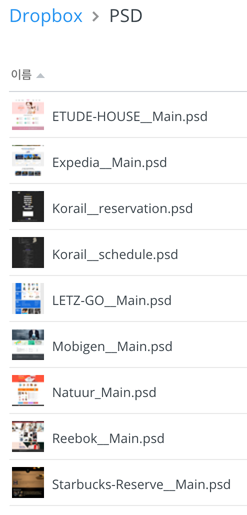

###### Front-End Develop SCHOOL

# DAY 05

-

### Team Activity

**[20분]** 팀 단위로 디자이너가 제작한 [PSD(Photoshop Document) 파일](https://www.dropbox.com/sh/pl3vrst3re24sht/AAD-koAIko_i493P-v9hSF1Ia?dl=0)을 선택 후, 개별 분석하여 HTML 문서 구조화(Markup) 한다.

각 팀은 팀원 모두가 동일한 PSD를 선택하여 문서 구조화하여야 한다. 
만약 선택 문제로 의견이 분분한 경우, 아래 명시된 팀별 PSD를 선택한다.

- [A 팀] ETUDE-HOUSE__Main.psd
- [B 팀] Expedia__Main.psd
- [C 팀] Korail__reservation.psd / Korail__schedule.psd
- [D 팀] LETZ-GO__Main.psd
- [E 팀] Mobigen__Main.psd
- [F 팀] Natuur_Main.psd
- Reebok__Main.psd
- Starbucks-Reserve__Main.psd

-

### Code Review

**[20분]** 각 팀원은 HTML 문서 구조화 한 결과를 코드 리뷰 후, 간결하고 올바른 문서 구조화에 관해 논의한다.

- [문법 검사] HMTL 문법은 유효한가?
- [의미 구조화] HTML 구조는 올바른 의미를 가지는가?
- [코드 최적화] 불 필요한 `
` 또는 `` 요소의 남용은 없었는가?
- [팀원간 소통] 코드는 읽기 쉽고, 간결한가?

-

### Code Refactoring

**[10분]** 논의된 결과를 토대로 팀원은 작성한 HTML 구조 문서 코드를 리팩토링 한다.

> ##### ※ 리팩토링(Refactoring) 이란?
> 소프트웨어 공학에서 **'결과의 변경 없이 코드의 구조를 재조정함'**을 뜻한다. 주로 가독성을 높이고 유지보수를 편하게 한다. 버그를 없애거나 새로운 기능을 추가하는 행위는 아니다. 사용자가 보는 외부 화면은 그대로 두면서 내부 논리나 구조를 바꾸고 개선하는 유지보수 행위이다.

---

### 진행 내용

- HTML 스크립트, 오브젝트
- HTML 기타
- HTML 프레임
- HTML5 표준
- CSS 란?
- CSS 선택자

-

### 기타/참고

<!-- - [pages.github.com](https://pages.github.com/) -->