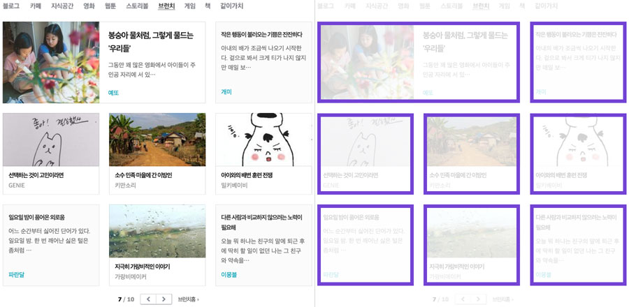
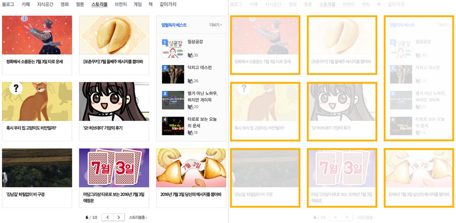

###### Front-End Develop SCHOOL

# DAY 10

### 지난 수업 내용 복습

- [FDS_TEST__2016/07/04](http://goo.gl/forms/I01sMbeZo4Hy4J903)

-

### 진행 내용

- CSS 배경 속성
- CSS 레이아웃 속성
- CSS 리스트 속성
- CSS 테이블 속성

-

### Float

- Float 속성 정리
- Float이 문서 흐름에 미치는 영향
- clear 속성
- Float이 적용된 요소를 감싸는 부모 요소 높이 설정 방법
- Float & Overflow;

-

### Vertical Rhythm

- Headings
- Paragraph
- Lists
- Table


-

### 실습 Part 1.

`float` 속성을 사용하여 아래 레이아웃을 구현해보세요. 레이아웃에 사용된 글은 아래 있으며, 트위터 아이콘에 마우스가 올라가면 상태 디자인이 변경됩니다. 그리고 텍스트 영역에 마우스가 올라가면 배경 색상이 변경되어야 하며, 사진 방향으로 화살표가 그려져야 합니다.


```md
PETER LONGMAN

Lorem ipsum dolor sit amet, consectetur adipiscing elit. Proin quis consectetur nisi, ac placerat odio. Maecenas porta orci a lorem fermentum.

[twitter]

-

JOAN MARTINEZ

Lorem ipsum dolor sit amet, consectetur adipiscing elit. Quisque vitae metus ligula.

[twitter]

-

MICHAEL DOE

Aenean pharetra adipiscing sem non ornare. Duis at dui turpis. Quisque in accumsan.

[twitter]

-

SAUL GOODMAN

Phasellus rutrum est interdum tincidunt commodo. Donec vel dignissim orci.

[twitter]

-

HUGH LAURENCE

Lorem ipsum dolor sit amet, consectetur adipiscing elit. Praesent ac magna mauris.

[twitter]

```

-

### 실습 Part 2.

`float` 속성을 사용하여 설정하는 레이아웃을 매번 잡는 것이 아니라, 재사용할 수 있는 모듈로 만들어 사용하고자 합니다. 이를 class 속성으로 재 사용 가능한 모듈 디자인을 구현해보세요.




-

### 기타/참고

- [A new micro clearfix hack](http://nicolasgallagher.com/micro-clearfix-hack/)
- [Force Element To Self-Clear its Children](https://css-tricks.com/snippets/css/clear-fix/)
- [CSS 레이아웃을 배웁시다](http://ko.learnlayout.com/toc.html)
- [All About Floats](https://css-tricks.com/all-about-floats/)
- [CSS: Clearing Floats with Overflow](http://webdesignerwall.com/tutorials/css-clearing-floats-with-overflow) [#](http://firejune.com/1653/Float+%EC%86%8D%EC%84%B1%EC%9D%98+%EB%86%92%EC%9D%B4+%EB%AC%B8%EC%A0%9C%EB%A5%BC+Overflow%EB%A1%9C+%ED%95%B4%EA%B2%B0%ED%95%98%EB%8A%94+%EB%B0%A9%EB%B2%95)
- [lucy](http://lucy.29cm.co.kr/hello)
- [conference](http://themes-pixeden.com/landing/conference/home3.html#home)


<!-- https://docs.google.com/forms/d/1pYH0IM_1QN1pEXp4_mrk-F1gOCwjE4RgHFLSYCuC79c/viewform?entry.1667344800=%EB%8B%B5%EC%95%88%EC%A7%80&entry.1954690747=vertical-align:+bottom;&entry.1877237233=small-caps&entry.764623325=%ED%85%8D%EC%8A%A4%ED%8A%B8+%EB%8C%80%EC%8B%A0+%EB%B0%B0%EA%B2%BD+%EC%9D%B4%EB%AF%B8%EC%A7%80%EB%A5%BC+%EC%82%AC%EC%9A%A9%ED%95%98%EC%97%AC+%EC%9D%B4%EB%AF%B8%EC%A7%80%EB%A1%9C+%EB%8C%80%EC%B2%B4%ED%95%98%EB%8A%94+%EB%B0%A9%EB%B2%95%EC%9C%BC%EB%A1%9C+%EC%84%B1%EB%8A%A5+%ED%96%A5%EC%83%81%EC%9D%84+%EB%AA%A9%EC%A0%81%EC%9C%BC%EB%A1%9C+%ED%95%98%EB%8A%94+%EC%8A%A4%ED%94%84%EB%9D%BC%EC%9D%B4%ED%8A%B8+%EA%B8%B0%EB%B2%95%EC%9D%84+%EC%82%AC%EC%9A%A9%ED%95%A0+%EB%95%8C+%EB%B9%88%EB%B2%88%ED%95%98%EA%B2%8C+%EC%82%AC%EC%9A%A9%EB%90%A9%EB%8B%88%EB%8B%A4.&entry.1992794266=font:+bold+22px;&entry.1492371134=%EB%8B%B5%EC%9D%B4+%EC%97%86%EB%8B%A4.&entry.452809078=%ED%99%94%EB%A9%B4%EC%97%90%EC%84%9C+%EC%95%88%EB%B3%B4%EC%9D%BC+%EB%BF%90+%EC%95%84%EB%8B%88%EB%9D%BC+%EA%B3%B5%EA%B0%84%EC%A1%B0%EC%B0%A8+%EC%82%AC%EB%9D%BC%EC%A7%90++++VS+++%ED%99%94%EB%A9%B4%EC%97%90%EC%84%9C+%EC%95%88+%EB%B3%B4%EC%9D%B4%EC%A7%80%EB%A7%8C+%EA%B3%B5%EA%B0%84%EC%9D%80+%EB%82%A8%EC%95%84%EC%9E%88%EC%9D%8C&entry.1797276971=none&entry.1838079932=@media+only+screen+and+(max-width:+600px)+%7B+.target+%7B+float:+none;+%7D+%7D&entry.1182003709=.parent+%7B+overflow:+auto;+%7D+%EB%98%90%EB%8A%94+overflow:+auto;&entry.212329359=%EC%9D%B4%EB%AF%B8%EC%A7%80+%EC%9E%90%EC%8B%A0%EC%9D%84+%ED%8F%AC%ED%95%A8%ED%95%98%EB%8A%94+%EB%B6%80%EB%AA%A8+%EC%9A%94%EC%86%8C%EC%9D%98+%EC%98%A4%EB%A5%B8%EC%AA%BD+%EC%B8%A1%EB%A9%B4%EC%97%90+%EB%B6%80%EC%9C%A0%ED%95%98%EC%97%AC+%EC%9D%B4%EB%8F%99%EB%90%A9%EB%8B%88%EB%8B%A4.+%EB%A7%8C%EC%95%BD,+%EB%A8%BC%EC%A0%80+%EC%98%A4%EB%A5%B8%EC%AA%BD+%EB%B0%A9%ED%96%A5%EC%9C%BC%EB%A1%9C+%EB%B6%80%EC%9C%A0%EB%90%9C+%EC%9A%94%EC%86%8C%EA%B0%80+%EC%9E%88%EB%8B%A4%EB%A9%B4+%ED%95%B4%EB%8B%B9+%EC%9A%94%EC%86%8C%EC%9D%98+%EB%92%A4(%ED%99%94%EB%A9%B4+%EB%B0%A9%ED%96%A5%EC%9D%80+%EC%98%A4%EB%A5%B8%EC%AA%BD)%EC%97%90+%EB%82%98%EB%9E%80%ED%9E%88+%EB%B6%99%EA%B2%8C+%EB%90%A9%EB%8B%88%EB%8B%A4. -->