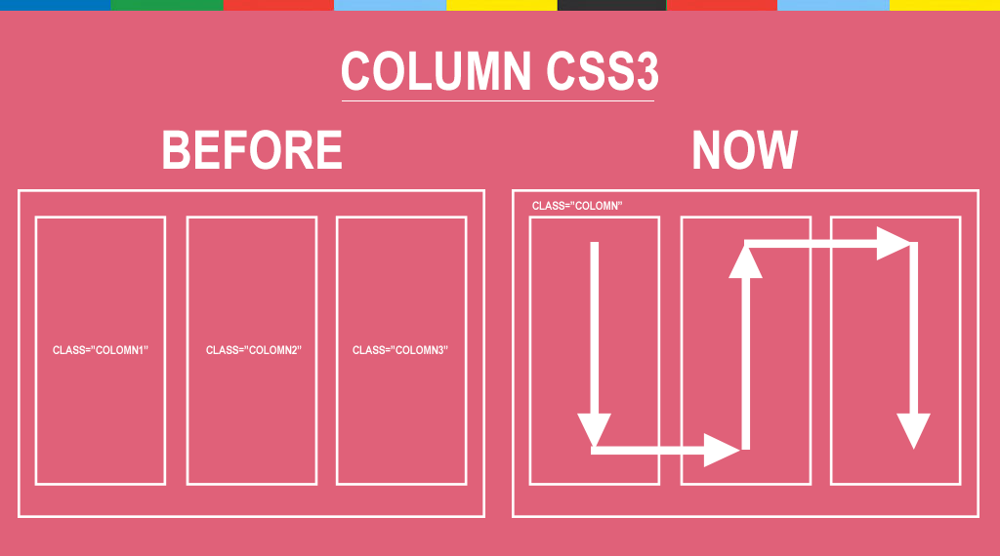

###### Front-End Develop SCHOOL

# DAY 17

### CSS3 Align Justify

텍스트 양쪽 정렬 [`text-align-last`](http://caniuse.com/#search=text-align-last)


```css
.align-last-justify {
  width: 20rem;
  margin-left: auto;
  margin-right: auto;
  font-size: 6rem;
  text-align: justify;
  -moz-text-align-last: justify;
  text-align-last: justify;
  font-weight: 900;
}
```

-

### Fluid Grid

유연한 그리드 시스템 제작 방법.


-

### CSS3 Animation Steps

타임라인 기반의 애니메이션을 보완해주는 `steps()` 기반의 애니메이션 방법.

##### Penguin Sprite Image


##### Adam Sprite Image


##### Street Fighter Ken Sprite Image


-

### CSS3 Multiple column layout

CSS3를 활용한 멀티 컬럼 디자인 방법.



-

### CSS3 Masonry Layout

높이가 불규칙한 블록을 벽돌 쌓듯이 디자인하는 레이아웃 방법.


-

### 보충 내용 리스트

1. 그리드 시스템 만드는 방법 / 사용법
1. 웹 타이포그래피 / 버티컬 리듬
1. 애니메이션 정리
1. 컬럼 그리드 그라데이션 그리는 방법