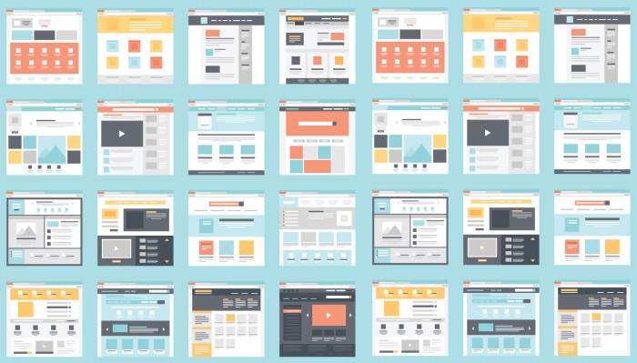

###### Front-End Develop SCHOOL

# DAY 18

### UI Navigation Pattern

GREAT NAVIGATION IS GREAT UX

- [ui-patterns.com](http://ui-patterns.com/patterns/navigation/list)
- [Essential navigation patterns in 2016](http://www.webdesignerdepot.com/2016/01/essential-navigation-patterns-in-2016/)
- [Essential navigation patterns in 2015](http://www.webdesignerdepot.com/2015/01/3-essential-navigation-trends-for-2015/)

-

#### 내비게이션 제작 실습

자주 사용되는 내비게이션 패턴 실습.

##### Depth 1 Horizontal
- [squarespace.com](https://www.squarespace.com/)
- [Samsung WA](https://www.samsungwa.com/)
- [oculus.com](https://www3.oculus.com/en-us/rift/)

##### Depth 1 Sticky
- [70percentpure.be](http://70percentpure.be/)
- [altpress.com](http://www.altpress.com/)
- [longstoryshortdesign.co.uk](http://longstoryshortdesign.co.uk/)

##### Depth 1 Full Screen

- [wiesbadenammeer.de](http://www.wiesbadenammeer.de/)
- [gonzaloperez.ws](http://www.gonzaloperez.ws/)

##### Depth 1 Vertical

- [jackjones.com](http://jackjones.com/?forcecountry=GB&redirected=1)
- [coupang.com](https://www.coupang.com/)

##### Depth 2 & Accessibility / Mega Menus
- [Fast Campus](http://www.fastcampus.co.kr/)
- [Kakao 프라이버시 정책](http://privacy.kakaocorp.com/)
- [The Hyundai](http://www.ehyundai.com/newPortal/DP/DP000000_V.do?branchCd=B00148000)
- [makr.com](https://makr.com/)
- [blog.crazyegg.com](https://blog.crazyegg.com/)

##### Video BG
- [holzweiler.no](https://www.holzweiler.no/)
- [clebee.net](https://www.clebee.net/)
- [bvaccel.com](https://www.bvaccel.com/)

-

### Image Trimming & Slicing

1. Photoshop Action
1. Photoshop Image Assets Generator
1. Photoshop Exports

-

### Sprite Image

1. Sprite Sheet
1. Online Generator Sprite Image

-

### 기타/참고

- [What is UX Design?](http://www.slideshare.net/isbn9760806/what-is-ux-design-15336063)