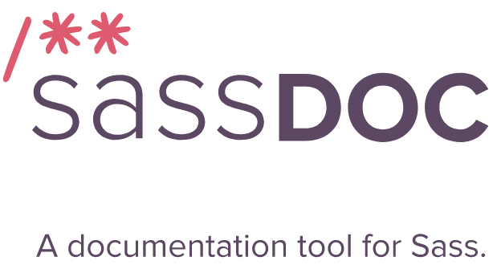

###### Front-End Develop SCHOOL

<br>



[SassDoc](http://sassdoc.com/)은 Sass 라이브러리/프레임워크 사용법(API: 변수, 함수, 믹스인 등)을 문서로 만들어 주는 자동화 도구이다. SassDoc은 특정 구문 주석을 인식하여 데이터를 로드하여 테마에 맞춰 자동으로 HTML 문서를 만들어 준다.

## 설치

NPM을 사용하여 전역(`-g, --global`)에 `sassdoc` 모듈을 설치

```sh
$ npm install sassdoc -g
```

## SassDoc 주석

SassDoc은 [JSDoc](http://usejsdoc.org/)에서 크게 영향을 받았으며, 문서화되어야 하는 각 항목(변수, 함수, 믹스인 등) 앞에 `///` 주석을 이용하여 정보를 제공(e.g `@author`, `@example`, ...) 한다. 다음은 `$size` 믹스인에 SassDoc을 적용한 예이다.

```scss
/// 요소의 크기(width, height)를 한 줄로 설정하도록 도와주는 믹스인
///
/// @group shorthand
/// @author yamoo9
///
/// @param {Length} $width - 요소의 너비
/// @param {Length} $height [$width] - 요소의 높이
/// @output `width`, `height`
///
/// @example scss - `.demo` 요소 크기 설정
///   .demo {
///     @include size(12rem, 4rem);
///   }
/// @example sass - `.demo` 요소 크기 설정
///   .demo
///     +size(12rem, 4rem)

@mixin size($width, $height: $width) {
  width: $width;
  height: $height;
}
```

SassDoc을 시작하는 첫 번째 행은 설명으로 시작한다. (다른 주석보다 먼저 나와야 한다) 다음으로 [SassDoc의 주석(Annotations)](http://sassdoc.com/annotations/)을 참고하여 적절한 것을 추가한다.

주석(Annotation) | 설명(Description) | 별칭(Aliases)
--- | --- | ---
설명 범위 | 설명 범위 | -
설명 | 문서화 된 항목에 대한 설명 | -
[@access](#access) | 접근 여부(공개, 비공개) | -
[@alias](#alias) | 다른 항목의 별명 | -
[@author](#author) | 작성자 | -
[@content](#content) | 믹스인 내용 설명 | -
[@deprecated](#deprecated) | 파기 예정 | -
[@example](#example) | 예시 | -
[@group](#group) | 그룹 설정 | -
[@ignore](#ignore) | 무시 사항 | -
[@link](#link) | 관련 링크 | @source
[@name](#name) | 이름 | -
[@output](#output) | 출력 사항 | -
[@parameter](#parameter) | 믹스인 또는 함수의 매개변수 | @param, @arg, @argument
[@property](#property) | 속성 | @prop
[@require](#require) | 요구 사항 | @requires
[@return](#return) | 함수 반환 값 | @returns
[@see](#see) | 관련 자원 | -
[@since](#since) | 변경 내역 | -
[@throw](#throw) | 예외 사항 | @throws, @exception
[@todo](#todo) | 관련된 작업 | -
[@type](#type) | 변수 유형 | -


## SassDoc 실행

SassDoc 주석을 입력하는 과정이 마무리 되면 SassDoc을 실행하여 문서를 자동 생성한다.

```sh
# 기본 사용법
$ sassdoc {Sass 디렉토리}

# 출력 폴더 지정
$ sassdoc {Sass 디렉토리} --dest {SassDoc 자동 생성 파일 디렉토리}

# 제외하고자 하는 항목이 있을 경우 설정
$ sassdoc stylesheets/ '!stylesheets/vendors/*'
```

## SassDoc 주석 설명

#### 설명

문서화 된 항목을 설명

__예시__

```scss
/// 이 곳에 설명 추가
/// 원한다면 여러 줄로 작성 가능
/// Markdown 문법으로 구문 분석 됨
```

#### @access

문서화 된 항목에 대한 접근 여부(공개, 비공개)를 설정

- placeholders
- variables
- functions
- mixins

__예시__

```scss
/// @access public
/// @access private
```

#### @alias

문서화 된 항목에 대한 접근 여부(공개, 비공개)를 설정

- variables
- functions
- mixins

__예시__

```scss
/// @alias 다른 항목
```

#### @author

문서화 된 항목에 대한 작성자

- placeholders
- variables
- functions
- mixins

__예시__

```scss
/// @author 작성자 이름 (Markdown으로 구문 분석)
```

#### @content

문서화 된 믹스인에 대한 내용 설명

- mixins

__예시__

```scss
/// @content 믹스인 설명
```

#### @deprecated

문서화 된 항목에 대한 파기 여부 설정

- placeholders
- variables
- functions
- mixins

__예시__

```scss
/// @deprecated
/// @deprecated 파기 내용 이유 설명(옵션, Makrdown 구문 분석)
```

#### @example

문서화 된 항목 예시

- placeholders
- variables
- functions
- mixins

__예시__

- 예시는 들여쓰기를 사용해야 올바르게 동작
- 현재 지원되는 언어 : `css`, `scss`, `markup`, `javascript`
- 설명 앞 `-`은 선택 사항
- Markdown으로 구문 분석 됨

```scss
/// @example
///   4 + 2 = 8
///   4 / 2 = 2
///
/// @example scss - 클램프 함수
///   clamp(42, $min: 13, $max: 37)
///   // 37
```

#### @group

문서화 된 항목의 그룹 설정

- placeholders
- variables
- functions
- mixins

__예시__

- 그룹은 SassDoc의 기본 테마에 항목이 표시되는 방식을 정의
- 그룹을 구성하는 별칭 지정 가능

```scss
/// @group helpers
```

#### @ignore

문서화 된 항목과 관련된 사항 중 무시 사항 설정

- placeholders
- variables
- functions
- mixins

__예시__

```scss
/// @ignore Message
```

#### @link

문서화 된 항목과 관련된 링크

- placeholders
- variables
- functions
- mixins

__예시__

```scss
/// @link http://some.url
/// @link http://some.url - 링크 설명 (옵션)
```

#### @name

문서화 된 항목의 사용자 정의 이름

- placeholders
- variables
- functions
- mixins

__예시__

```scss
/// @name message-[error|warning|success|info]
```

#### @output

믹스인이 출력하는 사항에 대한 설명 (Markdown 구문 분석)

- mixins

__예시__

```scss
/// @output 설명
```

#### @parameter

문서화 된 항목의 매개변수를 설명

- functions
- mixins

__예시__

- 여러 유형은 파이프(`|`)로 구분
- Markdown으로 구문 분석

```scss
/// @param {type} $name
/// @param {type | othertype} $name
/// @param {type} $name - 설명(옵션)
/// @param {type} $name [default value] - 설명(옵션)
```

#### @property

문서화 된 항목의 속성 설명

- functions
- mixins

__예시__

- 속성을 매핑하고, 점 표기법을 사용하여 중첩
- Markdown으로 구문 분석

```scss
/// @prop {Type} base.default [default] - 설명(옵션)
```

#### @require

문서화 된 항목에 다른 항목이 필요한지 여부를 정의

- placeholders
- variables
- functions
- mixins

__예시__

- 유형(type)은 옵션
- 기본 유형은 함수(function)
- <link>는 옵션
- Markdown으로 구문 분석

```scss
/// @require item
/// @require {type} item
/// @require {type} item - 설명(옵션)
/// @require {type} item 설명(옵션)
/// @require {type} item <link>
/// @require {type} item 설명(옵션) <link>
```

#### @return

문서화 된 함수의 반환 값 설명

- functions


__예시__

- 여러 유형은 파이프(`|`)로 구분
- Markdown으로 구문 분석

```scss
/// @return {type}
/// @return {type | othertype}
/// @return {type} 설명(옵션)
```

#### @see

문서화 된 항목과 관련이 있는 항목을 설명

- placeholders
- variables
- functions
- mixins


__예시__

- 기본 유형은 함수
- 여러 유형은 파이프(`|`)로 구분
- Markdown으로 구문 분석

```scss
/// @see other-item
/// @see {mixin} other-item
/// @see $other-item
/// @see %other-item
```

#### @since

문서화 된 항목이 구현, 업데이트된 버전을 설명

- placeholders
- variables
- functions
- mixins


__예시__

- Markdown으로 구문 분석

```scss
/// @since 버전(version)
/// @since 버전(version) 설명(옵션)
```

#### @throw

문서화 된 항목에 의해 발생한 오류를 설명

- placeholders
- functions
- mixins


__예시__

- Markdown으로 구문 분석

```scss
/// @throw Error 관련 메시지
```

#### @todo

문서화 된 항목에 대해 수행할 작업을 정의

- placeholders
- variables
- functions
- mixins


__예시__

- Markdown으로 구문 분석

```scss
/// @todo 할 일 정의
```

#### @type

문서화 된 변수의 유형을 설명

- variables


__예시__

- 여러 유형은 파이프 기호(`|`)로 구분
- Markdown으로 구문 분석

```scss
/// @type Bool
/// @type Bool | String
```


