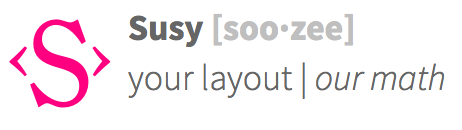

###### Front-End Develop SCHOOL

<br>



### Susy2 그리드 레이아웃 활용

Susy2 그리드 레이아웃 5가지 활용 방법 DEMO

> **고정(Static) 레이아웃**<br>
    데스크탑 디자인만 필요한 경우 활용 방법

> **중첩(Nested) 레이아웃**<br>
    중첩된 복잡한 레이아웃(박스 안의 박스)이 필요한 경우 활용 방법

> **유동(Fluid) 레이아웃**<br>
    Susy2가 지원하는 기본 레이아웃 활용 방법

> **반응형(RWD: Responsive) 레이아웃**<br>
    Susy2가 지원하는 기본 레이아웃 활용 방법

> **적응형(AWD: Adaptive) 레이아웃**<br>
    적응형 레이아웃을 필요로 하는 경우 활용 방법


#### Susy2 기본 믹스인 & 함수

**믹스인**
- [[M]](http://susy.readthedocs.org/en/latest/toolkit/#container) `+container(<layout>)` ＞ 컨테이너 레이아웃 컨텍스트 설정
- [[M]](http://susy.readthedocs.org/en/latest/toolkit/#span-mixin) `+span(<span>)` ＞ HTML 요소 레이아웃 설정
- [[M]](http://susy.readthedocs.org/en/latest/toolkit/#nested-context) `+nested(<span>)` ＞ 개별 레이아웃 컨텍스트 설정

**함수**
- [[F]](http://susy.readthedocs.org/en/latest/toolkit/#span-function) `span(<span>)` ＞ width 값 반환
- [[F]](http://susy.readthedocs.org/en/latest/toolkit/#gutters) `gutter(<span>)` ＞ 거터(Gutter) 값 반환


#### Susy2 글로벌 설정([Global Settings](http://susydocs.oddbird.net/en/latest/settings/#global-defaults))

```scss
/*
 * Susy2 Globa Settings
 * http://susydocs.oddbird.net/en/latest/settings/#global-defaults
 */
$susy: (
  // Flow
  // 문서의 읽는 방향 설정 (ltr, rtl)
  flow: ltr,

  // Math
  // 유동형(Fluid), 고정형(Static) width 설정 (fluid, static)
  // ※ 고정형으로 설정할 경우, column-width 값도 설정해줘야 함
  math: fluid,

  // Output
  // 레이아웃 출력 모드 설정 (float, isolate)
  // ※ 현재 Susy 버전은 Float을 메인으로 출력하지만, 향후 Flexbox 등 다양한 방법 지원 예정
  output: float,

  // Gutter Position
  // 거터의 방향 설정 (after, before, split, inside, inside-static)
  // ※ inside 설정은 Padding으로 처리됨
  gutter-position: after,

  // Container
  // 컨테이너 요소의 최대 폭 값을 설정 (auto, <length>)
  container: auto,

  // Container Position
  // 상위 요소를 기준으로 하는 컨테이너 요소의 레이아웃 정렬 (center, left, right, <length> * 2)
  container-position: center,

  // Columns
  // 컬럼의 총 개수 설정 (4, <number>, <list>)
  columns: 4,

  // Gutters
  // 거터의 폭 설정 (1/4, <gutter-width>/<column-width>)
  gutters: .25,

  // Column Width
  // 컬럼의 폭 설정 (false, null, <length>)
  column-width: false,

  // Global Box Sizing
  // 전역 CSS3 박스 사이즈 설정 (content-box, border-box)
  global-box-sizing: content-box,

  // Last Flow
  // 레이아웃 내의 마지막 요소 float 방향 설정 (to, from)
  last-flow: to,

  // Debug
  // 레이아웃 디버깅 환경 설정
  debug: (
    // 그리드 이미지: (hide, show, show-columns, show-baseline)
    // ※ 그리드 이미지를 보여줌, 만약 Compass vertical rhythms을 사용할 경우,
    // -line-height 설정 값에 따라 베이스라인을 그려줌.
    image: hide,

    // 그리드 컬럼 색상: (rgba(hsl(240, 100%, 70%), .25), <color>)
    color: rgba(hsl(240, 100%, 70%), .25),

    // 그리드 모드: (background, overlay)
    // ※ overlay 설정일 경우, 컨테이너 요소의 ::before 요소를 사용하여 오버레이 함.
    output: background,

    // 그리드 토글 버튼 방향: (top right, <direction>)
    // ※ overlay 설정에서만 사용 가능.
    toggle: top right
  ),

  // Use Custom
  // 사용자 정의 설정
  use-custom: (
    // 사용자 정의 background-image() 믹스인 사용 유무: (true, false)
    // ※ Compass, Bourbon의 믹스인을 사용할 경우, true로 설정
    background-image: true,

    // 사용자 정의 background-size(), -origin(), -clip() 사용 유무 (false, true)
    background-options: false,

    // 사용자 정의 box-sizing() 사용 유무: (true, false)
    // ※ Compass, Bourbon의 믹스인을 사용할 경우, true로 설정
    box-sizing: true,

    // 사용자 정의 clearfix() 사용 유무: (false, true)
    clearfix: false,

    // 사용자 정의 rem() 사용 유무: (true, false)
    rem: true,

    // 사용자 정의 breakpoint() 사용 유무: (true, false)
    breakpoint: true,
  )
);
```


###### Susy2 주요 믹스인/함수

```sass
//
 * --------------------------------
 * Susy2 주요 믹스인/함수
 * --------------------------------

 // 믹스인
 +container( auto | <length> )
 +span( <length> | ... )
 +gutters( <length> | ... )

 // 함수
 container( auto | <length> )
 span( <length> | ... )
 gutter( <length> | ... )
```


#### 그리드 시스템 유형

[대칭(Symmetrical) VS 비대칭(Asymmetrical)](http://susy.readthedocs.org/en/latest/diy/#core-settings)

```scss
// 일정한 컬럼 간격의 그리드 시스템
$symmetrical: (
  columns: 12, // <Number> 컬럼 총 개수
  gutters: 1/4,
);

// 일정하지 않은 컬럼 간격의 그리드 시스템
$asymmetrical: (
  columns: (1 3 4 6 2), // <List> 비대칭 컬럼 설정
  gutters: .5,
);
```

[대칭(Symmetrical) 그리드 확인](http://susy.readthedocs.org/en/latest/diy/#is-symmetrical)

`is-symmetrical()`

```scss
$sym: is-symmetrical(12);
$asym: is-symmetrical(2 4 6 3);

// 출력 결과
$sym: 12;
$asym: null;

// 조건 확인
$result: if(is-symmetrical(asym), true, false);
```

### Susy2 빠른 작성법 `Shorthand`

Susy2 구문이 제공하는 빠른 입력 유형의 작성법.

이름  | 용법 | 예시  |
------------- | -------------  | -------------
$grid | [columns] [gutter] [column-width] | $grid: 12<br />$grid: 12 1/3 <br />$grid: 12 (60px 10px)<br />$grid: (1 2 3 2 1) .25
$span | [span] at [location] of [layout] <br /> [컬럼 넓이] at [위치] of [레이아웃 설정]  | $span: 8<br /> $span:8 of 12<br />$span: 3 at 4 of 12 .25 fluid <br />$span: 30%;
$layout | [grid] [keywords]  | $layout:8<br />$layout:4 (4em 1em) fluid inside-static rtl


### Susy2 설정 요약
이름  | 기능 | 용법 | 예시
-------------|-------------|-------------|-------------|
Container | 컨테이너 설정 | container($layout) | @include container;<br/>width: container(); <br/>
Layout | 새로운 레이아웃 설정 | layout($layout) | @include layout(12 1/4 inside-static);
with-layout | 개별 영역 레이아웃 설정 | with-layout($layout, $clean) { @content } | @include with-layout(8 static) {...};
Span | 컬럼 개수 (width 설정) | span($span) { @content } | @include span(25%); <br /> @include span(3); <br /> @include span(last 3); <br /> @include span(2 wider);
Gutters | 컬럼 사이 간격 | gutter($span) | margin-left: gutter(); <br />margin-left: gutter(10); <br />@include gutters; <br /> @include gutters(3em);
Susy-breakpoint | 반응형 웹 중단점 설정 / 레이아웃 적용 | susy-breakpoint($query, $layout, $no-query) | @include susy-breakpoint(30em, 8) {...};
isolate | 격리된 레이아웃 설정 | isolate($isolate) | margin-left: isolate(2 of 7 .5 after); <br/>@include isolate(25%);
Gallery | 갤러리 레이아웃 설정 | gallery($span, $selector) | @include gallery(3 of 12);

###### Susy2 툴킷(Toolkit)

이름  | 기능 | 용법 | 예시
-------------|-------------|-------------|-------------|
Pre | margin-left:$span | pre($span) |@include pre(25%);
Post| margin-right:$span | post($span)|@include post(25%); <br />@include post(2 of 7);
Pull| margin-left:-$span |pull($span)|@include pull(25%);
Squish| margin-left:$span; <br/>margin-right:$span|squish($pre [, $post])|@include squish(25%); <br/>@include squish(1, 3);
Prefix|padding-left:$span|prefix($span)|@include prefix(25%); <br/>@include prefix(2 of 7);
Suffix|padding-right:$span|suffix($span)|@include suffix(25%); <br/>@include suffix(2 of 7);
Pad|padding-left:$span;<br />padding-right:$span|pad($prefix [, $suffix])|@include pad(25%); <br/>@include pad(1, 3);
Bleed|사방으로 음수 마진, 양수 패딩 설정|bleed($bleed)|@include bleed(1em);<br />@include bleed(1em 2 20px 5% of 8 .25);
Bleed-x|좌우로만 설정|bleed-x($bleed)|@include bleed-x(1em 2em);<br/>
Bleed-y|상하로만 설정|bleed-y($bleed)|@include bleed-y(1em 2em);

```sass

// 클리어(Clear)
// --------------------------------------------------------------------
+break()   // clear: both
+nobreak() // clear: none

// 초기화(Reset)
// --------------------------------------------------------------------
+alpah() | +first() // 흐름(Flow)이 rtl 일 경우 사용 권장: margin-left: 0
+omega() | +last()  // 흐름(Flow)이 ltr 일 경우 사용 권장: margin-right: 0

// 마진 공간(space - margin)
// --------------------------------------------------------------------
+push() // 밀어넣기 (margin-left (+))
+pull() // 잡아당기기 (margin-right (-))

// 패딩 공간(space - padding)
// --------------------------------------------------------------------
+prefix() // 그리드 요소 왼쪽에 패딩 공간 삽입 (padding-left)
+suffix() // 그리드 요소 오른쪽에 패딩 공간 삽입 (padding-left)
+pad()    //그리드 요소 양쪽에 패딩 공간 삽입: prefix() + suffix()

// 양쪽 마진 공간(space - margin both)
// --------------------------------------------------------------------
+pre()    // 그리드 요소 앞에 공간 삽입 (margin-left)
+post()   // 그리드 요소 뒤에 공간 삽입 (margin-right)
+squish() // 그리드 요소 양쪽에 공간 삽입: pre() + post()

// 상하좌우 마진/패딩 공간(space - margin/padding both)
// --------------------------------------------------------------------
+bleed() // 그리드 요소 상/우/하/좌에 마진/패딩 공간 동시 삽입 (margin/padding)

// 아이솔레이트 레이아웃
// --------------------------------------------------------------------
+isolate() // 서브픽셀 라운딩 이슈 해결 레이아웃 구현
+gallery() // 갤러리 스타일 레이아웃을 구현

// 상하좌우 마진/패딩 공간(space - margin/padding both)
// --------------------------------------------------------------------
+show-grid() // 디버깅 그리드를 화면에 그림

```
