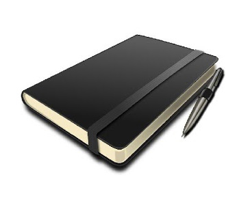

###### 프론트엔드 개발 스쿨 4th × 패스트캠퍼스

## FDS 4th 수강생 학습 요약 정리

[FDS 4기 분들이 매일 공부한 내용을 정리해서 올리는 저장소](https://github.com/owl423/FDS04_Summary)

## 이미지 최적화

- [__이미지__ — jpg, png 압축 온라인 서비스](https://tinypng.com/)
- [__이미지__ — svg 압축 온라인 서비스](https://jakearchibald.github.io/svgomg/)
- [__스프라이트__ — png 이미지 생성 온라인 서비스](http://spritepad.wearekiss.com/)
- [__스프라이트__ — svg, png 아이콘 이미지 생성 온라인 서비스](https://iconizr.com/)

## 이미지 변환

- [SVG → PNG 변환 온라인 서비스](http://svgtopng.com/ko/)
- [PNG → SVG 변환 온라인 서비스](https://convertio.co/kr/png-svg/)

## Sass 라이브러리 & 도큐멘테이션

- [Susy & yamoo9 & SassDoc](./DAY04/sass-lib-doc/README.md)