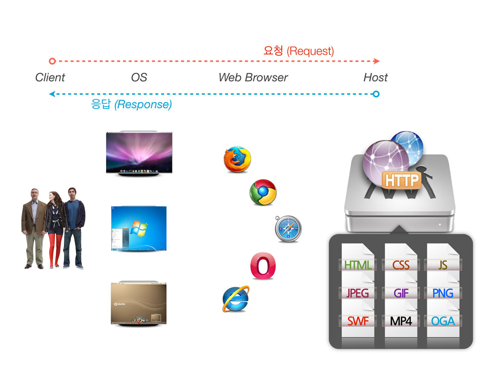

[← Back](README.md)

## 웹 환경

**클라이언트**와 **서버**로 나뉘는 **네트워크 아키텍처**를 나타낸다.

-

#### 서버

특별한 서비스를 제공하는 컴퓨터.

-

#### 클라이언트

서비스를 사용하기 위해 서버에 접속하는 사용자 혹은 사용자의 단말기. (웹 브라우저 같은)

-

#### 서버의 주소

URL(IP와 Port로 구성) 
> ex) 192.168.0.1:80

-

#### 서버의 종류(`port`)

- **웹 서버(`80`)**
- **FTP 서버(`21`)**
- 데이터베이스 서버(`mysql:3306`)
- DNS 서버(`1023`, `53`)
- ssh 서버(`22`)
- 메일 서버(`110`,`25`,`143`)
- etc.

-

#### 서버로 요청과 서버로부터 응답

###### 요청(Request) to Server

- GET - 정보를 가져오는 역활 
  > http://www.service.com/bbs/board.php?bo_table=use&wr_id=818912&page=3

- POST - 정보를 수정/입력하는 역활

###### 응답(Response) from Server

- HTML 파일
- CSS 파일
- JavaScript 파일
- Image 파일
- Media 파일
- etc.

---

## 웹 호스팅

**네트웍에 연결되어 있는 컴퓨터들**을 **호스트**라고 한다.

온라인 서버의 일정 공간을 빌려서 내가 원하는 서비스를 할 수 있게 해주는 것.
개인이 웹 서버를 운영하는것은 사실 비용도 비용이거니와 거의 불가능.
그래서 일정 공간만 빌려서 사용을 하는 것을 웹호스팅이라고 한다.

#### 살펴볼 항목

- 웹 용량
- DB(Database, 데이터베이스) 용량
- 트래픽(Traffic)/일
- PHP 버전
- MySQL 버전
- 1년간 이용료

트래픽이나 하드 용량이 모자랄 경우 서서히 필요한 만큼만 늘려 나가는걸 추천.
물론 처음부터 큰 용량과 트래픽으로 시작해도 상관은 없지만, 처음부터 큰 용량과 트래픽이 필요하지 않다.
서비스를 사용하다 용량이 부족한 경우, 상위 서비스로 변경이 가능. 다만 하위 서비스로의 변경은 불가능.

-

#### 무료 호스팅

- [hostinger.kr](http://www.hostinger.kr/web-hosting)

-

#### 유료 호스팅

- [sansting.com](http://www.sansting.com/) - 내게 맞는 웹호스팅 환경을 이제 쉽게 찾으세요.

-

#### 유/무료 호스팅 비교

- [웹호스팅 무료호스팅 서비스 비교 (국내+외국)](http://nine8007.tistory.com/entry/%EB%AC%B4%EB%A3%8C%ED%98%B8%EC%8A%A4%ED%8C%85-%EC%97%85%EC%B2%B4-%EB%B0%8F-%EC%84%9C%EB%B9%84%EC%8A%A4-%EB%B9%84%EA%B5%90-%EA%B5%AD%EB%82%B4-%EC%99%B8%EA%B5%AD)
- [해외무료호스팅 vs 카페24](http://gganuslab.com/free-hosting-vs-cafe24/)

### 요약

- **해외 호스팅**은 **무료**로 제공되는 서비스가 뛰어나나, **속도가 느리다**.
- hostinger.kr 서비스의 경우, 운영하는 웹사이트가 서버 CPU의 20% 이상을 사용하면 24시간 동안 사이트가 차단됨. (사진,동영상 서비스는 무리)
- 결론! **지속적이고 안정적이고 빠른 서비스를 하고자 맘 먹었다면, 유료 호스팅 서비스를 사용할 것을 권장**.

---

## 도메인

#### IP란?

인터넷에 연결되어 있는 장치(컴퓨터/스마트폰/타블릿/서버 등)는 각각의 장치를 식별할 수 있는 주소를 가지고 있는데 이를 ip라고 한다. 예) `127.120.24.99`, `192.168.0.1`

#### 도메인이란?

[도메인](http://krnic.or.kr/jsp/resources/domainInfo/domainInfo.jsp)은 인터넷에 연결된 컴퓨터를 사람이 쉽게 기억하고 입력할 수 있도록 문자(영문, 한글 등)로 만든 인터넷주소.
법률상으로는 인터넷 주소 자원에 관한 법률 제 2조에 따라 도메인은 인터넷에서 인터넷 프로토콜 주소를 사람이 기억하기 쉽도록 하기 위하여 만들어진 것.

IP는 사람이 이해하고 기억하기 어렵기 때문에 이를 위해서 각 IP에 이름을 부여할 수 있게 했는데, 이것을 도메인이라고 한다.

##### 도메인 구매 참고 자료

- [.kr 도메인 등록비 비교 사이트](http://blog.nullfree.kr/3)
- [.com/.net/.org 도메인 등록비 가격비교 (국내업체편)](http://blog.nullfree.kr/4)
- [등록 대행자 및 수수료 서비스](http://domain.nida.or.kr/jsp/popup/agencyFeePop.jsp)

##### 도메인 구매 시 호스트에 연결

1. 도메인 관리 페이지 접속
1. 호스트 관리 또는 포워딩 관리 페이지 접속
1. 웹 호스팅 업체로부터 IP 주소를 확인

---

## FTP

#### FTP란?

파일 전송 프로토콜(File Transfer Protocol). 
HTTP가 웹을 해석하고 전달하기 위한 프로토콜인 것처럼 FTP는 파일을 주고 받기 위해서 필요한 프로토콜.

FTP 서버(21 포트 사용)에 파일을 올리기 위해서는 서버에 접속할 수 있는 프로그램이 필요한데 이를 FTP 클라이언트라고 한다.

- FTP Server (Port 21)
- FTP Client

-

#### FTP 클라이언트 도구

- [Filezilla](https://filezilla-project.org/)

---

## 웹 환경 개발의 두 갈래

- Front-End 개발
- Back-End 개발

-

### Front-End 개발

사용자 화면단 UI 제작자. 사용자 환경을 고려한 디자인(설계) 전문가로 클라이언트 측면의 프로그래밍을 하고 있다.
HTML, CSS, JavaScript, AJAX를 전문적으로 다루며, 디자이너 혹은 백엔드 개발자와의 협업이 가능한 역량이 요구된다.
그렇기에 그래픽 이미지 편집 능력과 서버 스크립트 언어(JSP, PHP, ASP 등)에 대한 지식도 필요하다.
최근 웹기술 경향은 프론트엔드 개발의 중요성이 대두되고 있다.

- **접근성/사용성** 
WAI, WCAG 2.0, WAI-ARIA 1.0

- **구조(데이터, 모델) 언어** 
HTML

- **스타일(비주얼 디자인) 언어** 
CSS

- **동작(인터랙션) 언어** 
JavaScript, ECMAScript

- **그래픽 리소스** 
  - Images 이미지 파일 [`jpg`, `png`, `gif`, `svg`]
  - Medias 영상/음원 파일 [`mp4`, `mp3`, `ogv`, `oga`]
  - Fonts 웹폰트 파일 [`woff`,`eot`,`svg`]

- **프론트엔드 라이브러리** 
[jQuery](http://jquery.com/), [Dojo](https://dojotoolkit.org/), [YUI](http://yuilibrary.com/) 등등

- **프론트엔드 프레임워크** 
[Bootstrap](http://getbootstrap.com/), [AngularJS](http://angularjs.org/) 등등

  - 웹 UI 개발을 보다 편리하게 만들어 주는 도구.
  - 생산성 향상.
  - 정신 건강에 좋음.
  - 하지만 유행에 민감해, 바뀔 때마다 학습이 시간이 소요됨. (트렌드가 자주 바뀜)

#### Front-End 개발 관련해서 읽어보면 좋을 글

- [프론트엔드 개발자는 왜 구하기 어려운가?](http://ppss.kr/archives/26024)
- [탁월한 프론트엔드 엔지니어가 되는 법](http://hyunseob.github.io/2016/02/21/how-to-become-a-great-frontend-engineer/)
- [frontendhandbook.com](http://www.frontendhandbook.com/)

-

### Back-End 개발

비즈니스 로직 서비스 제작자. 프론트엔드에서 전달된 데이터 포맷이나 데이터베이스 입/출력 및
다양한 비즈니스 프로세스를 프로그래밍 코드로 구현하는 역할을 하고 있는 백엔드(Backend) 개발자는
프론트엔드(frontend)에 대한 이해와 데이터베이스,웹서버,네트워킹등 웹 어플리케이션의
전반적인 인프라에 대한 이해가 필요하다.

- **웹 서버 (Apache, IIS, nginx, GWS, etc.)** 
사용자의 요청에 맞게 데이터(HTML, image, etc.)를 전송해주는 프로그램

- **데이터 베이스 (MySQL, Oracle, MsSQL, PostgreSQL, LightSQL, MongoDB, etc.)** 
사용자의 정보를 저장하는 저장소

- **스크립트 엔진 (PHP, JSP, ASP)** 
웹서버에서 사용자의 요청을 분석해주는 프로그램

- **웹 프레임워크 (Django, Ruby on Rails, ASP.NET, etc.)** 
  - 웹개발을 보다 편리하게 만들어 주는 도구.
  - 생산성 향상.
  - 정신 건강에 좋음.
  - 하지만 유행에 민감해, 바뀔 때마다 학습 시간이 요구됨. (트렌드가 자주 바뀜)

#### Back-End 개발 관련한 정보 영상

- [웹환경의 이해 2 - Back-End 환경편](https://www.youtube.com/watch?v=0acywSaxlXo)

