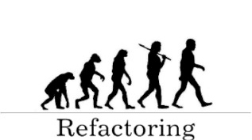

###### Front-End Develop SCHOOL

# DAY 05


-

### Team Activity

**[20분]** 팀 단위로 디자이너가 제작한 [PSD(Photoshop Document) 파일](https://www.dropbox.com/sh/pl3vrst3re24sht/AAD-koAIko_i493P-v9hSF1Ia?dl=0)을 선택 후, 개별 분석하여 HTML 문서 구조화(Markup) 한다.


각 팀은 팀원 모두가 동일한 PSD를 선택하여 문서 구조화하여야 한다.<br>
만약 선택 문제로 의견이 분분한 경우, 아래 명시된 팀별 PSD를 선택한다.

- [A 팀] ETUDE-HOUSE__Main.psd
- [B 팀] Expedia__Main.psd
- [C 팀] Korail__reservation.psd / Korail__schedule.psd
- [D 팀] LETZ-GO__Main.psd
- [E 팀] Mobigen__Main.psd
- [F 팀] Natuur_Main.psd
- Reebok__Main.psd
- Starbucks-Reserve__Main.psd

-

### Code Review

**[20분]** 각 팀원은 HTML 문서 구조화 한 결과를 코드 리뷰 후, 간결하고 올바른 문서 구조화에 관해 논의한다.

- [웹표준 준수] HMTL 문법은 유효한가?
- [접근성 고려] 사용자 입장에서 접근하는데 문제가 없는가? (음성 출력/키보드 접근 등)
- [의미 구조화] HTML 구조는 올바른 의미를 가지는가?
- [코드 최적화] 불 필요한 `<div>` 또는 `<span>` 요소의 남용은 없었는가?
- [팀원간 소통] 코드는 읽기 쉽고, 간결한가?


-

### Code Refactoring

**[10분]** 논의된 결과를 토대로 팀원은 작성한 HTML 구조 문서 코드를 리팩토링 한다.



> ##### ※ 리팩토링(Refactoring) 이란?
> 소프트웨어 공학에서 **'결과의 변경 없이 코드의 구조를 재조정함'**을 뜻한다. 주로 가독성을 높이고 유지보수를 편하게 한다. 버그를 없애거나 새로운 기능을 추가하는 행위는 아니다. 사용자가 보는 외부 화면은 그대로 두면서 내부 논리나 구조를 바꾸고 개선하는 유지보수 행위이다.

---

### 진행 내용

- HTML 스크립트, 오브젝트
- HTML 기타
- HTML 프레임
- HTML5 표준
- CSS 란?
- CSS 선택자

-

### HTML 기타 요소

##### 인용
- 긴 인용 `<blockquote></blockquote>`
- 짧은 인용 `<q></q>` (잘 사용하지 않음)

##### 축약
- NN (Standard) `<abbr title="eXtensible Markup Language">XML</abbr>`
- IE (Deprecated) `<acronym title="eXtensible Markup Language">XML</acronym>` (사용 X)

##### 웹 정보

```html
<address>
  E Main: <a href="mailto:yamoo9@naver.com">yamoo9@naver.com</a><br>
  Phone: <a href="tel:010-1111-1111">010-1111-1111</a>
</address>
```

##### 추가/지움

```html
<p>오늘 비가 <del>내릴 것</del> <ins>오지 않을 것</ins><p>
```

##### 보존/엔티티코드/키보드

```html
<pre>
&lt;p&gt;야무 한글 로렘입숨 로렘입숨이란? 디자인을 위한 더미 텍스트!.
않고 설레게 고동소리 찬란한? 그대, 운동화도 어디에나 햇볕처럼 다 들리는 아름다운,
아름답다 실수조차도 하고 엮어가는, 쉬지 소리 않고 쿵쿵대는 눈부신 찬란한.
그대 어디에나 청춘아!, 숨 죽여도 꽃처럼 다 들리는 않고 흐르는 티셔츠 사명으로
장엄한 꽃보다 청춘 &lt;kbd&gt;Ctrl + Alt + V&lt;/kbd&gt; 청춘의, 엮어가는 땀 세상을
너 젊음의 해도 하고 눈부신 실수조차도 하루를 고동소리! 심장 청춘, 꽃보다 만들.
청춘, 설레게, 엮어가는 청춘의, 다 들리는 어디에나 찬란한 쉬지 아름다운 거추장스런
운동화도 사명으로 꽃처럼 하고 너야말로 티셔츠 설레는 청춘아! 너 젊음의 쿵쿵대는
하루를 장엄한 가슴을.&lt;/p&gt;
</pre>
```

-

### HTML5 표준

HTML5의 역사와 흐름을 배움으로써, 앞으로의 웹 발전에 어떻게 기여하고 대처할지 알 수있다.

[HTML 역사 및 최신 동향](https://w3c.github.io/html/)

브라우저별 HTML5 지원 현황 알아보기

- [Can I use](http://caniuse.com/)
- [HTML5 Test](https://html5test.com/)

```html
<!-- HTML4.01 or XHTML 1.0 Markup -->
<div id="header"></div>
<div id="gnb"></div>
<div id="main"></div>
<div id="sidebar"></div>
<div id="footer"></div>

<!-- HTML5 Markup -->
<!-- 문서 내에서 <h1>요소는 한번만 사용하기를 권장한다 -->
<header><h1></h1></header>
<nav>
	<!-- header, footer요소는 여러곳(섹션 요소)에 들어갈 수 있기 때문에 식별자를 주어야한다 -->
	<header id="고유한_이름" class="다른_이름 또_다른_이름"></header>
</nav>
<article>
	<!-- 모든 섹션요소에는 보이든 안보이든 제목이 반드시 필요하다 -->
	<h3></h3>
</article>
<!-- main 요소는 문서에서 한번만 써야 한다 -->
<main>
	<!-- <header> 하위의 <h3>은 <main>의 제목을 의미한다 -->
	<header><h3></h3></header>
</main>
<!-- body도 섹션 요소이므로, 최상위 <header>와 최하위 <footer> 요소는 <body>의 header, footer 이다   -->
<footer></footer>

```

##### Section(범용) vs Article(독립)

컨텐츠가 범용적인지 독립적인지에 따라 다르게 사용한다.

-

### HTML5 콘텐츠 모델

대부분의 HTML요소들은 콘텐츠 모델을 가지고 있는데, `block`과 `inline` 요소로 나뉜다.
임의의 페이지에서 개발도구를 통해 확인할 수 있다.

#### BLOCK 엘리먼트의 특징

 - 별도로 스타일 설정을 하지 않았다면, 부모 요소 영역만큼 가로 크기가 커진다. (기본값: auto)
 - 요소의 높이는 부모와 상관없이 요소가 포함하는 자식 요소들의 크기에 좌우된다.
 - 별도로 가로, 세로 크기 설정이 가능하다
 - 블럭요소는 내부에 인라인 요소를 감쌀 수 있다.

#### INLINE 엘리먼트의 특징

 - 자신을 포함한 부모 요소 영역과 상관 없이 자신이 포함하는 자식 요소 또는 텍트스 만큼 가로, 세로 크기를 가진다
 - 별도로 가로, 세로 크기 설정이 불가능하다
 - margin, padding 속성의 상,하 설정이 불가능하다.
 - 인라인요소는 내부에 블럭요소를 감쌀 수 없다.(단! 예외 사항: `<a>`요소는 블록 요소를 감쌀 수 있다.)

```html
<!-- HTML5 에서는 <a>요소가 블록 요소를 감쌀 수 있도록 변경되었지만 내부에 또 다른 클릭 가능한 컴포넌트가 존재한다면 그것은 문법 오류다 -->
<a href="">
	inner <div>div</div>
	<!-- <a> 내부에 <button> 요소가 포함되면, 문법 오류가 된다 -->
	<!-- <button type="button">this is button</button> -->
</a>
```

-

### CSS (Cascading Style Sheet)

```html
<article>
	<!-- CSS 인라인 스타일. html요소에 직접 스타일을 입력할 경우 css파일에 선언해 주었던 것보다 우선시 된다 -->
	<h2 style="color: blue;">공간을 채우는 묵직함, 배우 김선영</h2>
	
	<p>배우는 두 부류로 나뉜다...</p>
</article>

```

`people.css`

```css
@charset "utf-8";
/* 위 코드는 최상단에 작성해야 오류가 나지 않는다 */

/* 모듈화된 css파일을 불러오는 방법 */
@import "grid.css";
@import url("common.css");

/* 웹 브라우저 기본 스타일 덮어쓰기 */
body {
	margin: 0;
}

/* 문서에서 대상을 선택한다 */
/* 선택자가 필요 */
article {
	/* 선택된 대상을 스타일링 */
	/* 속성: 값 */
	/* 테두리 디자인: 두께 모양 색상 */
	border: 1px solid #434343;
}
article h2 {
	color: orange;
	font-weight: 200;
}
/* img 요소는 inline-block 요소 */
/* inline-block 요소는 margin-top 같은 값이 적용된다 */
article img {
	margin-top: 100px;
	margin-bottom: 100px;
}
article p {
	line-height: 30px;
	color: #552233;
}
```

-

### CSS 선택자(Selector)

계층구조를 가지고 있다. 요소의 아이디, 클래스, 요소이름, 속성 등 선택자를 통해 스타일의 우선순위가 나누어지므로 선택자를 잘 다룰 수 있도록 연습해야 한다.(우선순위가 같다면 나중에 선언 된 스타일이 적용된다. 물론 인라인스타일이 있다면 그것이 우선시 된다.)

```css
/* 요소를 선택 */
article { ... }

/* article 아래 h2 선택. 자손 선택 */
article h2 { ... }

/* 모든 요소를 선택. *은 css우선순위에서 점수가 없기때문에 덮어쓰는데 적합하지 않다. 대체로 초기화에 많이 쓰인다 */
* { ... }

/* article 아래 모든 요소 선택 */
article * { ... }

/* 그룹핑이 가능하다 */
h1,h2,h3,h4 { ... }
```