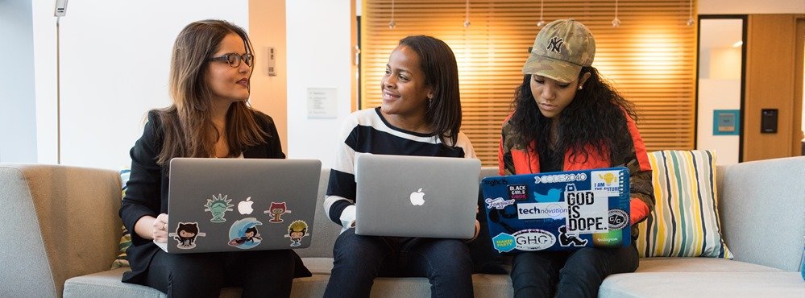
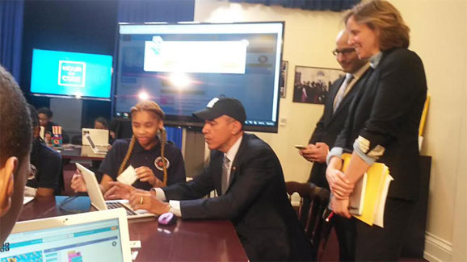
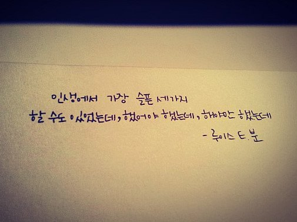
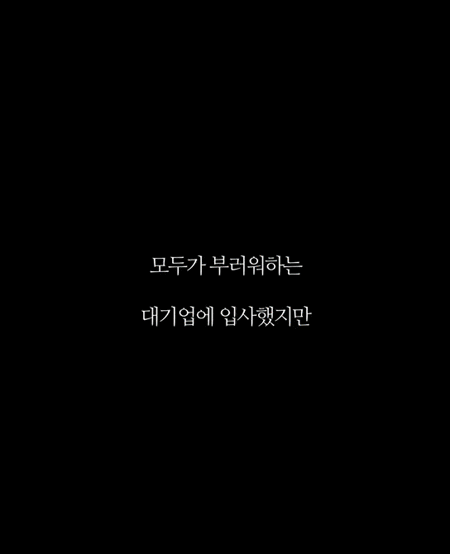
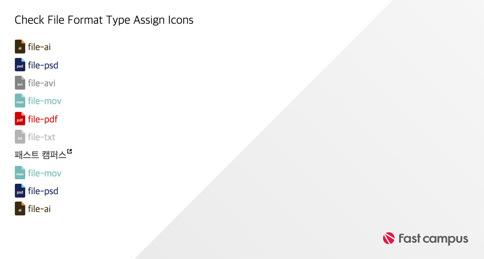

###### Front-End Develop SCHOOL

# DAY 06

### ["코딩을 배우는 건 쉽지 않다"](http://www.zdnet.co.kr/news/news_view.asp?artice_id=20160623161306)



**“코드를 배우기 쉽다는 말을 멈춰라(Stop saying learning to code is easy).”**

마이크로소프트(MS)의 에반젤리스트 스콧 한셀만이 지난 18일 애플 WWDC2016 컨퍼런스 기조연설 후 남긴 블로그 제목이다. 그의 글이 애플 WWDC 후 뜨거운 논의를 이끌어내고 있다. [스콧 한셀만 블로그](http://www.hanselman.com/blog/StopSayingLearningToCodeIsEasy.aspx) | [Y콤비네이터 해커뉴스 댓글보기](https://news.ycombinator.com/item?id=11933700)


스콧 한셀만은 타일러 맥기니스란 사람의 트위터를 소개하며 **“프로그래밍은 어려운 것”**이며 **“물론 보람있고 즐거운 것이지만, 쉽다는 말은 사람들은 실패하게 만들고, 자기 회의에 빠뜨릴 것”**이라고 밝혔다. 타일러 맥기니스는 **“코딩이 어렵지 않다는 WWDC 키노트는 나를 혼란스럽게 한다”**며 **“입문자를 거대한 실망에 빠뜨리고 있다”**고 적었다.

애플은 올해 WWDC 기조연설에서 스위프트 언어를 학습할 수 있는 아이패드앱 ‘스위프트 플레이그라운드’를 선보였다. 학생과 일반인도 코딩의 기본 개념을 쉽게 익힐 수 있다고 강조했다. 이날 WWDC 키노트의 분위기는 프로그래밍 세계로 진입장벽이 매우 낮아졌다는 식으로 흘렀다. 코딩을 전혀 모르는 사람도 당장 프로그래밍을 배울 수 있을 것 같다는 생각을 하게 만들었다.

스콧 한세만은 **프로그래밍에 대한 정확한 인식을 갖게 해야 한다고 주장**했다. 프로그래밍의 밝은 면과 어두운 면을 모두 알려줘야 한다는 것이다. 그는 **“프로그래밍은 어려우며, 복잡하고, 소모적이며, 분통터지는 일”**이라며 “문서화는 보통 형편없고, 때때로 컴퓨터는 멍청하고, 기능을 멈춘다”고 적었다.

이어 **“그러나, 당신을 이끌어줄 환상적인 멘토를 만날 것이고, 불가능하다고 여기는 것을 만들며 힘을 느끼게 될 것”**이라며 **“당신을 둘러싼 세상의 기술을 더 잘 이해하게 되고, 새로운 툴을 시도하면서 직접 툴을 만들게 되며, 때론 해답에 깜짝 놀라고, 시스템들이 어떻게 함께 합을 맞추는 지 보게 될 것이고, 수년 후 컴퓨터의 역사와 어떻게 거인의 어깨 위에 서 있는 지 배우게 될 것”**이라고 적었다.

**프로그래밍을 한다는 건 높은 만족감을 줄 수 있지만, 목표를 이루기까지 무수한 고단함을 감내해야 한다**는 얘기다. 그는 **“프로그래밍을 배우는 건 쉽지 않지만, 가능한 일이다”**며 **“당신은 코딩을 할 수 있다”**고 강조했다.

-

##### 기사 답변들


---

### [자바스크립트 코딩에 도전한 美 오바마 대통령](http://www.cnet.co.kr/view/123550)

미국 오바마 대통령이 미국시간으로 8일 ‘아워 오브 코드’ 행사에 참여해 자바스크립트 코드를 직접 작성했다. **미국 역사상 대통령이 직접 프로그래밍 언어 코드를 작성한 것은 오바마 대통령이 처음**이다. 미국시간으로 8일 백악관은 중학생을 초청해 아워 오브 코드 행사를 진행했다. 이 행사는 비영리 재단인 code.org가 진행하는 행사 ‘아워 오브 코드’(Hour of Code)의 일환이며 올해 두 번째로 열렸다. 오바마 대통령은 이 행사에 참여해 손수 자바스크립트 코드를 작성했다.



자바스크립트 언어는 1995년 개발되어 웹페이지 구성에 필수처럼 쓰이는 프로그래밍 언어 중 하나다. 오바마 대통령은 영상을 통해 **“무언가를 소비하지만 말고 직접 만들라. 우리 생활의 모든 것을 구성하는 기술에 대해 배우기 위해서 한 시간만 내라”**라고 조언하기도 했다.

아워 오브 코드 행사는 어린이에게 친숙한 게임을 이용해 마우스 클릭만으로 프로그래밍 원리를 배울 수 있는 한 시간짜리 프로그램이다. 올해는 디즈니 애니메이션 ‘겨울왕국’이 교재로 쓰인다. 이번 주 동안 한국을 포함한 전 세계에서 7만 7천여개가 넘는 관련 행사가 진행될 예정이다.

---

### [한국 기업교육과 미국 기업교육의 차이점](http://m.blog.naver.com/mazorka1/220742610336)

"강사가 중심이 되면 강사는 무엇인가를 보여 주어야 하고, 가르쳐줘야 하고 그리고 큰 울림을 주고 가야 한다. 하지만 **교육생이 중심이 된다면 스스로 성찰하여야 하고, 자신의 내부를 들여다 보고 또 꺼내 보아야 하고 그리고 자기의 계발에 보다 중점하여야 한다.** 그래서 **교육생은 목소리를 내서 말해야 하고, 토론해야 하고, 그리고 피드백을 듣고 주고 하는 과정이 여실히 필요해 지는 것이다.**"

강사가 일방적으로 전하고 시키는 강의가 아닌, 본인이 해야 하는 비중이 큰 수업에 처음 참여하는 사람들은 당황해하곤 한다. 왜 인풋은 안하고, 아웃풋에 집중하냐고. 읽고 외우고 따라하기는 이미 많이 했는데도 효과를 못 봐서, 효과를 보고 싶어 왔다고는 하지만... 강의는 이래야 한다는 고정관념에 사로잡혀 있으면 스스로를 망친다. (주입식 교육을 거부한다면서, 주입식 교육을 하지 않는 곳에서 주입식 교육을 요구하게 되는 반전... 요즘 자체 인풋을 위한 고급 자료는 공짜로도 많이 널려 있지만, 배우고 익힌 걸 덜 Risky하게 제대로 써먹으면서 그와중에 실무진이나 전문가에게 피드백 받으면서 발전시킬 기회는 많지 않다. **유투브 영상 보며 코딩을 독학하기는 쉽지만, 진짜 자기 머리로 코드를 직접 써내려가기는 어렵듯이 말이다.**)

**교육은 강사가 아닌, 참여자의 성장을 이끌어내는 게 목표**니까... 강사도 학생을 성장시키기 위해 더 노력하며 자신을 성장시키고 그와중에 더 큰 걸 배우고 얻는다.


---

### [당신만의 배를 만들어라 (Build Your Own Ship)](http://blog.paulsoh.co/2016/03/22/%EB%8A%A6%EA%B9%8E%EC%9D%B4-%EA%B0%9C%EB%B0%9C%EC%9E%90%EB%93%A4%EC%9D%B4%EC%97%AC-%EB%8B%B9%EC%8B%A0%EB%A7%8C%EC%9D%98-%EB%B0%B0%EB%A5%BC-%EB%A7%8C%EB%93%A4%EC%96%B4%EB%9D%BC/)

**전공자가 아닌 것은 처음에는 큰 불리함일 수 있으나 시간이 지나면서 훨씬 더 큰 강점이 될 수 있다.** 그 전에 어떤 일을 했든 그 일을 하면서 익힌 그 어떤 스킬도 훌륭한 개발자가 되는 데에 적용할 수 있다. **당신이 과거에 계발한 이러한 장점들은 당신에게 자신감을 불어넣어 줄 것이다.**

내가 포커 플레이어로써 **실패했던 이유는 남들이 하는 플레이 방식을 정확한 이해 없이 모방만 했기 때문**이다. 나는 포커 플레이어로써 나만의 배를 짓지 않았던 것이다.

당신의 **개발자로써의 전략이 단순히 남들을 모방하는 것이라면 당신은 광활한 재능의 바다에서 스스로를 차별화할 수 없다.** 심지어 그런 식으로 공부 했다가는 요새 하루가 다르게 똑똑해 지는 기계들과 자기 자신을 차별화할 수 없게 될지도 모른다. 개발자로써 나는 단순히 유행이라는 이유만으로 따라하는 실수를 범하지 않으려고 노력한다. 십년 전 나는 남들이 하는 방식을 그대로 따라하는 바람에 내가 가진 대부분의 돈을 잃고 포커 선수로써의 커리어를 끝내야만 했다. **남들을 모방했다가 크게 데어본 경험은 그런 면에서 내게 도움이 되었다.**

**대부분의 사람들이 남들을 모방하는 것은 학습의 ‘고통’을 완화 시켜주기 때문**이다.

─ 본문 중 일부 내용 ─


---


### 힘들고, 힘들어, 그래서 포기하고 싶다면...

- 공부의 목적은 **지금 기억하기 위함이 아니라, 내일도 기억하기 위함**이다.<br>어제 공부한 것이 오늘 기억나지 않는다면 공부를 제대로 한 것이 아니다.

- **마음이 앞서면 그만큼 포기도 앞서게 된다.**<br>자기 계발에 **필요한 것은 절박함이지, 다급함이 아니다.**

- **10번만 반복해봐라.** Please! 그래도 안된다면..<br>웃으며 과감히 포기하라. 뒤도 돌아보지 말고 떠나라. 이 길은 잘못된 길이니까.

- **정말 노력했나?** 정말로? 노력했다고 생각하면 아래(↓) 사진을 보라.


> 고수는 그냥 되는게 아닌가봅니다. 길가면서도 코드를 손에서 놓질 못하는 안전 불감... 아, 아니 집요함 이랄까요.

---

### 당신을 응원합니다!



> 인생에서 가장 슬픈 세가지. 할 수도 있었는데, 했어야 했는데, 해야만 했는데

-


> 포기하고 싶은 바로 그 1분을 참아내는 것. 그 순간을 넘어야 다음 문이 열릴 것이다.

-


> 꿈은 도망가지 않아. 도망가는 것은 언제나 자신이야.

-


> 포기하면 그 순간이 바로 시합 종료에요.<br>
> [SLAMDUNK 명장면 다시보기](http://mostview.tistory.com/221)

-

##### 패스트 캠퍼스 SCHOOL에 당신이 들어온 이유를 생각하라.

[](https://www.facebook.com/fastcampusschool/photos/pcb.1181208881930021/1181206245263618/?type=3&theater)

> SCHOOL 1기 수료생의 메시지: "하고 싶었던 공부를 하기 위해 이 곳에 있었습니다. 저는."

-

그래도 포기하고 싶은가? 그렇다면..<br>
[**그 어떤 자극**](https://kr.pinterest.com/shelgoh/%EB%A7%90%EA%B7%80-words-%D9%A9-%DB%B6/)도 당신을 붙잡을 수 없을테니 미련 없이 떠나라.


> 떠나라. 더 이상 갈팡질팡하지 말고...

---

### 강의 피드백 0622

※ 반성의 계기가 되는 피드백만 추렸습니다. 좋은 말씀 주신 피드백은 응원이 되어 힘이 됩니다. 감사합니다. :)


> 디지털 마케팅 SCHOOL 1기 수료생 임정혁님: "야무님은 인정합니다. ㅎㅎ 이유있는 자신감과 열정 최고입니다. (엄지 척)"

**훗날 프디스 1기 수료생에게도 엄지 척 받을 수있도록 노력!! 노력!! 노력하겠습니다!!**

-

> 서버 연결이나 개인 url, transmit 같은 경우는 말로만 설명을 들어 약간 한 귀로 들어오고 한 귀로 흘러나가는 기분이 들었습니다... 허허 제 능력 부족인 것 같지만 그래도 뭔가 더 머리에 쏙쏙 들어올 수 있는 방법이 없을까요?

> 시간이 되신다면 웹호스팅, 워드프레스 부분을 강의해 주시면 안 될까요? ^^

다음 주 금요일 저녁 6시부터 7시 사이 특강할께요. 원하는 분만 남으세요. 강제 수업 아닙니다 ^ㅡ^

-

> 정리가 많이 됐습니다. 다만 강사님 말이 너무 빨라서 놓치고 지나가는 부분이 조금씩 생기네요. 조금만 천천히 강의해 주세요.

> 선생님 말씀이 빨라서 무엇을 아는지 모르는 상황에서 바로 넘어가 버리는 거 같아요. 가끔 설명해 주신 것 생각하다 순간적으로 놓치기도 합니다. 한 요소나 정의에 대해서 설명이 끝나시면 정리 되었는지 학생들에게 확인해 주시것도 좋을것 같아 의견 적어봅니당^^

역시.. 속도 문제는 늘 나오네요. 제 입에서 모터를 제거해야 하는데... 그것이 문제로다. 그리고 하나를 수행한 후에는 강의장을 한 바퀴 돌아보겠습니다. 그러면 꼭 저를 붙잡고 물어봐주세요. 질문을 통해 강의 내용을 챙겨야 하는 것은 수강생의 기본적인 자세입니다 ^ㄴ^

-

> 오늘도 정신차리고 보니 수업이 끝나있네요! 재밌고 다 좋은데 직접 코딩할 수 있는 시간을 아주 쪼~금만 더(10초 가량) 주셨으면 좋겠습니다^^;;

물론이죠! 코딩 시간이 부족한데 넘어가는 듯하면... 어..? 어?? 어??? 하지 마시고 시간을 더 달라고 당당하게 이야기 주세요. "왜 말을 못해?! 내가 시간이 더 필요하다고 말을 못해!" (「OO의 연인」 패러디인거 아시죠? ^^;)

-

> 팀 스터디를 어떠한 방향으로 진행하면 좋을지 강사님이 제시해주시면 큰 도움이 될 것 같습니다.

가장 좋은 것은 팀원들 간의 대화를 통해 방향을 잡아가는 것이라고 봅니다. 강사가 지시하는 방향대로 따라오는 형태가 아닌, 스스로의 개척. 그것은 훗날 공부하는 방법을 개선하는 계기가 될 것입니다. ^ㅡ^ (그래도 방향을 함께 고민해줬으면 한다면, 영배님께 물어보세요~ 전에 수업 끝난 후 남아서 질문하던 영배님에게 이야기한 적이 있습니다. 아... 영배님이 누군지는 아시죠? 모른다면 반성하세요! 필요한 것은 주어지는 것이 아니라, 찾아야 하는 것이니다. ^^)

-

> 선생님 서브라임 테마 너무 예뻐요~ 사이드바랑 툴바 테마 지정하는 패키지가 무엇인가요오?? 그 외에 작업하는데 편한 서브라임 패키지 추천 부탁드려요 ㅎㅎㅎㅎ

전에도 말씀드렸지만, 제가 수업에서 사용하는 것들은 [Sublime Text 3 마스터링 코스](https://www.inflearn.com/course/sublime-text-3-마스터링-코스/) 온라인 강의에서 찾아볼 수 있습니다. ^^ ㅎ 그래도 지금 제가 사용하는 테마는 강의에 없으니 이야기 드릴께요~ Material Theme 입니다.

---

### 진행 내용

- CSS 란?
- CSS 기본 문법
- CSS 선택자

-

###CSS 선택자

선택자 유형 | 설명
--- | ---
* | 전체 선택자
E | 요소 선택자
.class-name | 클래스 선택자
#id-name | 아이디 선택자
E > E | 자식 선택자
E + E | 인접 형제 선택자
E ~ E | 일반 형제 선택자

※ 자손 선택자 이용시, 마지막에 오는 선택자가 스타일이 적용될 요소이다.

-

####자식 선택자
```css
/* E(P) > E(C) */
/* 직계 자식을 가리키는 선택자. 자손 요소는 해당되지 않는다 */
nav > ul > li { ... }

<nav>
	<ul>
		/* ul 직계자손 li에만 스타일이 적용되고 */
		<li>
			<ul>
				/* 최하위 li에는 스타일 적용이 안된다 */
				<li></li>
			</ul>
		</li>
	</ul>
</nav>
```

-

####클래스 선택자

```css
/*
E.class-name (디자인 컨셉이 명확하지 않은 경우에는 사용을 자제)
.class-name (대중적으로 사용되는 방법, 코드 재사용 목적)
.class-name1.class-name2 (멀티클래스. 두 클래스를 가진 요소에 스타일이 적용된다)
.class-name1 .class-name2 (자손 선택과 동일하다. 형태적으로 멀티 클래스와 비슷하므로 햇갈리지 말자)
 */

/* 공통의 스타일 */
button { ... }
/* 개별적인 스타일 */
.button.buy { color: blue; }
.button.buy-cancel { color: red; }
/* 순서를 바꿔도 똑같이 동작한다.(IE6 제외) */

<button type="button" class="button buy">구매</button>
<button type="button" class="button buy-cancel">취소</button>

/* 네이밍은 정말 중요하다. 명시적으로 이름 짓는 연습을 하자! */
```

-

####인접 형제 선택자

> 주의점! 절대적으로 틀(프레임)이 무너지지 않아야 한다.

```html
<!-- 선택자: div>div>div -->
<div>
	<div>
		<div></div>
	</div>
</div>

<!-- 선택자: div+div+div -->
<div></div>
<div></div>
<div></div>

<!-- 선택자: div h4 + ul -->
<div>
	<!-- 첫줄 ul은 스타일 적용이 안된다 -->
	<ul><li></li></ul>
	<h4></h4>
	<!-- 스타일 적용이 된다. 다만 앞에 다른 요소가 나온다면 적용이 되지 않게 된다(h4와 인접하지 않았기 때문) -->
	<ul>
		<li></li>
	</ul>
</div>
```

-

####일반 형제 선택자

> _인접 형제 선택자와 다르다!_

```html
<!-- body > div ~ p -->
<body>
	<div></div>
	<h1></h1>
	<!-- 선택됨 -->
	<p></p>
	<h3></h3>
	<!-- 선택됨 -->
	<p></p>
	<div></div>
</body>

<!-- 인접 형제 선택자였다면 선택할 수 없다 -->
```

####속성 선택자

`[id="some-id"]` 속성 선택자는 `#some-id`와 동일하다. 이처럼 요소의 속성을 통해서 선택을 할 수 있다.

```css
/* 모든 id를 가지는 요소를 가리킴 */
[id] { ... }
/* someClass라는 특정 클래스를 가지는 요소를 가리킴  */
[class="someClass"] { ... }

/* .screen_out 선택과 다른 점은, 같은 요소임에도 다른 클래스를 가지고 있다면 스타일 적용이 안된다.
screen_out 클래스만 가지고 있는 요소를 선택한다. 즉 <div class="screen_out another_class">인경우 선택되지 않는다 */
#shopping3 [class="screen_out"] {
	border: 4px solid #303030;
}

/* 특정 조건을 걸고 속성 선택자를 사용할 수 있다. */
[class^="screen_out"] /* screen_out클래스로 시작하는 경우 */
[class$="screen_out"] /* screen_out클래스로 끝나는 경우 */
a[href="..."][class="some"] /* 여러 조건을 걸 수도 있다 */
```

-

**파일 포맷별 아이콘 설정**



```html
<div class="lecture">
	<h2 class="lecture-title">Check File</h2>
	<!-- 모듈화된 클래스 -->
	<ul class="lecture-file-list reset-list">
		<li class="lecture-file-item"><a href="resource/file.ai">file-ai</a></li>
		<li class="lecture-file-item"><a href="resource/file.psd">file-psd</a></li>
		<li class="lecture-file-item"><a href="resource/file.avi">file-avi</a></li>
		<li class="lecture-file-item"><a href="resource/file.mov">file-mov</a></li>
		<li class="lecture-file-item"><a href="resource/file.pdf">file-pdf</a></li>
		<li class="lecture-file-item"><a href="resource/file.txt">file-txt</a></li>
	</ul>
</div>

<div class="demo">
	<!-- 모듈화된 클래스 -->
	<ul class="reset-list">
		<li><a href="">item-10</a></li>
		<li><a href="">item-11</a></li>
	</ul>
</div>
```
```css
/* 코드를 모듈화 하므로써 재사용성을 높일 수 있다 */
.reset-list {
	/* 기본적인 리스트 스타일 초기화 */
	/* 정말매우굉장히많이 사용되는 코드 */
	list-style-type: none;
	margin-top: 0;
	margin-bottom: 0;
	padding-left: 0;
}

/* 파일 타입 이미지 제공을 위한 기본 디자인 */
.lecture-file-list a {
	display: block;
	font-size: 2.38em;
	text-decoration: none;
	text-indent: 40px;
	/* 중복된 코드 재사용을 위해 모듈화 */
	background-repeat: no-repeat;
}

/*
파일 포맷에 따라 자동적으로 아이콘을 배경 이미지로 설정하는 스타일
 */
a[href$=".psd"]{
	background-image: url("input/image/link/here");
	/* 중복 */
	/* background-repeat: no-repeat; */
}
a[href$=".ai"]{
	background-image: url("input/image/link/here");
	/* 중복 중복 */
	/* background-repeat: no-repeat; */
}
a[href$=".txt"]{
	background-image: url("input/image/link/here");
	/* 중복 중복 중복!! */
	/* background-repeat: no-repeat; */
}


/* 외부 링크 선택 조건 */
a[href^="http://"][target="_blank"]{
	background-image: url("input/image/link/here");
	background-repeat: no-repeat;
	background-posotion: 0% 4px;
}
```

-

### 기타/참고

[Adobe CC 과자](https://www.dropbox.com/sh/7pismtqusk5x8h6/AADxsqtMxv-vll737x7qJx5fa?dl=0)