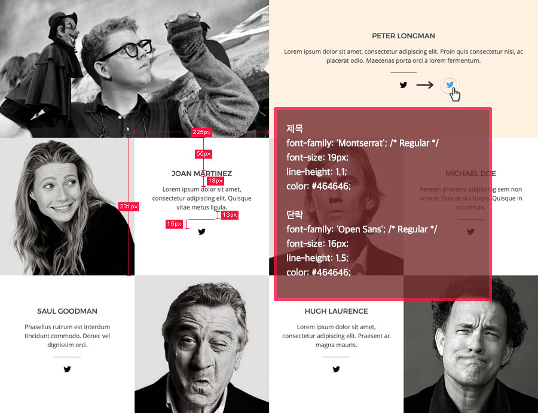
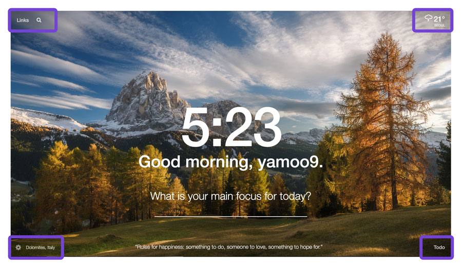
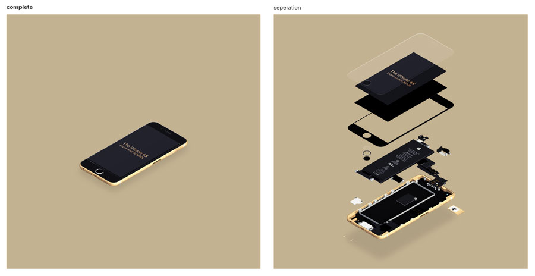

###### Front-End Develop SCHOOL

# DAY 11

### 지난 실습 자료 Code Review

[DEMO-Float-Layout__Conference-Speakers](http://demo.yamoo9.net/FDS/conference-speakers/) 참고.



#### Google 웹폰트 사용 시 주의점. (특수문자)

[`Montserrat` | `Open Sans`](https://fonts.google.com/selection?query=Montserrat&selection.family=Montserrat|Open+Sans)

```html
<!-- | 기호는 <link> 요소의 href 속성에 바로 사용할 수 없도록 되어 있어 엔티티코드(%7C)로 변경하여 사용해야 한다. -->
<link href="https://fonts.googleapis.com/css?family=Montserrat%7COpen+Sans" rel="stylesheet">
```

-

### 진행 내용

- CSS 레이아웃 `position` 속성
- CSS 배경 속성
- CSS 리스트 속성
- CSS 테이블 속성

-

### Vertical Rhythm

- Headings
- Paragraph
- Lists
- Table


```css
body {
	font: 18px/1.5 "Spoqa Han Sans", sans-serif;
	background: url(" ... ");

}
/*h6, h5, h4 {font-weight: 700;}*/
h1, h2, h3 {
	font-weight: 200;
}

h1, h2, h3, h4, h5, h6, p {
	margin-bottom: 27px;
}

/* 제목 디자인 Type Scale x1.2 */
h1 {font-size: 44.7876px; line-height: 81px;}
h2 {font-size: 37.3248px;}
h3 {font-size: 31.104px;}
h2, h3, h4 { line-height: 54px; }
h4 {font-size: 25.92px;}
h5 {font-size: 21.6px;}
h5, h6 { line-height: 27px; }
```

####CSS로 vertical-rhythm 만들기

```css
body {
	/* 선형 그레디언트 */
	/* background-image: linear-gradient(angle, color-stop 0% ~ color-stop 100%,); */
	background-image: linear-gradient(180deg, transparest 95% 0%, #704578 95%,);
	background-size: 1px 27px;
}
```

 > px 단위를 상대값으로 바꾸어 보자

-

### Position

레이아웃 디자인을 위한 요소
 - `static` : 
 	- 모든 요소의 기본값
 - `relative` :
 	- 원래 위치에서 상대적, 주는 속성(top, left, right, bottom)에 따라 이동
 	- 일반 흐름(normal flow)에 영향을 주지 않는다
 - `absolute` :
 	- 부모 위치에서 상대적, relative 처럼 속성에 따라 이동
 	- 부모 요소는 자격이 필요하다. position 값이 static이 아니고 가장 가까운 요소를 찾는다.
 	- 일반 흐름(normal flow)에 영향을 준다


-

### Position 실습 Part 1.

CSS 포지션 속성을 활용하여 __Momentum 레이아웃 디자인__을 구현해봅니다.



-

### Position 실습 Part 2.

CSS 포지션 속성을 활용하여 __Scene 레이아웃/애니메이션 디자인__을 구현해봅니다.


-

### Position 실습 Part 3.

CSS 포지션 속성을 활용하여 __Explode iPhone 레이아웃/애니메이션 디자인__을 구현해봅니다.




-

### 기타/참고

- [CSS 레이아웃을 배웁시다](http://ko.learnlayout.com/toc.html)
- [마진/패딩 % 설정의 기준은?](http://stackoverflow.com/questions/11003911/why-are-margin-padding-percentages-in-css-always-calculated-against-width)
- [lucy](http://lucy.29cm.co.kr/hello)
- [conference](http://themes-pixeden.com/landing/conference/home3.html#home)
- [trendhunter.com](http://www.trendhunter.com/trends/topshop-x-adidas-originals-ads)
- [nitrolicious.com](http://nitrolicious.com/2009/10/21/ppq-x-adidas-originals/)
- [42 Super Cool And Exciting Sports Related Photo Manipulations](http://www.soultravelmultimedia.com/2013/09/28/42-super-cool-and-exciting-sports-related-photo-manipulations/)