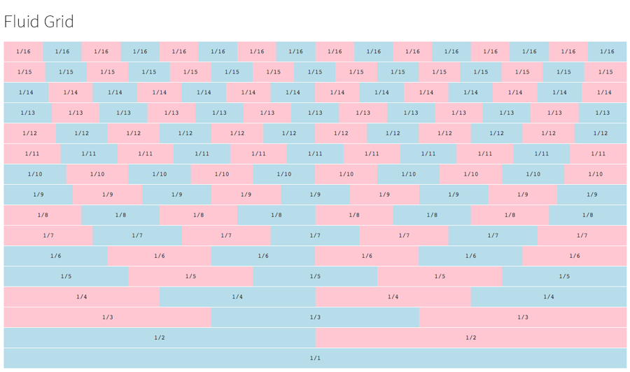
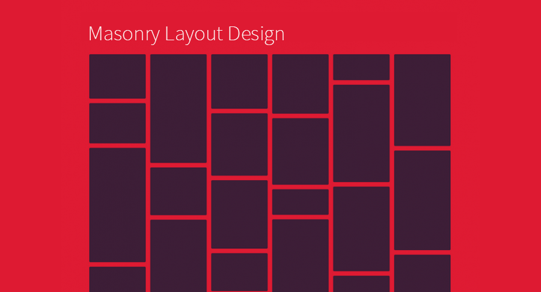

###### Front-End Develop SCHOOL

# DAY 17

### CSS3 Align Justify

텍스트 양쪽 정렬 [`text-align-last`](http://caniuse.com/#search=text-align-last)


```css
.align-last-justify {
  width: 20rem;
  margin-left: auto;
  margin-right: auto;
  font-size: 6rem;
  text-align: justify;
  -moz-text-align-last: justify;
  text-align-last: justify;
  font-weight: 900;
}
```

-

### Fluid Grid

유연한 그리드 시스템 제작 방법.



```html
<div class="grid">
  <div class="unit-1-3">unit-1-3</div>
  <div class="unit-2-3">unit-2-3</div>
</div>
```
```css
/* 컨테이너 모듈. 오랜만에 micro clearfix를 써봅시다 */
.grid::before,
.gird::after {
  content: '';
  display: table;
}
.grid after::after {
  clear: both;
}

[class*="unit-"] {
  box-sizing: border-box;
  float: left;
  /* float이 적용된 박스의 width가 컨텐츠만큼으로 바뀌므로 100% 설정을 해준다 */
  width: 100%;
}
.unit-2-4,
.unit-3-6,
.unit-1-2 { width: 50%; }
.unit-2-6
.unit-1-3 { width: 33.3333%; }
.unit-4-6
.unit-2-3 { width: 66.6667%; }
.unit-1-4 { width: 25%; }
.unit-3-4 { width: 75%; }
.unit-1-5 { width: 20%; }
.unit-2-5 { width: 40%; }
.unit-3-5 { width: 60%; }
.unit-4-5 { width: 80%; }
.unit-1-6 { width: 16.6666667%; }
.unit-5-6 { width: 83.3333333%; }
[...]

/* 거터 모듈, 그룹핑을 통해 편하게 관리 */
.gutter-group [class*="unit-"],
.gutter {
  padding-left: 1rem;
  padding-right: 1rem;
}
.no-gutter,
.grid .no-gutter {
  padding-left: 0;
  padding-right: 0;
}

/* offset */
unit-offset-1-2,
unit-offset-2-4,
unit-offset-3-6,
unit-offset-4-8 {
  margin-left: 50%;
}
unit-offset-1-3,
unit-offset-2-6,
unit-offset-3-9 {
  margin-left: 33.3333%;
}
[...]
```

**유닛을 이용하여 박스를 배치해봅시다!**

-

### CSS3 Animation Steps

타임라인 기반의 애니메이션을 보완해주는 `steps()` 기반의 애니메이션 방법.

##### Penguin Sprite Image


##### Adam Sprite Image


##### Street Fighter Ken Sprite Image


-

### CSS3 Multiple column layout

CSS3를 활용한 멀티 컬럼 디자인 방법.


```html
<div class="column-container no-multi-columns">
  <div class="unit-1-3 column">
    <h2>Title</h2>
    <p>Lorem ipsum dolor sit amet, consectetur adipisicing elit. Ipsum, provident.</p>
    <p>Lorem ipsum dolor sit amet, consectetur adipisicing elit. Ipsum, provident.</p>
  </div>
  <div class="unit-1-3 column">
    <p>Lorem ipsum dolor sit amet, consectetur adipisicing elit. Ipsum, provident.</p>
    <p>Lorem ipsum dolor sit amet, consectetur adipisicing elit. Ipsum, provident.</p>
  </div>
  <div class="unit-1-3 column">
    <p>Lorem ipsum dolor sit amet, consectetur adipisicing elit. Ipsum, provident.</p>
    <p>Lorem ipsum dolor sit amet, consectetur adipisicing elit. Ipsum, provident.</p>
  </div>
</div>
<div class="column-container use-multi-columns">
  <div class="column">
    <p>Lorem ipsum dolor sit amet, consectetur adipisicing elit. Ipsum, provident.</p>
    <p>Lorem ipsum dolor sit amet, consectetur adipisicing elit. Ipsum, provident.</p>
  </div>
  <div class="column">
    <p>Lorem ipsum dolor sit amet, consectetur adipisicing elit. Ipsum, provident.</p>
    <p>Lorem ipsum dolor sit amet, consectetur adipisicing elit. Ipsum, provident.</p>
  </div>
  <div class="column">
    <p>Lorem ipsum dolor sit amet, consectetur adipisicing elit. Ipsum, provident.</p>
    <p>Lorem ipsum dolor sit amet, consectetur adipisicing elit. Ipsum, provident.</p>
  </div>
</div>
```
```css
.column-container {
  max-width: 56.25rem;
  margin: 3rem auto;
}
.column-container::after {
  content: '';
  display: block;
  clear: both;
}
.column {
  line-height: 1.5rem;
  padding-right: 1.5rem;
}
.column p {
  margin-bottom: 1.5rem;
}
.column:last-child {
  padding-right: 0;
}

.use-multi-columns {
  line-height: 1.5rem;
  color: #6c6045;

  /* CSS3 Multi Columns */
  /* 컬럼의 개수 */
  -webkit-column-count: 3;
  -moz-column-count: 3;
  column-count: 3;

  /* 컬럼 사이 간격(gap) */
  -webkit-column-gap: 1.5rem;
  -moz-column-gap: 1.5rem;
  column-gap: 1.5rem;

  /* 컬럼 사이 간격 중앙에 배치되는 수직 선 */
  -webkit-column-rule: 1px solid #aaa;
  -moz-column-rule: 1px solid #aaa;
  column-rule: 1px solid #aaa;
}
.use-multi-columns p {
  margin-top: 0;
  margin-bottom: 1.5rem;
  /* text-align: justify; */
  /* rem이 아닌 em써야 함 */
  letter-spacing: -0.045em; /* 자간 */
  word-spacing: 0.2em; /* 어간 */
}

.use-multi-columns h2 {
  margin-top: 0;
  font-size: 2rem;
  line-height: 1.2rem;

  /* 제목이 모든 컬럼을 사용할 때 */
  -webkit-column-span: all;
  -moz-column-span: all;
  column-span: all;
}
```

-

### CSS3 Masonry Layout

높이가 불규칙한 블록을 벽돌 쌓듯이 디자인하는 레이아웃 방법.



```html
<div class="masonry-container">
  <div class="masonry-item">
    
    <h2>title01</h2>
    <p>Lorem ipsum dolor sit amet.</p>
  </div>
  <div class="masonry-item">
    
    <h2>title02</h2>
    <p>Lorem ipsum dolor sit amet.</p>
  </div>
  <div class="masonry-item">
    
    <h2>title03</h2>
    <p>Lorem ipsum dolor sit amet.</p>
  </div>
  <div class="masonry-item">
    
    <h2>title04</h2>
    <p>Lorem ipsum dolor sit amet.</p>
  </div>
  <div class="masonry-item">
    
    <h2>title05</h2>
    <p>Lorem ipsum dolor sit amet.</p>
  </div>
  <div class="masonry-item">
    
    <h2>title06</h2>
    <p>Lorem ipsum dolor sit amet.</p>
  </div>
</div>
```
```css
.masonry-container {
  max-width: 1200px;
  margin: 3rem auto;
  -webkit-column-gap: 1.5rem;
  -moz-column-gap: 1.5rem;
  column-gap: 1.5rem;
  line-height: 1.5rem;
}
.masonry-container .masonry-item {
  display: inline-block;
  margin-bottom: 1rem;
  width: 100%;
}
.masonry-item .masonry-item h2 {
  margin-bottom: 0.625rem;
  line-height: 1;
  font-weight: 100;
}
.masonry-item .masonry-item p {
  margin-bottom: 0.625rem;
  line-height: 1.5;
}

@media only screen and (min-width: 400px) {
    .masonry-container {
        -moz-column-count: 2;
        -webkit-column-count: 2;
        column-count: 2;
    }
}

@media only screen and (min-width: 700px) {
    .masonry-container {
        -moz-column-count: 3;
        -webkit-column-count: 3;
        column-count: 3;
    }
}

[...]
```

-

### 보충 내용 리스트

1. 그리드 시스템 만드는 방법 / 사용법
1. 웹 타이포그래피 / 버티컬 리듬
1. 애니메이션 정리
1. 컬럼 그리드 그라데이션 그리는 방법