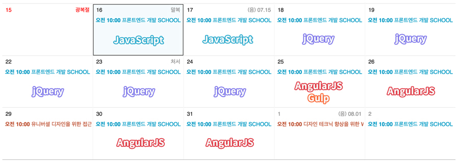

###### Front-End Develop SCHOOL

# DAY 34

### 8월 16일부터 9월 2일 전까지, 코스 커리큘럼 스케쥴

##### 1. JavaScript 목표
- DOM 헬퍼 함수
- 생성자 함수와 프로토타입 객체
- DOM 헬퍼 라이브러리 구현

##### 2. jQuery v3 목표
- 실무자의 필수 라이브러리, `jQuery` 사용법
- jQuery 라이브러리 카테고리 별 학습
- jQuery 플러그인 개발 패턴
- 비동기 통신 AJAX (+JSON)

##### 3. Node.js + Gulp + AngularJS v1 목표
- `Node.js` 서버 환경
- `Gulp.js` 테스크 러너
- `AngularJS` 사용법
- `SPA` 싱글 페이지 애플리케이션 제작

-

### 9월 3일 이후, 코스 커리큘럼 스케쥴

#### α. 포트폴리오 목표
- GitHub 정리
- 미완의 결과물(팀 엑티비티 과제 및 개인 작업) 보완/완성
- UI Kit / 코딩 스타일 가이드 완성
- 패럴럭스 / 비주얼 임팩트가 큰 RWD 웹 사이트 제작
- 기성 기업 사이트(유명 브랜드) 선택 후, 웹 표준/접근성 고려 리뉴얼 사이트 제작

#### β. 하이어링데이 발표 준비 (19일 이후)
- 발표 슬라이드 준비 (4분 이내)
- 발표 슬라이드 리허설

#### Ω. [특강] ECMAScript 2015 목표
- `ECMAScript 2015`에서 변경된 사항
- `Babel`을 사용한 `ES2015` → `ES5` 컴파일