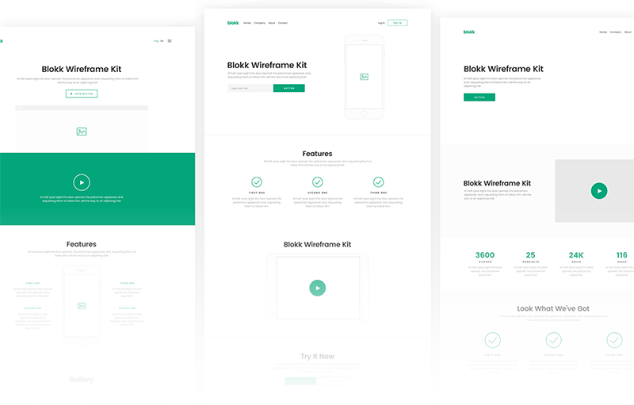

###### Front-End Develop SCHOOL

# 미니 프로젝트 ─ "지난 2주간 학습한 내용을 정리하다."

[와이어프레임 디자인](../ASSETS/Pages__wireframe.zip) 파일을 다운로드 받아 2주간 공부한 것을 토대로 뷰(View) 페이지를 구현 해봅니다. 
해당 와이어프레임 페이지 디자인은 웹폰트 [Poppins](https://fonts.google.com/specimen/Poppins)를 사용합니다.

##### 1. 주어진 모든 페이지(5)를 모두 완수한다는 각오로 프로젝트에 임합니다.

##### 2. 아래 나열된 목록의 내용을 고려/준수하여 미니 프로젝트(과제)를 수행하세요.

- [웹표준 준수] HTML, CSS 문법은 유효한가?
- [접근성 고려] 사용자 입장에서 접근하는데 문제가 없는가? (음성 출력/키보드 접근 등)
- [의미 구조화] HTML 구조는 올바른 의미를 가지는가?
- [네이밍 규칙] HTML, CSS에 설정된 이름은 간결하며 읽기 용이한가?
- [스타일 모듈] CSS 스타일 디자인(설계)는 효율적으로 작성되었는가?
- [모션 센스] CSS3 애니메이션/트렌지션은 적절하고 아름답게 사용되었나?
- [코드 최적화] 불 필요한 `
` 또는 `` 요소의 남용 및 무의미하게 중복되는 스타일 코드는 없었는가?
- [코드 리팩토링] 코드는 읽기 쉽고, 간결한가?
