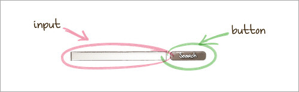
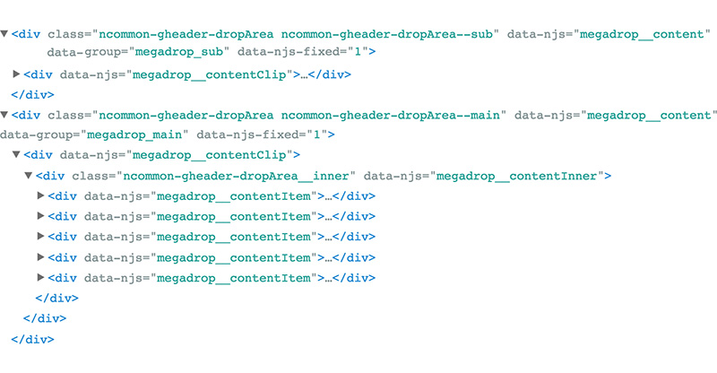

###### Front-End Develop SCHOOL

# [](https://en.bem.info/)


### BEM이란?

블럭(Block), 요소(Element), 변경자(Modifier)를 축약하여 부르는 이름.

- 러시아의 큰 기업인 Yandex에서 탄생
- 코딩 스타일이 아님, 개발 및 설계 방법론
- 객체를 코드로 표현하는 방법과 일련의 패턴
- 프로그래밍 방법에 관한 보편적 지식

-

### BEM의 목표

**빠른 개발 속도**

단계적이 아닌 병렬적으로 개발을 진행하여
웹 사이트의 첫 버전을 신속하게 공개

**효율적인 유지보수**

오랜기간 동안 효율적으로 유지보수 할 수 있는
구조와 커뮤니케이션 방법 확립

**팀의 확장성**

급격한 학습 곡선 없이 새로운 맴버를 할당할 수
있는 환경 조성

**코드의 재사용**

UI의 일관성을 유지하고 재사용성을 높이기 위해
문맥적인 의존 없는 모듈 개발


-

### 개발 방법론

1. 단계적 개발 (직렬)
2. 동시적 개발 (병렬)

##### 1. 단계적 개발 방법론

일반적인 사용되고 있는 개발 프로세스로 디자이너와 개발자 간 각자의 영역에서 작업하며 서로 간섭하는 일이 없어야 한다.
하지만 디자인은 늘 수정 가능성이 열려 있을 뿐 아니라, 새롭게 추가되는 페이지, 요소 등이 있으므로 불규칙적으로 변하는 요구사항에 하나 하나 대응하는 것은 쉽지 않다.

> 디자이너가 페이지 시안을 제공하면, 이어서 마크업/스타일링/스크립팅을 하게 된다. 이 방법의 문제는 작업이 진행 중인 상황에서도 디자인 시안이 변경되는 경우가 잦아 개발을 뒤엎어야 하는 경우가 발생할 수 있다는 점이다. 이로 인해 언성이 높아지고, 서로에게 불쾌한 경험을 제공하는 경우가 부지기수이다.

##### 2. 동시적 개발 방법론

문제의 범위를 작게 나눠 디자인/개발을 최대한 병렬적으로 진행한다. 문제의 범위를 작게 나누는 이유는 변경 사항에 기민하게 대처 처리가 가능하기 때문이다. 단, 이 방법은 사전에 협업자와 긴밀한 커뮤니케이션으로 팀원 간의 조직력을 요구한다. (※ 국내 디자이너와 협업할 경우, 많은 시행착오와 학습/경험을 요구하게 된다)

> 디자이너는 제작하고자 하는 페이지의 전체적인 컨셉(와이어프레임, 레이아웃, 컬러 시스템, 컴포넌트 등)을 먼저 설계(Design)하여 UI Kit을 제작한 후 개발자에게 제공한다. 그리고 개발자는 UI Kit을 토대로 레이아웃, 컬러 시스템, 컴포넌트를 모듈(부품) 단위로 작게 나눠 프로토타입 및 프레임워크를 개발한다. 이 시간에 디자이너는 자신이 만든 UI Kit을 토대로 페이지를 제작하여 개발자에게 제공하면, 개발자는 제작된 프레임워크를 활용하여 페이지를 제작한다.

-

### 하나로 일치된 데이터 도메인 (Unified Data Domain)

서로 각자 간섭없이 개발하는게 아니라 블럭(Block)의 이름을 함께 짓고, 이해 관계자가 공통적으로 용어를 사용한다.
이를 __Unified Data Domain__이라고 한다. 각 영역에 이름을 붙이고 함께 사용하면 커뮤니케이션 비용을 낮출 수 있다.
변경이 필요한 영역을 정확하게 알려줄 수 있고 각 영역을 조합해 새로운 영역을 만들어 낼 때도 몇 마디 대화 만으로 의사를 전달할 수 있다.


-

#### Block

애플리케이션의 컴포넌트(부품)로써 독립된 영역을 지칭한다.


블럭은 문맥 의존적이지 않은 독립된 객체 또는 높은 수준으로 추상화 한 컴포넌트다.<br>
하위에 요소만 포함할 수도 있고, 또 다른 블럭을 포함할 수도 있다.


#### Element

블록(영역)을 구성하는 작은 단위로 요소를 말한다.



요소는 블럭을 구성하는 작은 단위로써 특정 기능을 담당한다.<br>
블럭과 달리 문맥 의존적이며 요소가 속한 블럭 내에서만 의미를 가진다.


#### Modifier

블럭 또는 요소의 스타일이나 동작을 표현할 경우 사용한다. (상태 디자인, State Design)


숨겨놓은 요소를 출력하거나 특정 버튼에 커서를 올렸을 때, 배경색을 변경하는 등 블럭이나 요소의 상태를 표현한다.<br>
기존과 비슷하지만 스타일이나 동작이 조금 다른 블럭이나 요소를 만들고 싶은 경우에 사용한다.

-

### MindBEMding

BEM 방법론을 기반으로 한 이름 작성법(Naming Guide)이다.

BEM은 클래스 명명 규칙을 강제하지 않는다. 많은 사람이 오해하고 있는 호불호가 극명하게 갈리는 명명법은
BEM 방법론을 기반으로 한 [MindBEMding](https://csswizardry.com/2013/01/mindbemding-getting-your-head-round-bem-syntax/) 명명법이다. 다른 것으로 [modified BEM](https://pages.18f.gov/frontend/#suggested-custom-methodology)이 있다.

- `.block {}`           : `.block` 영역
- `.block__element {}`  : `.block`을 지원하는 자식 요소
- `.block--modifier {}` : `.block`의 상태를 나타내는 변환자


BEM 명명법에 따라 클래스 이름을 작성한 예를 살펴보면서 이해해보자.

```css
.site-search        { ... } /* Block */
.site-search__field { ... } /* Element */
.site-search--full  { ... } /* Modifier */
```

__[BAD]__: 아래 class 속성 이름의 경우, 각 이름이 명확하게 무엇을 의미하는지, 어떤 경우에 사용되지는 파악하기 쉽지 않다.

- `full`   ↔ ?
- `field`  ↔ ?
- `button` ↔ ?

```html
<form class="site-search  full">
  <input type="text" class="field">
  <input type="Submit" value ="Search" class="button">
</form>
```

__[GOOD]__: 아래 class 속성 이름의 경우, 각 이름이 무엇을 의미하며, 어떤 경우에 사용되는지 파악이 쉽다.

- `site-search--full`   ↔ site-search 블록 변경자
- `site-search__field`  ↔ site-search 블록 요소
- `site-search__button` ↔ site-search 블록 요소

```html
<form class="site-search  site-search--full">
  <input type="text" class="site-search__field">
  <input type="Submit" value ="Search" class="site-search__button">
</form>
```

-

```css
.media           { ... }
.media__img      { ... }
.media__img--rev { ... }
.media__body     { ... }
```

__[BAD]__

```html
<div class="media">
  
  <div class="body">
    <h3 class="alpha">Welcome to Foo Corp</h3>
    <p class="lede">Foo Corp is the best, seriously!</p>
  </div>
</div>
```

__[GOOD]__

```html
<div class="media">
  
  <div class="media__body">
    <h3 class="alpha">Welcome to Foo Corp</h3>
    <p class="lede">Foo Corp is the best, seriously!</p>
  </div>
</div>
```

-

### Uuuugly!

일반적으로 BEM 명명법을 사용한 class 속성 이름은 호불호가 갈린다. 이름이 길고 보기 좋지 않다는 이유이다.
하지만 이름 작성이 다소 길어지고 불편할지라도, 그것이 가져오는 효과가 탁월하다면 고려하여 반영해 볼 필요가 있다.

[](https://www.nintendo.co.jp/ "닌텐도 제팬")

---

### 가상 시나리오

- [Promise - mozilla | MDN](http://uyeong.github.io/bem-style-mdn/)
- [Promise - mozilla | MDN 해부도](http://uyeong.github.io/bem-style-mdn/anatomy.html)


-

### 참고 자료

- [BEM 101](https://css-tricks.com/bem-101/)
- [a New Front-End Methodology BEM](https://www.smashingmagazine.com/2012/04/a-new-front-end-methodology-bem/)
- [CSS Coding Style Guide](https://pages.18f.gov/frontend/css-coding-styleguide/naming)
- [19 principles of development on BEM or that each developer of libraries has to know](http://developers-club.com/posts/267875/)
- [[CSS방법론] SMACSS, BEM, OOCSS](http://wit.nts-corp.com/2015/04/16/3538)
