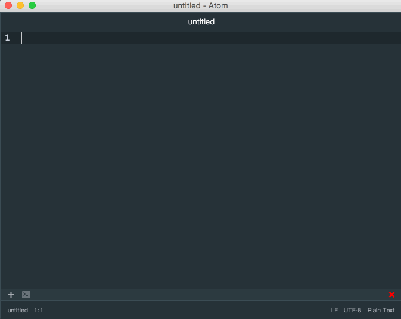

###### Front-End Develop SCHOOL

## CLI(Command Line Interface)


-

### 명령 프롬프트 주요 명령어

#### 1 디렉토리 이동

디렉토리 간 이동 시에 사용된다.

[`cd`](https://ko.wikipedia.org/wiki/Cd_(%EB%AA%85%EB%A0%B9%EC%96%B4)) : Change Directory 줄임 말.

```sh
$ cd {디렉토리 경로}

# 예시
$ cd ../
$ cd ~/Desktop
```

-

#### 2.1 디렉토리 생성

새로운 디렉토리를 생성할 경우 사용한다.

[`mkdir`](https://ko.wikipedia.org/wiki/Mkdir) : Make Directory 줄임 말.

```sh
$ mkdir {디렉토리 이름}

# 예시
$ mkdir study-sass
$ md myProject     # mkdir 명령을 md로 줄여 사용할 수 있음.
```

#### 2.2 `&&` 명령어 활용

명령어 사이에 `&&`를 넣으면 명령어를 차례대로 실행한다.

```sh
$ mkdir {디렉토리 이름} && cd {디렉토리 이름}

# 예시
$ mkdir images && cd images
```

-

#### 3. 파일 생성

빈 파일 또는 내용이 있는 파일을 생성할 때 사용한다.

- [`touch`](https://ko.wikipedia.org/wiki/Touch_(%EC%9C%A0%EB%8B%89%EC%8A%A4)) : 빈 파일을 생성할 경우 사용
- [`echo`](https://ko.wikipedia.org/wiki/Echo) : 간단한 내용이 있는 파일을 생성할 경우 사용

```sh
$ touch {파일 이름}

# 예시
$ touch common.css
$ touch css/grid.css

# -------------------------------------------------------------------------

$ echo {파일 내용} > {파일 이름}

# 예시
$ echo 'Cafe Latte 주세요.' > coffee.js      # > 신규 파일 작성할 경우 사용
$ echo 'Ice는 조금만 넣어주세요.' >> coffee.js # >> 기존 파일에 내용 추가할 경우 사용
```

-

#### 4. 파일 내용 확인

[`cat`](https://ko.wikipedia.org/wiki/Cat_(%EC%9C%A0%EB%8B%89%EC%8A%A4)) : concatenate(연결하다)의 동의어인 catenate에서 유래.

```sh
$ cat {파일 이름}

# 예시
$ cat coffee.js
$ cat css/common.css
```

-

#### 5. 디렉토리 목록 출력

디렉토리 목록을 출력한다. `option` 값은 설정하면 다양한 처리가 가능하다.

[`ls`](https://ko.wikipedia.org/wiki/Ls_(%EC%9C%A0%EB%8B%89%EC%8A%A4)) : List Segments 줄임 말.

##### 옵션 리스트

- `-a`, `--all` : 숨겨진 디렉토리/파일까지 모두 출력
- `-1`, `--format=single-column` : 수직 방향으로 출력
- `-l` : 파일 유형, 권한 정보, 링크 수, 소유자, 소유그룹, 용량, 생성날짜, 파일이름 등 정보를 출력 (Long Format)
- `-r`, `--reverse` : 역순(내림차순)으로 출력
- `-R` : 하위 디렉토리/파일까지 모두 출력

```sh
$ ls {디렉토리 경로} {옵션}

# 예시
$ ls -a
$ ls -1
$ ls ./sub-dir/ -al
$ ls -al | grep .gitconfig
```

-

#### 6. 파일/디렉토리 이동 또는 이름 변경

[`mv`](https://ko.wikipedia.org/wiki/Mv) : Move 줄임 말. (이미 존재하는 파일/디렉토리의 경우 이름 변경이 가능)

```sh
$ mv {파일 또는 디렉토리 이름} {이동할 경로 / 파일 또는 디렉토리 이름}

# 예시
$ mv coffee.js js/coffee.js
$ mv photo.jpg assets/images/picture.jpg
```

-

#### 7. 파일/디렉토리 복제

[`cp`](https://ko.wikipedia.org/wiki/Cp_(%EC%9C%A0%EB%8B%89%EC%8A%A4)) : Copy 줄임 말.

```sh
$ cp {복사할 파일/디렉토리 이름} {복사된 파일/디렉토리 이름}

# 예시
$ cp coffee.js java.js
$ cp js/coffee.js scripts/coffee.js
```

-

#### 8-1. 디렉토리 제거

[`rmdir`](https://ko.wikipedia.org/wiki/Rmdir) : Remove Directory 줄임 말. (빈 디렉토리만 제거 가능)

```sh
$ rmdir {지우고자 하는 빈 디렉토리 이름}

# 예시
$ rmdir temp
$ rmdir _/cache
```

#### 8-2. 파일/디렉토리(비어 있지 않은) 제거

[`rm`](https://ko.wikipedia.org/wiki/Rm_(%EC%9C%A0%EB%8B%89%EC%8A%A4)) : Remove 줄임 말. (비어 있지 않은 디렉토리를 지울 때도 사용)

```sh
$ rm {제거할 파일/디렉토리 이름}

# 예시
$ rm cafe.py
$ rm css/         # css 디렉토리 내부에 파일이 존재할 경우
$ rm -r js/       # js 디렉토리 내부 하위 디렉토리 파일까지 모두 제거할 경우
$ rm -rf assets $ # assets 디렉토리 내부 하위 디렉토리 파일까지 모두 제거하되, 경고를 나타내지 않음
```

-

#### 9. 콘솔 화면 지우기

콘솔 화면에 출력된 내용을 지울 때 사용한다. ( Mac OSX 단축키: `⌘ + K` / Windows 단축키: `ctrl+L` )

[`clear`](https://ko.wikipedia.org/wiki/Clear_(%EC%9C%A0%EB%8B%89%EC%8A%A4)) : Clear

```sh
$ clear # Mac OSX
$ cls   # Windows
```

-

#### 10. 기타

- [`env`](https://ko.wikipedia.org/wiki/Env) : 운영체제 환경 정보를 출력
- [`who`](https://ko.wikipedia.org/wiki/Who_(%EC%9C%A0%EB%8B%89%EC%8A%A4)) : 현재 컴퓨터에 로그인 한 사용자 목록을 출력하는 명령어
- [`whoami`](https://ko.wikipedia.org/wiki/Whoami) : 현재 사용자의 이름을 출력하는 명령어
- [`pwd`](https://ko.wikipedia.org/wiki/Pwd) : Print Working Directory 줄임 말. 현재 작업 중인 디렉터리의 이름을 출력하는 명령어
- `which` : 프로그램의 위치를 출력
- `history` : 기억된 입력 명령어 목록을 출력
- [`sudo`](https://ko.wikipedia.org/wiki/Sudo) : Substitute User Do 줄임 말. 다른 사용자의 보안권한과 관련된 프로그램을 구동할 수 있게 해주는 프로그램
- [`chmod`](https://ko.wikipedia.org/wiki/Chmod) : Change Mode 줄임 말. 파일/디렉터리의 파일 시스템 모드 변경 ([참고](https://www.conory.com/note_linux/19194))
```sh
$ env
$ who
$ whoami
$ pwd
$ which {프로그램 이름} # e.g) which node
$ history
$ sudo npm install # Mac OSX 사용자의 경우 관리자 권한 문제로 sudo 명령을 사용해야 때가 종종 발생
$ sudo chmod 777 {파일/디렉토리 이름}
```

-

#### 11. [Vim 에디터(Editor)](./VIM.md)

콘솔 화면에서 파일의 생성 또는 편집 모드로 진입힌다. `esc` 키를 누른 후 명령어를 통해 사용한다.

```sh
$ vi {파일 이름}

# ---------------------------------------------------------------------------------
# vim Editor 편집 모드
# ---------------------------------------------------------------------------------

# i   : 삽입(글쓰기) 모드
# :q! : 저장 안 하고, 명령어 프롬프트로 나옴
# :wq : 저장 하고, 명령어 프롬프트로 나옴
```

-

###### 통합 개발 환경(IDE) 명령어 프롬프트 플러그인 for ATOM

[platformio-ide-terminal](https://atom.io/packages/platformio-ide-terminal)


