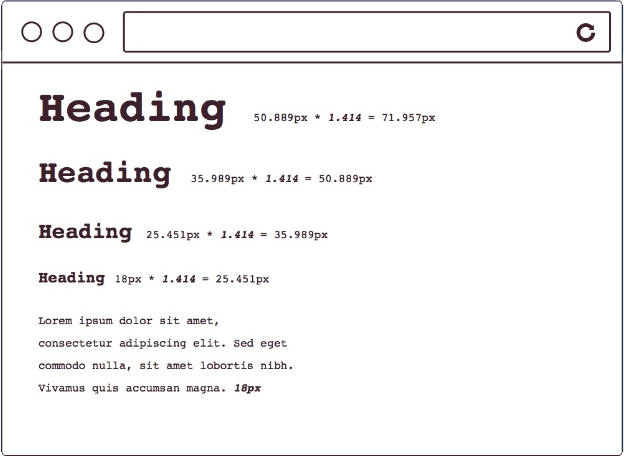
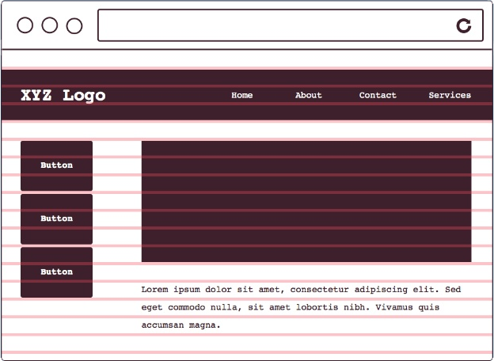
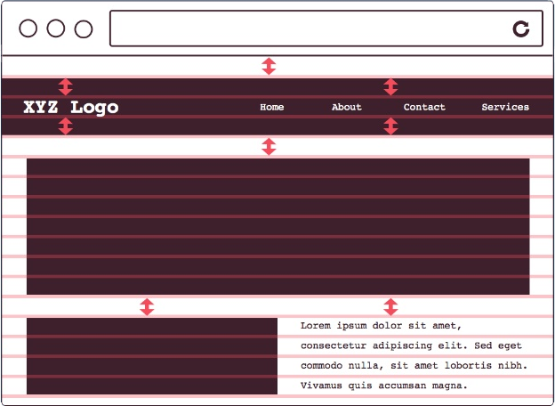
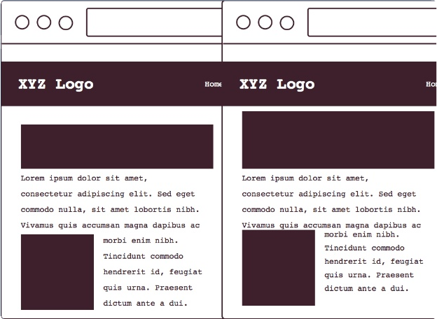
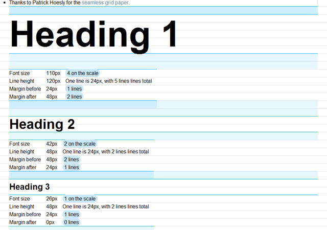

###### Front-End Develop SCHOOL

### 타이포그래피 시스템 (Typography System)

디자인 원칙에 따른 타이포그래피를 설계(Design)함을 말한다.

#### 모듈러 스케일(Modular Scale)

모듈러 스케일이란? 관계된 객체 간에 개별적으로 일정한 배율(Ratio)이 반영된 수의 나열이다.



##### 타입 스케일 배율(Type Scale Ratio)

- `1.067` — Minor Second
- `1.125` — Major Second
- `1.200` — Minor Third
- `1.250` — Major Third
- `1.333` — Perfect Fourth
- `1.414` — Augmented Fourth
- `1.500` — Perfect Fifth
- `1.600` — Minor Sixth
- `1.618` — Golden Ratio (황금 비율)
- `1.667` — Major Sixth
- `1.778` — Minor Seventh
- `1.875` — Major Seventh
- `2.000` — Octave
- `2.500` — Major Tenth

-

#### 베이스라인(Baseline)

베이스라인이란? 행(Row) 사이 간격으로 글자 크기(Font Size)를 포함하는 높이를 말한다.



-

#### 버터컬 리듬(Vertical Rhythm)

버티컬 리듬이란? 각 요소(Elements) 간의 수직적인 공간 배열 관계를 말한다.



-

#### 타이포그래피 시스템이 반영된 디자인

왼쪽 vs 오른쪽 결과물 중, 디자인 관점에서 우수한 것은 무엇일까?



---

### CSS 타이포그래피 시스템 & 모듈러 스케일

**모듈러 스케일** & **베이스라인** & **버티컬 리듬**이 반영된 타이포그래피 시스템 아름답지 아니한가?



수업 과정에서 만들어 본 Typography System 결과물


-

##### 모듈러 스케일을 반영한 단락, 제목 글자 크기 설정

> 폰트크기(font-size): 이전 폰트크기(previous-font-size) × 타입배율(type-scale)

```css
h5 {
  font-size: 1.125rem; /* (1 × 1.125) */
}

h6 {
  font-size: 1rem; /* 1rem = 16px */
}
```

-

##### 재사용 가능한 클래스 속성 설정

```css
h1,
.exa {
  font-size: 1.8020rem;
}

⋮

h6,
.kilo {
  font-size: 1rem;
}
```

-

##### 크기 범주를 넓히는 클래스 속성 설정

[미터법 접두사(Metric Prefix)](https://en.wikipedia.org/wiki/Metric_prefix)

```css
.yotta {
  font-size: 2.2807rem;
}

.zetta {
  font-size: 2.0273rem;
}

⋮

small, .milli {
  font-size: 0.8889rem;
}

.micro {
  font-size: 0.7901rem;
}
```

---

### 버티컬 리듬

```css
h1, h2, h3, h4, h5, h6,
p, ul, ol, dl, dd, figure,
blockquote, details, hr,
fieldset, pre, table {
  margin: 0 0 1.5rem;
}
```

-

##### 행간 설정 공식

> 행간(line-height): ceil( 폰트크기(font-size) ÷ 기본행간(base-line-height) ) × ( 기본행간(base-line-height) ÷ 폰트크기(font-size) )

```css
h1, .exa {
  /* line-height: ceil(1.802 ÷ 1.5) × (1.5 ÷ 1.802) */
  font-size: 1.8020rem;
  line-height: 1.6648;
}
```

-

##### 재사용 가능한 행간 클래스 속성 설정

```css
/* 공간 x1 */
.push {
  margin-bottom: 1.5rem;
}

/* 공간 제거 */
.push-none {
  margin-bottom: 0;
}

/* 공간 x2 */
.push-double {
  margin-bottom: 3rem;
}

/* 공간 1/2x */
.push-half {
  margin-bottom: 0.75rem;
}
```

-

##### 수업 시간에 작성한 CSS 코드 (행간, 마진 구하는 공식 정리)

```css
/* Baseline(Leading 24px) 가이드 추가 */
body {
  /*스타일 선언문*/
  /* 속성: 값; */
  /* 배경 이미지(background-image) 추가 */
  background-image: url("../images/Leading-24px.png");
}

/**
 * 본문 디자인(설계)
 * ---------------------------------------------
 * 글자 모양(Font Family): Spoqa Han Sans (Like Noto Sans)
 * 글자 색상(Color): #373737
 * 글자 크기(Font Size): 16px
 * 행간 비율(Line Height): 1.5 (16 x 1.5 = 24px)
 * 자간 설정(Letter Spacing): -25
 */
p {
  margin-bottom:  1.5em;
  font-family:    "Spoqa Han Sans";
  color:          #373737;
  font-size:      16px;
  line-height:    1.5;
  letter-spacing: -0.025em; /* Equal M */
}

/**
 * --------------------------------
 * 제목 디자인
 * h1~6
 *
 * Type Scale: x1.24
 * Base Font Size: 16px = 1em
 * ----------------------------- */
h6 {
  font-size: 1.24em;
  /*
  [ line-height을 구하는 공식 ]
  1) ceil( 글자 크기 비율(1.24) ÷ 행간 비율(1.5) ) = 글자 크기가 차지하는 행의 개수
     1.24/1.5 = .826666667 => 1개
  2) 행간 비율(1.5) ÷ 글자 크기 비율(1.24) × 행의 개수
     1.5/1.24 = 1.209677419 * 1
  */
  line-height: 1.2096;
  line-height: 1.21; /* ※ 행간을 소수점 3번째 자리까지 쓰되 올림 (다소 어긋난 높이 조정) */
  /*
  [ margin-bottom을 구하는 공식 ]
  행간 비율(1.5) ÷ 글자 크기 비율(1.24)
  1.5/1.24 = 1.209677419
  */
  margin-bottom: 1.2096em;
}
h5 {
  font-size: 1.5376em;
  line-height: 1.951; /* 행의 개수(2) × 0.9755  */
  line-height: 1.96;
  margin-bottom: 0.9755em; /* 1.5/1.5376 = 0.9755 */
}
h4 {
  font-size: 1.9066em;
  line-height: 1.5734; /* 행의 개수(2) × 0.7867 = 1.5734  */
  line-height: 1.58;
  margin-bottom: 0.7867em; /* 1.5/1.9066 = 0.7867 */
}
h3 {
  font-size: 2.3642em;
  line-height: 1.2688; /* 행의 개수(2) × 0.6344 = 1.2688 */
  line-height: 1.27;
  margin-bottom: 0.6344em; /* 1.5/2.3642 = 0.6344 */
}
h2 {
  font-size: 2.9316em;
  line-height: 1.5348; /* 행의 개수(3) × 0.5116 = 1.5348 */
  line-height: 1.54;
  margin-bottom: 0.5116em; /* 1.5/2.9316 = 0.5116 */
}
h1 {
  font-size: 3.6352em;
  line-height: 1.2378; /* 행의 개수(3) × 0.4126 = 1.2378 */
  line-height: 1.24;
  margin-bottom: 0.4126em; /* 1.5/3.6352 = 0.4126 */
}
```

---

### 모듈러 타이포그래피 도구

- [Typografier](http://typografier.web-dev.tools/)
- [type-scale](http://type-scale.com/)
- [modularscale](http://www.modularscale.com/)
- [gridlover](http://www.gridlover.net/)
- [Type Anatomy](https://www.supremo.tv/typeterms/)
- [Kerning Game](http://type.method.ac/)

### 읽어볼 참고 자료

- [A More Modern Scale for Web Typography](http://typecast.com/blog/a-more-modern-scale-for-web-typography)
- [How To Use Size, Scale, And Proportion In Web Design](http://vanseodesign.com/web-design/size-scale-proportion/)
