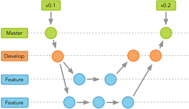
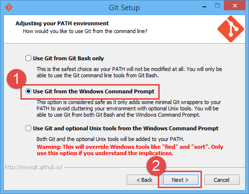

###### Front-End Develop SCHOOL

## Git 학습


### 0. Git에 대해

Git은 리눅스(Linux) 커널 프로젝트를 위한 버전 관리 시스템(VCS, Version Control System)으로 리눅스를 개발한 [리누스 토발즈](https://ko.wikipedia.org/wiki/%EB%A6%AC%EB%88%84%EC%8A%A4_%ED%86%A0%EB%A5%B4%EB%B0%9C%EC%8A%A4)에 의해 2005년도에 개발되었다. 프로젝트를 진행하면서 생성하는 코드를 분산 관리 하기 위해 사용되는 도구이다.

[ 참고: [짧게 보는 Git의 역사](https://git-scm.com/book/ko/v2/%EC%8B%9C%EC%9E%91%ED%95%98%EA%B8%B0-%EC%A7%A7%EA%B2%8C-%EB%B3%B4%EB%8A%94-Git%EC%9D%98-%EC%97%AD%EC%82%AC) / [Git, Wiki 글](https://ko.wikipedia.org/wiki/%EA%B9%83_(%EC%86%8C%ED%94%84%ED%8A%B8%EC%9B%A8%EC%96%B4)) ]

#### Git을 왜 사용할까?

###### 이유

1. 속도 (네트워크 및 파일 처리)
1. 동시 다발적인 개발 (협업 관리)
1. 책임성 (코드 오류 발생 근원지 파악/처리)
1. 대형 프로젝트를 효율적으로 지원

###### 풀이

1. 로컬에서 관리하여 속도가 빠르며, 캐시 알고리즘으로 변경된 부분을 제외하고는 이전에 기억된 파일로 링크만 걸어 빠르게 처리한다.
1. 전 세계 수많은 사람들이 동시 다발적으로 프로젝트를 갈라 각기 개발한 후, 관리자에 의해 개발된 결과 검토한 후 병합하며 관리한다.
1. 파일 변경 이력을 꼼꼼하게 기록하기 때문에 누가 언제 어떤 코드 라인을 수정했거나, 추가했는지 추적이 가능하다.
1. [리눅스 오픈 프로젝트 Github 저장소](https://github.com/torvalds/linux)를 살펴보면 무려 약 64만 건 이상 커밋을 처리하였다.

#### Git의 브랜치(Branch) 전략



Git은 나뭇가지 처럼 잘게 가지치듯 가지(Branch)를 쳐서 프로젝트를 관리하는 시스템이다. Master 브랜치를 시작으로 Develop 브랜치를 파생시킨 후, 개발을 진행한다. 필요할 경우 Feature 브랜치를 Develop 브랜치에서 파생하여 각각의 기능을 개발한 후, Develop 브랜치에 병합(Merge)한다. 개발 완료된 사항은 Master 브랜치에 다시 병합하여 관리하게 된다.

#### Git의 동작원리

##### Snapshot

- 데이터를 가져오거나 프로젝트에 기록할 때, __해당 시점의 파일의 스냅샷을 저장__
- 변경되지 않은 파일은 다시 파일을 저장하지 않고 이전에 기록된 파일을 링크하여 처리

##### Checksum

- 데이터를 저장하기 전에 체크섬을 구하고, __체크섬을 통해 데이터를 관리__
- SHA-1 해시 사용 (`bc33boca11e3df467777a4fa7639ba488c9d4911`)
  - 16진수 문자 40개로 구성된 문자열 (커밋 ID 라던가.. 앞 6자리 활용)
  - 파일의 내용 또는 디렉토리 구조를 기반으로 계산
- 파일 이름이 아닌, 콘텐츠의 해시 값을 기록 (파일 이름이 변경되어도 내용이 동일하기에 추적 가능)

##### Sections

Git은 3가지 영역을 통해 프로젝트를 관리한다.

Working Directory | Staging Area | Repository
----------------- | ------------ | ----------
작업 공간(Untracked Files) | 스테이지(관찰 공간, Tracked Files) | 저장소 공간


##### Lifecycles

Git은 생명 주기를 통해 파일 관리한다.

Untracted | Unmodified | Modified | Staged
--------- | ---------- | -------- | ------
관찰 중이지 않은 | 수정되지 않은 | 수정된 | 스테이지에 기록된


-

### 1.1. Git 설치

[Git Download](http://git-scm.com/download) 클릭 후, 사용 중인 운영체제 버전에 맞게 설치합니다.

※ Windows 사용자의 경우, 설치 과정에서 __Use Git from the Windows Command Prompt__ 체크 권장.



### 1.2. Git 설정 정보

Git에서는 협업 간, 책임성을 유지하기 위해 커밋(Commit)한 사람의 이메일(Email)과 이름(Name)이 반드시 필요합니다.

#### 설정 파일 위치

1. SYSTEM 전역 경로
1. `$HOME/.gitconfig`
1. `Working_directory/.git/config`

#### 사용자 정보 설정

```sh
$ git config --global user.name <사용자 이름>
$ git config --golbal user.email <사용자 이메일>

# 예시 -----------------------------------------------------------
# [user]
#   name = Jee Hoon
#   email = yamoo9@naver.com

# ------------------------------
# 글로벌 Git 설정 파일 편집(수정)
# ------------------------------
$ git config --global --edit
```

-

### 2. Git 작업 흐름(Workflow)

명령어 | 설명
--- | ---
`init` | Git 저장소(Repository) 초기화
`status` | Git 저장소 현재 상태 조회
`add` | 파일을 스테이지(변경 관찰)에 추가
`commit` | 스테이지에 있는 파일을 저장소에 추가
`log` | 작성한 커밋 및 작업한 파일 변경 이력 조회
`diff` | 이전/현재 커밋 차이점 비교
`branch` | 브런치(가지치기) 처리
`tag` | 태그 추가
`checkout` | Branch 이동 및 특정 파일 다운로드
`merge` | 병렬적으로 진행된 Brach를 하나의 Brach로 병합

-

### 3.1 Git 저장소 초기화

현재 디렉토리를 Git 저장소로 설정하는 명령<br>
※ 감춰진 .git 디렉토리가 생성된다.

```sh
$ git init
```

#### 실습

```sh
## 1. 새로운 디렉토리 생성/이동
$ mkdir git_test && cd git_test


## 2. Git 저장소 초기화 설정
$ git init
# Initialized empty Git repository in /Users/yamoo9/Desktop/git_test/.git/
# git_test git:master → 기본적으로 Master 브랜치(Branch)가 생성됨.


## 3. 환경 설정 확인
$ cat .git/config
# [core]
#   repositoryformatversion = 0
#   filemode                = true
#   bare                    = false
#   logallrefupdates        = true
#   ignorecase              = true
#   precomposeunicode       = true


## 4. 사용자 정보 입력
$ git config user.name yamoo9
$ git config user.email yamoo9@naver.com


## 5. 입력된 사용자 정보 확인
$ cat .git/config
# [core]
#   repositoryformatversion = 0
#   filemode = true
#   bare = false
#   logallrefupdates = true
#   ignorecase = true
#   precomposeunicode = true
# [user]
#   name = yamoo9
#   email = yamoo9@naver.com
```

### 3.2 `.gitignore` 파일 설정

무시(Ignore)할 디렉토리/파일 설정<br>
※ 운영체제에서 생성한 파일 또는 Log 파일 등 Git에서 관리할 필요가 없는 파일을 제거해주는 것이 좋습니다.

#### [.gitignore](https://www.gitignore.io/) 설정

```sh
$ vi .gitignore
# vim 화면에서 i 키를 누르면 INSERT 모드(코드 작성 모드)에 진입
# vim 화면을 나갈 경우 ESC 키를 누르고 :wq 입력 ENTER 키를 누르면 파일이 저장되고 vim 화면을 나간다.


## .gitignore 예시

### OSX ###
*.DS_Store
.AppleDouble
.LSOverride

### Windows ###
# Windows thumbnail cache files
Thumbs.db
ehthumbs.db
ehthumbs_vista.db

# Folder config file
Desktop.ini
```

-

### 4. Git 저장소 현재 상태 확인

Git 저정소 현재 상태를 확인하는 명령

```sh
$ git status

# On branch master
#
# Initial commit
#
# Untracked files:
#   (use "git add <file>..." to include in what will be committed)
#
#         .gitignore
#
# nothing added to commit but untracked files present (use "git add" to track)
```

-

### 5. Git 관리할 파일 추가

Working Directory에 있는 파일을 Staging Area로 추가 하는 명령

```sh
$ git add <파일 이름>

# 예시 -----------------------------------------------------------
$ git add .gitignore
$ git status

# On branch master
#
# Initial commit
#
# Changes to be committed:
#   (use "git rm --cached <file>..." to unstage)
#
#         new file:   .gitignore
```

Staging Area 파일을 다시 Working Directory로 돌리는 명령

```sh
$ git rm --cached <파일 이름>

# 예시 -----------------------------------------------------------
$ git rm --cached .gitignore
$ git status
# On branch master
#
# Initial commit
#
# Untracked files:
#   (use "git add <file>..." to include in what will be committed)
#
#         .gitignore
#
# nothing added to commit but untracked files present (use "git add" to track)
```

Staging Area로 추가할 파일이 많은 경우는 `.`을 사용하여 명령 수행

```sh
$ git add .
```

여러 개의 파일들을 Working Directory로 다시 이동하게 하는 명령

```sh
$ git rm --cached -r .
```

인터랙티브 모드를 사용하여 Staging Area 추가하고자 하는 파일을 설정하는 명령

```sh
$ git add -i

# *** Commands ***
#   1: status       2: update       3: revert       4: add untracked
#   5: patch        6: diff         7: quit         8: help
# What now>

# What now> 4
#   1: .gitignore
#   2: about.html
#   3: index.html
# Add untracked>>

# Add untracked>> 1, 3
# * 1: .gitignore
#   2: about.html
# * 3: index.html

# ENTER 키: 실행
# Ctrl+C : 종료
```

-

### 6. Git 커밋(Commit)

Staging에 있는 파일을 Repository로 추가하는 명령

```sh
$ git commit
$ git commit -m <커밋 메시지(간략)>
$ git commit -a -m <커밋 메시지(간략)> # 이미 Repository에 존재하는 파일만 가능.
```

-

### 7.1 Git 로그(Log)

저장소에 있는 커밋 이력을 조회하는 명령

```sh
$ git log                                     # 모든 파일 이력 상세 조회
$ git log --oneline                           # 한 줄로 커밋 ID, 타이틀 출력
$ git log --oneline --decorate --graph --all  # 브런치 및 그래프 결과 한 줄로 모두 출력
$ git log -- <파일 이름>                        # 특정 파일 이력 조회
```

### 7.2 좋은 커밋 메시지

커밋 메시지는 짧고 명확하게!

- __커밋 요약 내용__은 __50자 내외__ 권장
- __커밋 상세 내용__은 __한 줄에 72자 내외__ 권장

-

### 8. Git 커밋 결과 차이(Difference) 비교

다른 커밋과 Working Directory를 비교하는 명령

```sh
$ git diff
$ git diff <커밋 ID>
$ git diff <커밋 ID> -- <파일 이름>


# 예시 -----------------------------------------------------------

$ git diff e8b1632 -- index.html

# diff --git a/index.html b/index.html
# index 498fe2f..424cf9d 100644
# --- a/index.html
# +++ b/index.html
# @@ -1,3 +1,9 @@
# -<body></body>
# +<!doctype html>
# +<html lang="en">
# +  <head>
# +   <title>Git Difference</title>
# +  </head>
# +  <body>
# +   <h1>git diff</h1>
# +  </body>
#  </html>
```

-

### 9. Git 브랜치(Branch)

브랜치를 생성, 수정, 삭제하는 명령

```sh
$ git branch <브랜치 이름>               # 생성
$ git branch -d <브랜치 이름>            # 제거
$ git branch -m <브랜치 이름> <바꿀 이름>  # 이름 변경
$ git branch                           # 브랜치 목록 조회
```

※ 주의! master 브랜치 상태에서 한번도 커밋하지 않은 상태에서 새로운 브랜치를 만들면 오류 발생.
> fatal: Not a valid object name: 'master'.

-

### 10. Git 체크아웃

Working Directory의 소스를 특정 커밋으로 변경하는 명령

````sh
$ git checkout <브랜치 이름>                   # 특정 브랜치로 변경
$ git checkout <커밋 ID>                      # 특정 커밋 ID로 변경
$ git checkout <커밋 ID> -- <파일 이름(경로)>   # 특정 커밋 ID의 파일 이름에 해당하는 내용 복구(되돌림).

# 예시 -----------------------------------------------------------

$ git branch dev
$ git branch release
$ git branch
#   dev
# * master
#   release

$ git checkout dev
# Switched to branch 'dev'

$ git branch
# * dev
#   master
#   release
```

-

### 11. Git 병합(Merge)

다른 두 개의 소스를 병합하는 명령

```sh
$ git merge <브랜치 이름>
```

#### 병합이 잘 되는 경우와 충돌이 발생하는 경우

- 잘 되는 경우: 중복되는 위치의 파일에 변경 사항이 없는 경우 (자동으로 처리 잘 됨)
- 충돌이 발생하는 경우: 중복되는 위치의 파일에 변경이 발생한 경우 (수동으로 조정 필요)

#### 충돌이 발생하면 수동으로 조정 필요

중복되어 충돌된 내용을 살펴본 후, 불필요한 내용을 지운 후 병합을 다시 시도한다.

```sh
<<<<< head:
현재 브랜치에 포함된 내용
======
다른 브랜치에 포함된 내용
>>>>> <브랜치 이름>

# 예시 -----------------------------------------------------------

$ git merge dev
# Auto-merging sum.js
# CONFLICT (content): Merge conflict in sum.js
# Automatic merge failed; fix conflicts and then commit the result.

$ cat sum.js
# var m = 0;
#
# <<<<<<< HEAD
# for (; m>=101; m++) {
# =======
# for (; m>100; m++) {
#   if (m % 5 === 0) { continue; }
# >>>>>>> dev
#   console.log(m);
# }

# 충돌난 부분 수동 수정 후, 커밋 (병합 성공) ----------------------------

$ vi sum.js # vim 에디터로 수정
$ cat sum.js
# var m = 0;
#
# for (; m>100; m++) {
#   if (m % 5 === 0) { continue; }
#   console.log(m);
# }

$ git commit -a -m 'fix merge dev'
# [master f083f8f] fix merge dev

$ git log --decorate --graph --all
# *   commit f083f8f5bfe884ea1a355f7d1f2ea17eb1c2ee60 (HEAD -> master)
# |\  Merge: 2ca81e6 9d1d95b
# | | Author: Jee Hoon <yamoo9@naver.com>
# | | Date:   Tue Jan 17 19:27:46 2017 +0900
# | |
# | |     fix merge dev
# | |
# | * commit 9d1d95bb1f718ae5144b795916ed27b55fb2a3be (dev)
# | | Author: Jee Hoon <yamoo9@naver.com>
# | | Date:   Tue Jan 17 19:17:28 2017 +0900
# | |
# | |     add condition
# | |
# * | commit 2ca81e69a8c5238eb46fc9ddbeeeed43290f277b
# |/  Author: Jee Hoon <yamoo9@naver.com>
# |   Date:   Tue Jan 17 19:20:49 2017 +0900
# |
# |       fix for statement
# |
# * commit 37c60fdc00048f2f91479ddf2b32e8cb779521dd
#   Author: Jee Hoon <yamoo9@naver.com>
#   Date:   Tue Jan 17 19:15:14 2017 +0900
#
#       add sum.js
```

### xcrun: error 오류 발생 시 대처 방법

```sh
$ git version
xcrun: error: invalid active developer path (/Library/Developer/CommandLineTools), missing xcrun at: /Library/Developer/CommandLineTools/usr/bin/xcrun
```

아래 명령 실행하면 문제 해결.

```sh
$ xcode-select --install
```
---

### 12. Git 참고 자료

- [Git 간편 안내서](https://rogerdudler.github.io/git-guide/index.ko.html)
- [쉬운 Git 사용법](http://programmerchoo.tistory.com/m/category/programmer/Git%20%EC%82%AC%EC%9A%A9%EB%B2%95)
- [누구나 쉽게 이해할 수 있는 Git 입문](https://backlogtool.com/git-guide/kr/)
- Pro Git(번역) [ [온라인 버전](https://git-scm.com/book/ko/v2) | [다운로드 버전](../PDF/progit-ko.pdf) ]
- [Git 브랜치 배우기](http://learnbranch.urigit.com/)
- [git-flow cheatsheet(번역)](http://danielkummer.github.io/git-flow-cheatsheet/index.ko_KR.html)
- [Git 치트시트 (프린트용)](../PDF/git-cheatsheet-print.pdf)
- [좋은 커밋 메시지 작성하기](http://www.haruair.com/blog/2738)
- [SVN 능력자를 위한 GIT](http://www.slideshare.net/einsub/svn-git-17386752)
- [Git 문서](https://git-scm.com/docs)
- [Learn Git, CodeCademy](https://www.codecademy.com/learn/learn-git)
- [ADD GIT BRANCH NAME TO TERMINAL PROMPT (MAC)](http://mfitzp.io/article/add-git-branch-name-to-terminal-prompt-mac/)
