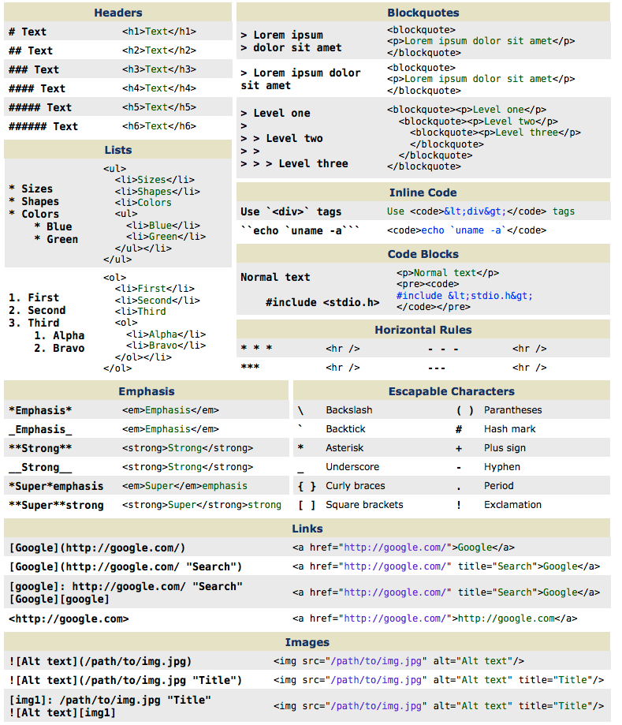

###### Front-End Develop SCHOOL

## Github 소셜 코딩


### 0. Github 서비스

#### 0.1 Github 란?

- Git Repository 가 아주 많이 모여있는 온라인 서비스
- 개발자들 간 소통이 원할한 Pull Request
- 소스 코드 공유와 참여(기여)가 손쉽게 가능

#### 0.2 Github 특징

- __Repository Fork__<br>
  프로젝트를 새로 만들지 않아도 다른 이의 프로젝트를 복사해서 나의 프로젝트로 옮길 수 있음
- __Pull Request__<br>
  소스의 변경사항을 Fork한 저장소에 커밋 후, 원작자에게 원본 소스 변경을 요청할 수 있음
- __Social Networking__<br>
  다른 이가 어떤 프로젝트에 참여 중이며, 어떻게 코드를 변경 작성했는지 볼 수 있고 프로젝트에 대한 의견 교환이 가능
- __Change Logs__<br>
  다수의 사용자가 프로젝트를 함께 수행하면 이력 관리가 매우 어려운데, Github 서비스를 이용하면 손쉽고 편리하게 관리할 수 있음

-

### 1. Github 가입 및 둘러보기

#### 1.1 Github 가입
1. [Github.com](http://github.com/) 접속
1. 화면 우측 상단의 `Sign Up` 버튼 클릭
1. `Username` / `Email Address` / `Password` 입력 후, `Create an acount` 버튼 클릭하여 가입
1. Personal Plan 선택 후, `Finish sign up` 버튼 클릭

> 참고 URL: [그래픽 이미지로 확인하는 Github 가입 절차](http://kkikkodev.tistory.com/36)

#### 1.2 Github 공개된 저장소 둘러보기

1. [Explore Github](https://github.com/explore) 접속
1. 관심있는 분야의 카테고리를 클릭한 후, 저장소를 살펴본다.
1. 다른 방법은 Search Github 입력 창에 관심사를 입력 후 저장소를 살펴본다.

-

### 2. Github 저장소(Repository) 생성

- 저장소 이름 (`e.g) https://github.com/{user_id}/<repository_id>`)
- 공개 여부 (※ 비 공개는 유료 버전에서만 가능. 즉, 무료 사용자는 기본 공개 됨)
- 소개 글 (`README.md` 파일 추가)

#### `README.md` 파일 작성을 위한 마크다운(Markdown) 문법 살펴보기

마크다운은 HTML 형식의 문서를 손쉽게 작성할 수 있는 메타 언어이다.



#### 2.1 마크다운 에디터

- [온라인 에디터: dillinger.io](http://dillinger.io/)
- [온라인 에디터: stackedit.io](https://stackedit.io/)
- [오프라인 에디터(Chrome 익스텐션): stackedit](https://chrome.google.com/webstore/detail/stackedit/iiooodelglhkcpgbajoejffhijaclcdg?utm_source=chrome-ntp-icon)

-

### 3. Git 명령어

#### 3.1 Remote Add

로컬 저장소(내 컴퓨터 저장소)에 원격 저장소(Github 저장소) 등록하는 명령

```sh
$ git remote add <별칭(alias)> <Github 저장소 주소(url)>

# 예시 ----------------------------------------------------
$ git remote add origin http://github.com/.../repo/

$ git remote -v # 등록 확인하기
```

#### 3.2 Fetch & Pull

##### Fetch

원격 저장소(Github 저장소) 자료를 로컬 저장소(내 컴퓨터 저장소)로 다운로드 받는 명령

```sh
$ git fetch [<별칭(alias)>] [<브랜치(branch) 이름>]

# 예시 ----------------------------------------------------
$ git fetch origin
```

##### Pull

원격 저장소에 있는 자료를 로컬 저장소로 다운로드 받은 후, 자동으로 병합을 수행하는 명령어

```sh
$ git pull [<별칭(alias)>] [<브랜치(branck) 이름>]

# 예시 ----------------------------------------------------
$ git pull origin
```

#### 3.3 Push & Clone

##### Push

로컬 저장소 자료를 원격 저장소로 업로드하는 명령

```sh
$ git push [<별칭(alias)>] [<브랜치(branch) 이름>]

# 예시 ----------------------------------------------------
$ git push -u origin master

# 옵션 -u, --set-upstream   git pull/status 업스트림(upstream) 설정
```

##### Clone

공개된 원격 저장소 자료를 복사하여 내 컴퓨터로 다운로드하는 명령

```sh
$ git clone [<원격 저장소 주소(url)>]

# 예시 ----------------------------------------------------
$ git clone https://github.com/yamoo9/FDS
```

#### 3.4 Pull Request

오픈 소스에서 기능 개선 또는 버그가 발견된 경우, 해당 문제를 직접 수정한 후 원작자에게 변경 사항을 수정 반영을 요청하는 명령

##### Pull Request가 필요한 이슈(Issue)의 경우

- 신규 기능을 추가하고자 하는 경우
- 오픈 소스에 버그가 있는 경우

##### Pull Request 단계

1. __Fork__          : 원작자의 원격 저장소 포크 (원격 저장소를 사용하기 위한 권한 처리)
1. __Clone__         : 원격 저장소 자료를 로컬 저장소르 복사
1. __Branch__        : master 브랜치에서 개발에 사용하고자 하는 이름의 브랜치 생성
1. __Checkout__      : 생성한 브랜치로 변경
1. __Source Change__ : 소스 변경
1. __Commit__        : 변경 이력 사항 커밋
1. __Push__          : 로컬 저장소의 브랜치 작업 내용을 원격 저장소에 업로드
1. __Pull Request__  : 변경 사항을 원작자에게 공지한 후, 원본 소스에 반영 요청

-

### 4. Github 둘러보기

- Watch, Star, Fork
- Issues
- Wiki
- Graphs


