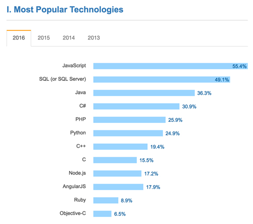
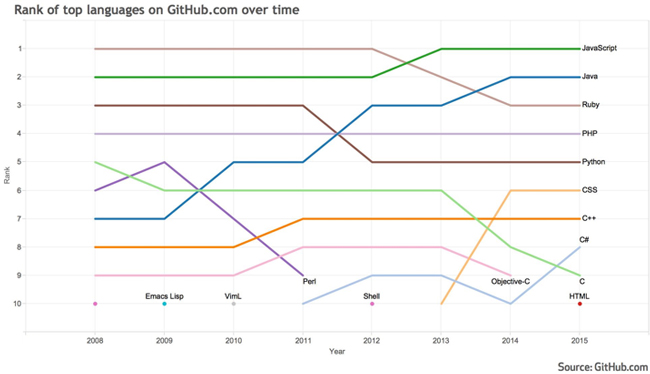

[← Back](README.md)

## 자바스크립트(JavaScript)

Javascript는 HTML, CSS와 함께 웹을 구성하는 요소중 하나로 웹브라우저에서 동작하는 유일한 언어이다.

JavaScript는 멀티-패러다임 언어로 명령형 (imperative), 함수형 (functional), 프로토타입 기반 (prototype-based) 객체지향형 언어다.

비록 다른 객체지향적인 언어들과의 차이점에 대한 논쟁들이 있긴 하지만, JavaScript는 강력한 객체지향 프로그래밍 능력들을 지니고 있다. <del>간혹 클래스가 없어서 객체지향이 아니라고 생각하는 사람들도 있으나</del> <ins>클래스가 ES2015부터 추가되어 전통적인 방식의 객체지향 방법도 지원하는</ins>, 프로토타입 객체지향 방식의 객체지향 언어다.

JavaScript는 웹은 물론 모바일 하이브리드 앱(PhoneGap, Sencha Touch, jQuery Mobile, Appcelerator), 서버 사이드([NodeJS](http://nodejs.org/) or Wakanda), Desk-top(Electron, NW.js, AppJS), 로봇 제어(NodeBots or noduino) 언어로서 세계에서 가장 인기있는 언어이다. ([가장 많은 오해를 받는 언어이기도 하다](http://javascript.crockford.com/javascript.html))

1995년 Brendan Eich(Nescape)이 Navigator 2를 위하여 웹페이지에 포함되는 스크립트 언어로서 개발되었으며 초창기 Javascript는 웹페이지 제작에 있어서 보조적인 기능을 수행하기 위해 한정적인 용도로 주로 사용되었다. 이 시기에 대부분 로직은 주로 웹서버에서 실행되었고 브라우저(클라이언트)는 서버로 부터 전달받은 HTML과 CSS를 렌더링하는 수준이었다.

하지만 웹이 더욱 발전하면서 과거 웹서버에서 수행되던 많은 역할들이 클라이언트로 이동하였는데 이것은 자바스크립트의 발전 덕분이다. 특히 [jQuery](http://jquery.com/)의 등장으로 다소 번거롭고 논란이 있던 DOM(Document Object Model)를 보다 쉽게 제어할 수 있게 되었다. 이는 정적인 웹페이지에 역동성을 부여하기 위한 목적으로 JavaScript의 위상을 더욱 높이는 계기가 되었다.

구글의 V8 Javascript Engine을 기초로 한 [Node.js](http://nodejs.org/)를 통해 이제는 웹 브라우저를 벗어난 환경에서도 개발이 가능해졌고 이로 인해 다양한 프레임워크 및 도구들까지 생겨나면서 그간 웹 브라우저에서만 동작하는 반쪽짜리 언어 취급을 받던 자바스크립트가 이제는 완벽한 Full stack 개발 언어로 생태계를 구축해나가고 있음은 물론 크로스 플랫폼을 위한 모바일 웹/앱 개발 분야에서도 주목받고 있다.

최근에는 SPA(Single Page Application) 웹 앱이 대중화되면서 [AngularJS](https://angularjs.org/), [Backbone.js](http://backbonejs.org/), [Ember.js](http://emberjs.com/) 등 다양한 SPA Framework와 안정적 성능과 뛰어난 편의성을 가진 [jQuery](http://jquery.com)와 같은 라이브러리 또한 많은 사용층을 확보하고 있다.

Front-end 영역은 이미 JQuery, AngulaJS, React, Backbone과 같은 JavaScript Framework가 강세를 나타내고 있으며 Back-end 영역 역시 node.js, express, SocketIO 등의 JavaScript Framework가 두각을 나타내고 있고 Front-end와 Back-end를 아우르는 웹 프로그래밍 언어의 표준으로 자리잡고 있다.

[Stackoverflow Developer Survey Results 2016](http://stackoverflow.com/research/developer-survey-2016#technology)

-

The rank of top languages on Github.com over time

-

월마트, 이베이, 페이팔, 우버, 야후, 그루폰 등 거대 글로벌 기업들의 JavaScript 환경으로 전환함에 따라 이와 같은 추세는 앞으로 더욱 가속될 전망이다. 빠르고 쉽게 서비스를 구축할 수 있는 장점을 가지고 있어 많은 Start-up기업 또한 JavaScript 환경을 사용하고 있다.

JavaScript는 C-family language로 `C`, `JAVA`에서 많은 문법을 차용했으며 `Awk`, `Perl`, `Python` 으로부터도 영향을 받았다.

JavaScript는 Interpreter language이기 때문에 compile이 필요없어 HTML 파일 안에 직접 기술이 가능하다.

---

### [ECMAScript Version](https://developer.mozilla.org/ko/docs/Web/JavaScript/%EC%96%B8%EC%96%B4_%EB%A6%AC%EC%86%8C%EC%8A%A4)

- ECMAScript 3 : [ECMA-262 3rd edition (1999.12)](http://www.ecma-international.org/publications/files/ECMA-ST-ARCH/ECMA-262,%203rd%20edition,%20December%201999.pdf) 가장 범용적으로 지원되는 버전이다.
- ECMAScript 5 : [ECMA-262 5th edition (2009.12)](http://www.ecma-international.org/publications/files/ECMA-ST-ARCH/ECMA-262%205th%20edition%20December%202009.pdf) HTML5와 함께 출현한 표준안이다. 인터넷 익스플로러 9이상이나 그 외 브라우저에서만 작동한다.
- ECMAScript 6 : [ECMA-262 6th edition (2015.06)](http://www.ecma-international.org/ecma-262/6.0/ECMA-262.pdf) `Symbol` type, `let` keyword, `module system`, `Arrow Function`, `class` 등이 추가되었다. [#ES2015](http://es6-features.org/)
