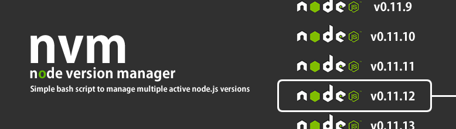

## NVM(Node Version Manager) 설치



### Windows 사용자

[nvm-windows](https://github.com/coreybutler/nvm-windows/) 설치

#### NVM 명령어 (Windows)

- `nvm version`                  <br>현재 실행 중인 NVM 버전을 출력합니다.
- `nvm list [available]`         <br>설치 가능한 Node.js 버전 목록을 출력합니다.
- `nvm install <version> [arch]` <br>버전(Version) 값은 node.js 버전 또는 최신 안정 버전(latest)을 입력할 수 있습니다. 선택적으로 32/64 비트 버전 설치 여부를 지정할 수 있습니다. 32/64 비트 버전을 모두 설치하려면 [arch] 값을 "all"로 설정합니다.
- `nvm use <version> [arch]`     <br>설치된 버전 중 사용하고자 하는 버전을 설정합니다. 선택적으로 32/64 비트 모드를 설정할 수 있습니다.
- `nvm uninstall <version>`      <br>설치 된 특정 Node.js 버전을 제거합니다.
- `nvm on`                       <br>Node.js 버전 관리를 활성화 합니다.
- `nvm off`                      <br>Node.js 버전 관리를 비 활성화 합니다. (비 활성화한다고 해서 Node.js가 제거되지는 않습니다)
- `nvm arch [32|64]`             <br>Node.js가 32/64 비트 모드로 실행 중인지 표시합니다. 기본 아키텍처를 대체하려면 32/64 비트 모드를 설정할 수 있습니다.
- `nvm proxy [url]`              <br>Node.js 다운로드 시에 사용 할 프록시를 설정합니다. 현재 프록시를 보려면 [url] 값을 비워 둡니다. [url]을 "none"으로 설정하면 프록시를 제거합니다.
- `nvm root <path>`              <br>NVM을 설정할 Node.js 경로를 설정할 수 있습니다. (<path> 값을 설정하지 않을 경우, 현재 경로가 출력됩니다)

---

### Mac OSX 사용자

#### 1. 이미 Node.js 가 설치되어 있다면 제거

##### homebrew를 사용해서 인스톨 했다면 아래 방법으로 제거

[이슈](https://github.com/creationix/nvm/issues/855#issuecomment-146115434)에서 볼 수 있듯, `v0.31.1`의 `nvm`은 `osx`의 `homebrew`를 지원하지 않음. `brew`를 통해서 `nvm` 및 `node`를 설치하면 충돌이 발생! `nvm`을 사용하시기로 마음 먹었다면, `homebrew`를 사용해서 인스톨 한 `nvm`, `node.js`를 모두 삭제.

```sh
$ sudo brew uninstall node —force sudo brew uninstall nvm —force
```

#### 2. nvm 설치

[NVM:GitHub](https://github.com/creationix/nvm)의 지시에 따라서 `nvm`을 설치.

최신 버젼은 아래의 커맨드로 설치.

```sh
$ curl -o- https://raw.githubusercontent.com/creationix/nvm/v0.31.1/install.sh | bash
```

#### 3. nvm 실행

`nvm` 자동 실행시키기. 이제부터 실행시키는 모든 `node`의 버젼은 `nvm`이 관리하게 될 것.
하지만 위 작업은 영구적인 것이 아니기 때문에, 터미널이 오픈될 때마다 실행시켜주어야 한다는 불편함이 있음.
따라서 사용 중인 컴퓨터의 `.profile`, `.bashrc` 혹은 `.zshrc`에 다음의 문구를 추가.

```sh
$ source /Users/$USER/.nvm/nvm.sh
```

터미널이 오픈될 때마다, `nvm`이 골라준 `node`를 실행시킬 수 있음.

##### nvm, 설치 가능한 Node 버전 탐색

```sh
$ nvm ls-remote
```

##### nvm, 새로운 Node 버전 설치

```sh
$ nvm install #{version} #6.6.0
```

##### nvm, 설치된 Node 버전 보기

```sh
$ nvm ls
```

##### nvm, 사용할 Node 버전 설정

```sh
nvm use #{version}
```

##### NPM 최신 버전 업데이트

```js
$ npm install -g npm@latest
```
