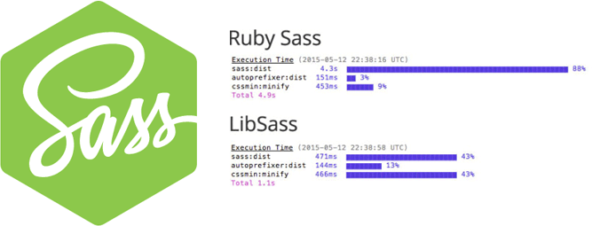

###### Front-End Develop SCHOOL

# Sass (Syntactically Awesome Style Sheet)

Sass 프리프로세서를 사용하는 환경은 Ruby / Node.js 등 입니다.
우리 수업에서는 Node.js 환경에서 공부해 봅니다.<br>
Node.js 환경의 Sass 처리 속도가 Ruby 기반의 Sass보다 확연하게 빠르기 때문입니다.

[](http://blog.greggant.com/posts/2015/06/12/libsass-vs-sass-benchmark.html)

-

### 1-1. 명령어 프롬프트 환경(<abbr title="Command Line Interface">CLI</abbr>) 구성


- **Mac OSX** [ Terminal / [iTerm](https://www.iterm2.com/) / [hyperjs](https://hyper.is/) ]
- **Windows** [ CMD / PowerShell / [Git Bash](https://git-for-windows.github.io/) / [Cmder ([참고](http://demun.tistory.com/2508))](http://cmder.net/) / [hyperjs](https://hyper.is/) ]
- [명령어(Command) 공부하기 (★★★★★)](./CLI.md)

-

### 1-2. JavaScript 개발 환경 구성

Node.js는 Back-End 개발 환경이지만, 오늘 날 Front-End 개발 환경 구축을 위해서도 필수적으로 사용됩니다. Node.js의 버전은 6.5.0 이상이면 어떤 것이든 상관 없습니다.
Node.js의 표준 패키지 관리자 NPM(Node Packages Manager)은 Node.js에 포함되어 있기 때문에 별도로 설치할 필요가 없습니다.

- [Node.js](https://nodejs.org/) : Google V8 엔진을 사용하여 제작된 JavaScript 런타임
- [NPM](https://www.npmjs.com/) : Node.js 패키지 매니저
- [NVM 사용하여 Node.js 설치/관리 (★★★★★)](./NVM.md)

※ Ubuntu 또는 Debian 사용자라면 Node.js 설치시 다음 명령을 실행합니다.<br>
&nbsp;&nbsp;&nbsp;설치와 관련된 자세한 내용은 Linux 배포판 용 [package manager installations page](https://nodejs.org/en/download/package-manager/)를 참고하세요.

```sh
$ curl -sL https://deb.nodesource.com/setup_6.x | sudo -E bash -
$ sudo apt-get install -y nodejs
```

NPM을 대체하는 새로운 패키지 매니저 [Yarn](./Yarn.md)을 공부해봅시다.

-

### 1-3. Node-Sass 개발 모듈 설치

[node-sass Github 저장소](https://github.com/sass/node-sass) 참고.

#### 1-3-1. 설치

```sh
$ npm install node-sass          # 프로젝트 로컬 설치
$ npm install node-sass --global # 컴퓨터 전역 설치
```

#### 1-3-2. [CLI 사용법](https://github.com/sass/node-sass#command-line-interface)

```sh
$ node-sass [옵션] <입력> [출력]

# 예시 ---------------------------------------------------------------------------

## Sass 파일 변환 기본 사용법
$ node-sass sass/style.sass css/style.css

## Sass 디렉토리(하위 디렉토리 포함) 변환 관찰 실행 명령
$ node-sass --watch --recursive sass --output css
$ node-sass -w -r sass -o css --output-style expanded --source-map ./map

## 옵션
--help                     도움말 출력
-v, --version              Sass 버전 정보 출력
--output-style             CSS 출력 스타일 설정 (nested | expanded | compact | compressed)
-w, --watch                디렉토리/파일 관찰
-o, --output               출력 디렉토리 설정
-r, --recursive            하위 디렉토리/파일 포함하여 관찰
-q, --quiet                컴파일 오류 발생 로그 말고는 로그(기록)를 제한하는 설정
--indent-type              CSS 변환 파일에 사용될 들여쓰기 유형 설정 (space | tab)
--indent-width             spaces 또는 tabs의 개수 설정 (최댓값: 10)
--source-map               소스맵 설정
--precision                소수점 자리 설정 (기본값: 4)

## Sass → CSS 출력 방식
compact  : 한 줄로 정리 (촘촘하게)
compress : 압축 (공백 없이)
expanded : 확장
nested   : 중첩
```

-

### 1-4. Sass 레퍼런스
  - [Sass API](http://sass-lang.com/)
  - [Sass 개발 환경/버전 호환성 검사](http://sass-compatibility.github.io/)
  - Sass 가이드라인 [ [en](https://sass-guidelin.es/) / [ko](https://sass-guidelin.es/ko/) ]
  - Sass 플레이 그라운드 [ [sassmeister.com](http://www.sassmeister.com/) / [sass.js.org](http://sass.js.org/) ]
  - [Airbnb CSS / Sass 스타일 가이드(번역)](https://github.com/CodeMakeBros/css-style-guide)
