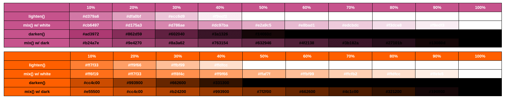
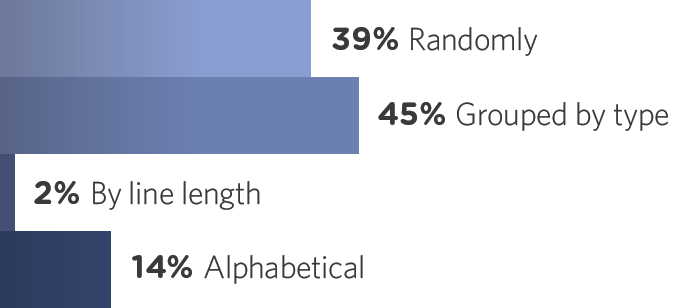
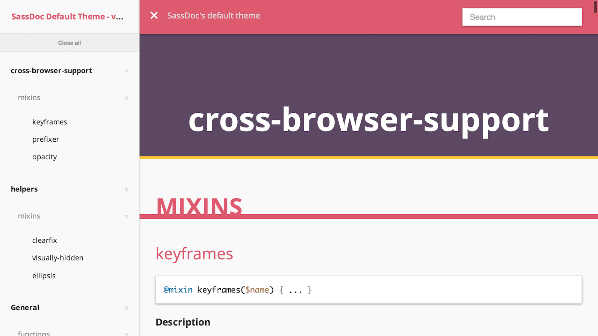

###### Front-End Develop SCHOOL

# Sass Guideline

### 왜 스타일가이드가 필요한가?

스타일가이드는 여러분의 코드에 대한 이상적인 상태를 제시하는 그저 읽기에 즐거운 문서가 아닙니다. 어떻게 그리고 왜 코드가 쓰여져야 하는지를 묘사하는, 프로젝트의 일생에서 핵심이 되는 문서입니다. 작은 프로젝트에서는 이것이 지나친 노력으로 보일 수 있습니다. 하지만 코드베이스를 깔끔하고 확장 가능하며 쉽게 관리할 수 있도록 유지하는 데 큰 도움이 됩니다.
말할 것도 없이, 더 많은 개발자들이 프로젝트에 참여할수록, 더 많은 코드 가이드라인이 필요합니다. 같은 맥락으로, 프로젝트가 클수록 스타일가이드는 더욱 필수품이 됩니다.

> 큰 프로젝트 일수록 코딩 스타일가이드는 필수. 하지만 작은 프로젝트일지라도 코드 품질 관리에 있어 가이드라인 역할은 비중이 크다.

-

### 핵심 원칙

이 스타일가이드에서 요구하는 바는 단 한가지! __Sass 사용 방법이 가능한 한 간단하게 유지되어야 한다는 점__입니다. CSS는 매우 문법이 단순한 언어입니다. Sass는 그런 CSS를 작성하는데 도움 역할을 하는 언어이기에 CSS 보다 사용 방법이 복잡해져서는 안됩니다. <abbr title="Keep It Simple Stupid">KISS</abbr> 원칙을 준수해야 합니다.

때로는, 코드를 유지가능하도록 만들기 위해 조금 반복하는 편이 더 낫습니다. 무거운 머리를 가진, 통제하기 힘들고, 불필요하게 복잡한 시스템을 제작하면 지나친 복잡성 때문에 유지관리가 완전히 불가능해질 수 있습니다. __코드는 수단에 불과하며, 목적이 될 수 없습니다.__

> CSS 작성 처럼 Sass 작성 또한 쉽고 간결해야 한다. 단숨함을 유지하는 것이 관건!

-

### 구문/서식

- space 2칸 들여쓰기
- 이상적인 행 너비는 80글자
- 적절하게 쓰인 여러 행의 CSS 규칙
- 공백의 의미있는 사용 (가독성)

```sass
.app
  display: block
  overflow: hidden
  padding: 0 1em
```

-

### 문자열

#### 인코딩

문자 인코딩과 관련한 잠재적인 문제를 피하기 위해서는, 메인 스타일시트에서 `@charset` 디렉티브를 사용해
__`UTF-8` 인코딩을 강제하는 것이 강력하게 권장__됩니다. 이 디렉티브가 스타일시트의 가장 첫 번째 요소이고
어떤 종류의 문자도 앞에 오지 않도록 하세요.

```sass
@charset 'utf-8'
```

#### 따옴표

CSS와 마찬가지로 문자열 처리 시에 Sass는 따옴표를 사용할 필요는 없으나, 다른 언어와의 혼동을 방지하기 위해
따옴표를 사용하는 것은 좋은 습관이 됩니다.

##### 따옴표를 사용해야 하는 이유

- 색 이름은 따옴표가 없으면 색으로 취급되는데, 이는 심각한 문제로 이어질 수 있다.
- 대부분의 구문 강조기는 따옴표 없는 문자열을 지원하지 못할 것이다.
- 전반적인 가독성에 도움이 된다.
- 문자열을 따옴표로 감싸지 않을 적절한 이유가 없다.

```sass
// GOOD [O]
$direction: 'left'

// BAD [X]
$direction: left
```

하지만 CSS 값인 문자열의 경우는 따옴표를 사용하지 않아야 합니다. (e.g: `initial`이나 `sans-serif`)

```sass
// GOOD [O]
$font-type: sans-serif

// BAD [X]
$font-type: 'sans-serif'

// OKAY
$font-type: unquote('sans-serif')
```

url의 경우는 따옴표를 사용하길 권장합니다.

```sass
// GOOD [O]
.menu__item--kitens
  background-image: url('/images/kittens.jpg')

// BAD [X]
.menu__item--kitens
  background-image: url(/images/kittens.jpg)
```

-

### 숫자

Sass에서 숫자는 단위가 없는 숫자에서부터 길이, 기간, 빈도, 각도 등에 이르기까지 모든 것을 포함하는 데이터 타입입니다.
덕분에 그런 단위들을 가지고 연산을 하는 것이 가능해집니다.

#### 0

소수점 앞의 0은 생략하지 말고, 소수점 뒤의 0은 생략하길 권장합니다.

```sass
// GOOD [O]
.media__image
  padding: 2em
  opacity: 0.5

// BAD [X]
.media__image
  padding: 2.0em
  opacity: .5
```

#### 단위

길이를 다룰 때, 0 값에 단위를 사용하지 않습니다.

```sass
// GOOD [O]
$length: 0

// BAD [X]
$length: 0em
```

단위를 숫자에 붙이기 위해서는, 이 숫자에 1 단위를 곱해야 합니다.

```sass
$value: 42

// GOOD [O]
$length: $value * 1px

// BAD [X]
$length: $value + px
```

단위를 제거하기 위해서는 해당 단위로 나누어야 합니다.

```sass
$length: 42px

// GOOD [O]
$value: $length / 1px

// BAD [X]
$value: str-slice($length + unquote(''), 1, 2)
```

단위를 모를 경우는 아래와 같은 방법을 사용하여 단위를 제거합니다.

```sass
$num: 34cm
$value: $num / ($num * 0 + 1)
```

#### 연산

__최상위 숫자 계산은 언제나 괄호로 감싸져야 합니다.__
이 요건은 가독성을 향상시킬 뿐만 아니라, Sass가 괄호 안의 수치를 계산하도록 강제함으로써 일부 예외적인 상황을 방지합니다.

```sass
// GOOD [O]
.app
  width: (100% / 3)

// BAD [X]
.app
  width: 100% / 3
```

-

### 컬러

#### 색의 서식

색을 가능한 한 간단하게 조작하기 위해서는 다음의 우선순위를 따르는 것이 좋습니다.

1. HSL 표기법
1. RGB 표기법
1. HEX 16진수 표기법 (가급적 소문자와 가능한 경우 단축형으로)

HSL 표기는 인간의 두뇌로 이해하기에 가장 쉬울 뿐만 아니라, 스타일시트 작성자가 색상, 채도, 명도를 조정함으로써 색을 변경하는 일을 쉽게 만듭니다.
RGB 역시 색이 청색, 녹색, 적색 중 어느 것에 가까운지 바로 보여주는 이점을 갖고 있지만 세 속성으로부터 색을 제조하는 일을 쉽게 만들어주진 않습니다.
마지막으로, 16진법은 인간의 머리로는 거의 해독이 불가능합니다.

```sass
// GOOD [O]
.list_item
  color: hsl(0, 100%, 50%)

.list_item
  color: rgb(255, 0, 0)

.list_item
  color: #f00

// BAD [X]
.list_item
  color: #FF0000

.list_item
  color: red
```

HSL이나 RGB 표기를 사용할 때, 쉼표(`,`) 뒤에는 언제나 스페이스 한 칸을 더하고
괄호(`(`, `)`)와 내용 사이에는 스페이스를 넣지 마세요.

```sass
// GOOD [O]
.foo
  color: rgba(0, 0, 0, 0.1)
  background: hsl(300, 100%, 100%)

// BAD [X]
.foo
  color: rgba(0,0,0,0.1)
  background: hsl( 300, 100%, 100% )
```

#### 색과 변수

색을 한 번 이상 사용할 때는 색을 대변하는 의미 있는 이름을 붙여 변수에 저장하세요.

```sass
$main-theme-color: hsl(330, 50%, 60%)
```

#### 명암 조절

`lighten()`과 `darken()` 두 함수는 HSL 공간에서 색의 명도를 증감하여 조정합니다.
기본적으로 이들은 `adjust-color()` 함수의 `$lightness` 매개 변수의 가명일 뿐입니다.

문제는 이들 함수가 가끔 기대되는 결과를 제공하지 않는다는 것입니다.
반면에 `mix()` 함수는 색을 `white`나 `black`과 혼합함으로써 명암을 조절하는 좋은 방법입니다.

앞서 언급한 두 함수보다 `mix()`를 사용하는 것의 이점은 색의 비율을 감소시킴에 따라 점진적으로
검은 색(혹은 흰 색)으로 나아간다는 점입니다. 반면 `darken()`과 `lighten()`은 색을 순식간에
완전한 검은 색이나 흰 색으로 만들어 버립니다.

> 
> lighten/darken 과 mix 사이의 차이를 보여주는 삽화 by [KatieK](http://codepen.io/KatieK2/pen/tejhz/)

매번 `mix()` 함수를 쓰는 것을 원치 않는다면, 재사용 가능한 `tint()`와 `shade()` 함수를 만들어 사용할 수도 있습니다.

```sass
/// 색을 약간 밝게 한다
/// @access public
/// @param {Color} $color       - 밝게 만들려는 색
/// @param {Number} $percentage - 반환될 색 내 `$color`의 백분율
/// @return {Color}
@function tint($color, $percentage)
  @return mix($color, white, $percentage)

/// 색을 약간 어둡게 한다
/// @access public
/// @param {Color} $color       - 어둡게 만들려는 색
/// @param {Number} $percentage - 반환될 색 내 `$color`의 백분율
/// @return {Color}
@function shade($color, $percentage)
  @return mix($color, black, $percentage)
```

-

### 리스트

리스트(List)는 Sass에서 배열(Array)에 해당되는 개념입니다.
리스트는 다음의 가이드라인을 준수해야 합니다.

- 한 줄 혹은 여러 줄.
- 80자 줄에 안 들어갈 정도로 길면 반드시 여러 줄에 표기한다.
- CSS 상에서 그대로 사용되지 않는 한 언제나 쉼표로 분리한다.
- 언제나 괄호로 감싼다.
- 여러 줄인 경우 뒤따르는 쉼표를 붙이고, 한 줄인 경우 제외한다.

```sass
// GOOD [O]
$font-stack: ('Helvetica', 'Arial', sans-serif)

// BAD [X]
$font-stack: 'Helvetica' 'Arial' sans-serif

// BAD [X]
$font-stack: 'Helvetica', 'Arial', sans-serif

// BAD [X]
$font-stack: ('Helvetica', 'Arial', sans-serif,)
```

리스트에 새로운 아이템을 추가할 때는, 언제나 제공된 API를 이용하세요. 수동으로 새로운 아이템을 추가하려고 하지 마세요.

```sass
$shadows: (0, 42px, 13.37px, hotpink)

// GOOD [O]
$shadows: append($shadows, transparent, comma)

// BAD [X]
$shadows: $shadows, transparent
```

-

### 맵

Sass v3.3부터 맵(Map)을 정의할 수 있는데, 이는 연관 배열, 해쉬 혹은 JavaScript 오브젝트(객체)에 해당하는 Sass 용어입니다.
맵은 키를 모든 유형의 값과 연결하는 자료 구조입니다. (키는 어떤 자료 유형도 될 수 있습니다. 심지어 맵도 포함됩니다).

맵은 다음과 같이 작성되어야 합니다.

- 콜론(`:`) 다음에 스페이스
- 여는 괄호 (`()`는 콜론(`:`)과 같은 줄에
- 문자열인 키는 따옴표로 감싼다.
- 각각의 키/값 쌍은 새 줄을 차지한다. (Sass 문법에서는 미지원)
- 각 키/값 뒤에는 쉼표(`,`)
- 추가, 제거 혹은 순서를 바꾸기 쉽도록 마지막 아이템 뒤에 따라오는 쉼표(`,`)
- 닫는 괄호(`)`)는 새 줄을 차지한다. (Sass 문법에서는 미지원)
- 닫는 괄호(`)`)와 세미콜론(`;`) 사이에는 스페이스나 새 줄을 넣지 않는다.

```sass
// GOOD [O]
$breakpoints: ('small': 767px, 'medium': 992px, 'large': 1200px,)

// BAD [X]
$breakpoints: ( 'small': 767px, 'medium': 992px, 'large': 1200px )

// BAD [X]
$breakpoints: (small: 767px, medium: 992px, large: 1200px,)

// BAD [X]
$breakpoints: (
  'small': 767px,
  'medium': 992px,
  'large': 1200px,
)
```

#### SASS 맵 디버그

Sass 맵 내에서 일어나는 정보를 확인하기 위해서는 아래 믹스인과 함수를 사용합니다.

```sass
=debug-map($map)
  @at-root
    @debug-map
      __toString__: inspect($map)
      __length__: length($map)
      __depth__: if(function-exists('map-depth'), map-depth($map), null)
      __keys__: map-keys($map)
      __properties__
        @each $key, $value in $map
          #{'(' + type-of($value) + ') ' + $key}: inspect($value)

// ----------------------------------------------------------------------

// 맵의 깊이를 알고 싶으시면 아래 함수를 추가하세요.
// 위의 믹스인이 자동으로 값을 표시할 것입니다.

/// 맵의 최대 깊이를 계산한다
/// @param {Map} $map
/// @return {Number} `$map`의 최대 깊이
@function map-depth($map)
  $level: 1

  @each $key, $value in $map
    @if type-of($value) == 'map'
      $level: max(map-depth($value) + 1, $level)

  @return $level
```

-

### 선언 정렬

CSS 속성 선언을 정리하는 방법은 대표적으로 아래 2가지 방법입니다.

- 알파벳 순서 고수하기
- 유형 별로 정렬하기(position, display, colors, font, 기타 등등…).

두 가지 방법 모두 장단점이 있습니다. 우선, 알파벳 순은 (적어도 로마자를 사용하는 언어에서는) 보편적인 만큼 한 속성을 다른 속성 앞에 정렬하는 문제가 논쟁거리가 못됩니다. 하지만, `bottom`과 `top` 같은 속성들이 서로 붙어있지 않은 모습이 제겐 엄청나게 이상해보입니다. 왜 애니메이션이 디스플레이 유형보다 먼저 나와야 합니까? 알파벳순에는 이상한 점이 많이 있습니다.

```sass
.tab__button
  background: black
  bottom: 0
  color: white
  font-weight: bold
  font-size: 1.5em
  height: 100px
  overflow: hidden
  position: absolute
  right: 0
  width: 100px
```

반면, 유형별로 속성을 정렬하는 것은 아주 타당합니다. 모든 폰트 관련 선언들이 한데 모이고, `top`과 `bottom`은 재결합하며 규칙들을 보면 마치 짧은 이야기를 읽는 느낌입니다. 그러나 [Idiomatic CSS](https://github.com/necolas/idiomatic-css)와 같은 관례를 고수하지 않는 한 이 방식은 여러가지로 해석될 수 있습니다. `white-space`는 어디로 가야 할까요? 폰트 혹은 디스플레이? `overflow`는 정확히 어디에 속할까요? 그룹 내에서 속성들의 순서는 어떻게 되어야 할까요? (역설적이게도 알파벳 순으로 정렬할 수도 있겠죠)

```sass
.tab__button
  height: 100px
  width: 100px
  overflow: hidden
  position: absolute
  bottom: 0
  right: 0
  background: black
  color: white
  font-weight: bold
  font-size: 1.5em
```

유형별 정렬의 다른 흥미로운 하위 갈래로 [Concentric CSS](https://github.com/brandon-rhodes/Concentric-CSS)라는 것이 있는데, 이것 역시 꽤 많이 사용되는 듯 합니다. 기본적으로 Concentric CSS는 순서를 정의하기 위해 박스 모델에 의존합니다. 바깥쪽에서 출발해서 안쪽으로 들어오게 되죠.

```sass
.tab__button
  width: 100px
  height: 100px
  position: absolute
  right: 0
  bottom: 0
  background: black
  overflow: hidden
  color: white
  font-weight: bold
  font-size: 1.5em
```

[CSS Tricks에서의 최근 설문조사](http://css-tricks.com/poll-results-how-do-you-order-your-css-properties/)에 따르면 45% 이상의 개발자들이 유형별로, 14%가 알파벳순으로 선언을 정렬하는 것으로 나타났습니다. 또한, 완전히 임의로 정렬하는 39%의 개발자들도 있습니다. ([최근 연구 결과](http://peteschuster.com/2014/12/reduce-file-size-css-sorting/)에 따른 유형별로 구분 짓는 방법이 Gzip 압축 시 압축률이 좋은 것으로 판명났습니다.)

> <br>
> 개발자들의 CSS 선언 정렬 방식을 보여주는 도표

-

### 중첩 규칙

Sass가 제공하는 기능 중 많은 개발자들에 의해 심하게 남용되는 기능은 중첩 규칙입니다. 중첩 규칙의 문제는 결과적으로 코드를 읽기 어렵게 만든다는 것입니다. 읽기 위해서는 들여쓰기의 단계를 바탕으로 산출되는 선택자를 상상할 수 있어야 합니다. CSS가 어떤 모습으로 산출될지 항상 명확하지 않습니다. 그런 경우를 방지하기 위해 몇 가지의 예외 사항을 제외하고는 가급적 중첩 규칙을 사용하지 않는 것이 좋습니다.

#### 예외

가상 클래스, 요소의 경우는 중첩 규칙을 사용하는 것이 좋습니다. 한 컴퍼넌트에 관한 모든 것을 한데 묶어 관리하기 용이하기 때문입니다.

```sass
.note__pen
  color: hsl(219, 100%, 66%)

  &:hover
    color: hsl(200, 60%, 36%)

  &::before
    content: '가상 요소'
```

뿐만 아니라, `.is-write` 같은 컴퍼넌트에 독립적인 상태 클래스를 사용할 때 컴퍼넌트의 선택자 아래에 중첩하여 깔끔하게 정리하는 것은 매우 좋은 습관입니다.

```sass
.note__pen
  // …

  &.is-write
    font-weight: 800
```

마지막으로 상위 범주 영역의 선택자를 사용할 경우 중첩 규칙은 매우 용이합니다.

```sass
.note__pen
  // …

  .no-opacity &
    display: none
```

간혹 `.no-opacity &`와 같은 선택자 방식이 생소하게 느껴져 혼란스러울 경우 아래처럼 헬퍼 믹스인을 만들어 사용할 수도 있을 겁니다.

```sass
/// 중첩 API를 제공하는 헬퍼 믹스인
/// @param {String} $selector - 선택자
=inside($selector)
  #{$selector} &
    @content
```

```sass
.note__pen
  // …

  +inside('.no-opacity')
    display: none
```

-

### 이름 작성 규칙

Sass에서 이름을 붙일 수 있는 것들이 몇 가지 있는데, 코드베이스 전체가 일관되며 읽기 쉽도록 이름을 잘 짓는 것이 중요합니다.

- 변수
- 믹스인
- 함수

Sass 플레이스홀더는 이 목록에서 일부러 제외했습니다. 플레이스홀더는 보통의 CSS 선택자로 간주될 수 있고,
따라서 클래스와 똑같은 작명 패턴을 따를 수 있기 때문입니다.

이름 작성의 기본 규칙은 변수, 함수, 믹스인에 관해 매우 CSS스러운 것을 고수하자는 것입니다.
__하이픈으로 구분된 소문자, 그리고 무엇보다도 의미있는 이름이어야 합니다.__

```sass
// Sass 변수
$vertical-rhythm-baseline: 1.5rem

// Sass 믹스인
=size($width, $height: $width)
  // …

// Sass 함수
@function opposite-direction($direction)
  // …
```

-

### 상수

프레임워크 또는 라이브러리를 제작하다 보면, 어떤 상황에서도 변경되지 않아야 하는 변수를 다루게 될 것입니다. 이를 상수(Constant)라고 하죠. 하지만 Sass는 기본적으로 상수를 제공하지 않습니다. 하지만 이름 관례를 통해 상수 임을 암시하게 작성하는 것은 가능합니다. 방법은 모든 글자를 대문자로 작성하고 사이 공백은 `_`을 추가하는 방법입니다.

```sass
// GOOD [O]
$CSS_POSITIONS: (top, right, bottom, left, center)

// BAD [X]
$css-positions: (top, right, bottom, left, center)
```

-

### 네임스페이스

Sass v4.x 에서 기본 제공되는 `@import` 기능을 사용하면, 다른 사람의 코드와 충돌하지 않도록 모든 변수, 함수, 믹스인, 플레이스홀더를 네임스페이스 안에 넣을 수 있습니다.

-

### 문서화

코드베이스 전역에서 사용되도록 만들어진 모든 변수, 함수, 믹스인, 플레이스홀더는 [SassDoc](http://sassdoc.com/)을 이용하여 전역 API의 일부로서 문서화되어야 합니다.

```sass
/// 슬래시(/) 세 개가 필수입니다.

/// 코드 베이스 전역에서 사용되는 버티컬 리듬 베이스라인.
/// @type Length
$vertical-rhythm-baseline: 1.5rem
```

SassDoc은 두 가지 중요한 역할을 합니다:

- 공개 혹은 비공개 API의 일부인 모든 것에 대해 주석 기반의 시스템을 이용하는 표준화된 주석을 강제한다.
- SassDoc의 엔드포인트(CLI tool, Grunt, Gulp, Broccoli, Node…)를 이용하여 API 문서의 HTML 버전을 생성할 수 있다.

> [SassDoc 사용법](http://sassdoc.com/annotations/)

> <br>
> SassDoc에 의해 생성된 문서

```sass
/// `width`와 `height`를 동시에 정의하도록 돕는 믹스인.
///
/// @author Hugo Giraudel
///
/// @access public
///
/// @param {Length} $width - 요소의 `width`
/// @param {Length} $height ($width) - 요소의 `height`
///
/// @example scss - 사용법
///   .foo
///     +size(10em)
///
///   .bar
///     +size(100%, 10em)
///
/// @example css - CSS 아웃풋
///   .foo {
///     width: 10em;
///     height: 10em;
///   }
///
///   .bar {
///     width: 100%;
///     height: 10em;
///   }
=size($width, $height: $width)
  width: $width
  height: $height
```

-

### 설계

CSS 프로젝트를 설계하는 것은 아마도 프로젝트의 일생에서 여러분이 해야 할 가장 어려운 일 중 하나일 것입니다. 구조를 일관되고 의미있게 유지하는 것은 더더욱 어렵습니다.

다행히도, CSS 전처리기를 사용함으로써 얻는 주된 장점 중 하나는 (CSS 디렉티브 `@import`와 달리) 성능에 영향을 주지 않고 코드베이스를 여러 파일로 분리할 수 있게 된다는 것입니다. Sass가 `@import` 디렉티브의 무거운 짐을 짊어진 덕분에 개발 단계에서 필요한 만큼 많은 파일을 사용하는 것이 완벽하게 안전하며, 생산 단계에서 모든 파일들이 하나의 스타일시트로 컴파일됩니다.

무엇보다도, 폴더의 중요성에 대해서는 아무리 강조해도 지나치지 않습니다. 심지어 작은 규모의 프로젝트에서조차 말입니다. 집에서도 모든 서류를 같은 박스에 넣지는 않는 법입니다. 폴더를 사용하겠죠: 집/아파트용, 은행용, 청구서용, 기타 등등. CSS 프로젝트를 구축할 때도 다르게 할 이유가 없습니다. 나중에 코드로 돌아왔을 때 찾아내기 쉽도록 코드베이스를 의미있는 분리된 폴더로 나누세요.


#### 컴포넌트

다음 요건들을 충족한다면 컴퍼넌트가 될 수 있습니다.

- 단 한 가지 일만 한다.
- 재사용이 가능하고 프로젝트 전체에 걸쳐 재사용된다.
- 독립적이다.

예를 들면, 검색 폼은 컴퍼넌트로 취급되어야 합니다. 그것은 다른 위치, 다른 페이지에서, 다양한 상황에서 재사용이 가능해야 합니다. DOM에서의 위치(footer, sidebar, main content…)에 의존해서는 안 됩니다.

대부분의 인터페이스는 작은 컴퍼넌트들로 생각될 수 있으며 이러한 인식을 고수할 것을 강력히 추천합니다. 이는 전체 프로젝트에 필요한 CSS의 양을 줄일 뿐만 아니라 모든 것이 혼란스러운 난장판보다 유지를 더 쉽게 만들기도 합니다.

#### 7-1 패턴

폴더 7개, 파일 1개. 기본적으로, 7개의 다른 폴더에 채워넣은 모든 부분 파일과,
이들을 불러들여 CSS 스타일시트로 컴파일하는 루트 레벨에 있는 하나의 파일(대개 `main.sass`)을 갖게 됩니다.

- base/
- components/
- layout/
- pages/
- themes/
- utils/
- vendors/

```sh
sass/
|
|– base/
|   |– _reset.sass       # Reset/normalize
|   |– _typography.sass  # 타이포그래피 규칙
|   …                    # 기타.
|
|– components/
|   |– _buttons.sass     # 버튼
|   |– _carousel.sass    # 캐러셀
|   |– _cover.sass       # 커버
|   |– _dropdown.sass    # 드롭다운
|   …                    # 기타.
|
|– layout/
|   |– _navigation.sass  # 네비게이션
|   |– _grid.sass        # 그리드 시스템
|   |– _header.sass      # 헤더
|   |– _footer.sass      # 푸터
|   |– _sidebar.sass     # 사이드바
|   |– _forms.sass       # 폼
|   …                    # 기타.
|
|– pages/
|   |– _home.sass        # 홈 한정 스타일
|   |– _contact.sass     # 연락처 한정 스타일
|   …                    # 기타.
|
|– themes/
|   |– _theme.sass       # 디폴트 테마
|   |– _admin.sass       # 관리자 테마
|   …                    # 기타.
|
|– utils/
|   |– _variables.scss   # Sass 변수
|   |– _functions.scss   # Sass 함수
|   |– _mixins.scss      # Sass 믹스인
|   |– _helpers.scss     # 클래스 & 플레이스홀더 헬퍼
|
|– vendors/
|   |– _bootstrap.sass   # Bootstrap
|   |– _jquery-ui.sass   # jQuery UI
|   …                    # 기타.
|
|
`– main.sass             # 메인 Sass 파일
```

###### BASE 폴더

`base/` 폴더는 프로젝트의 보일러플레이트 코드라고 부를 만한 것을 담습니다.
리셋 파일, 타이포그래피 규칙, 그리고 아마도 자주 사용되는 HTML 요소에 대한 표준 스타일을 정의하는 스타일시트를 찾을 수 있을 것입니다.

- _base.sass
- _reset.sass
- _typography.sass

###### LAYOUT 폴더

`layout/` 폴더에는 사이트나 어플리케이션의 레이아웃에 기여하는 모든 것들이 들어갑니다.
이 폴더는 사이트의 주요 부분(header, footer, navigation, sidebar…), 그리드 시스템 혹은 모든 폼의 스타일을 위한 스타일시트를 가질 수도 있습니다.

> `layout/` 폴더는 `partials/`라고 불릴 수도 있습니다. 이는 여러분이 선호하는 바에 달렸습니다.

_grid.scss
_header.scss
_footer.scss
_sidebar.scss
_forms.scss
_navigation.scss

###### COMPONENTS 폴더

`components/` 폴더에는 더 작은 컴퍼넌트 들이 들어갑니다. `layout/`이 (전반적인 뼈대를 정의하는) 거시적인 폴더임에 반해,
`components/`는 위젯에 초점을 둡니다. 이 폴더는 슬라이더, 로더, 위젯, 그리고 기본적으로 이들과 비슷한 것을 비롯해 온갖
구체적인 모듈들을 담습니다. 전체 사이트/어플리케이션이 주로 작은 모듈들로 구성되어야 하므로 `components`에는 대개 많은 파일들이 있습니다.

> `components/` 폴더는 선호에 따라 `modules/`라고 불릴 수도 있습니다.

- _media.sass
- _carousel.sass
- _thumbnails.sass

###### PAGES 폴더

만약 페이지에 한정된 스타일이 있다면 그것은 `pages/` 폴더 속, 페이지 이름을 딴 파일에 넣는 것이 좋습니다.
예를 들면, 홈페이지에만 한정된 스타일이 있어 `pages/` 폴더 속 `_home.scss` 파일이 필요해지는 것은 드문 일이 아닙니다.

> 이 파일들은 배포 과정에 따라, 산출되는 스타일시트에서 다른 파일과 병합되는 것을 피하기 위해 별도로 호출될 수 있습니다. 이것은 여러분이 결정할 문제입니다.

- _home.scss
- _contact.scss

###### THEMES 폴더

큰 사이트와 어플리케이션에서 여러 다른 테마들을 갖는 것은 흔히 있는 일입니다.
물론 테마를 다루는 다른 방법들도 있지만, 개인적으로는 `themes/` 폴더에 전부 모아두는 것을 좋아합니다.

> 이것은 프로젝트에 달려있는 것으로 많은 프로젝트에서는 존재할지 않을 가능성이 큽니다.

- _theme.sass
- _admin.sass

###### UTILS 폴더

`utils/` 폴더는 프로젝트에서 사용되는 모든 Sass 도구와 헬퍼를 모읍니다. 모든 전역 변수, 함수, 믹스인, 플레이스홀더는 여기로 들어가야 합니다.

이 폴더에 대한 경험적 법칙은 그 자체만으로는 컴파일되었을 때 한 줄의 CSS도 산출하지 않아야 한다는 것입니다. 이것은 그저 Sass 헬퍼일 뿐입니다.

> `utils/` 폴더는 선호에 따라 `helpers/`, `sass-helpers/` 혹은 `sass-utils/`로 불릴 수도 있습니다.

- _variables.scss
- _mixins.scss
- _functions.scss
- _placeholders.scss (친화적인 이름으로 _helpers.scss)

###### VENDORS 폴더

그리고 마지막으로 잊지 말아야 할 것으로, 대부분의 프로젝트는 Normalize, Bootstrap, jQueryUI, Fancy Carousel Slider jQuery Powered 등의 외부 라이브러리와 프레임워크에서 나오는 모든 CSS 파일을 담고 있는 `vendors/` 폴더를 가집니다. 이들을 같은 폴더에다 치워두는 것은 “저기요, 이건 내가 한 게 아닙니다. 내 코드가 아니고, 나는 책임이 없습니다”라고 말하는 좋은 방법입니다.

- _normalize.scss
- _bootstrap.scss
- _jquery-ui.scss
- _select2.scss

만약 어느 벤더의 한 부분을 덮어써야 한다면, 덮어쓰는 벤더의 이름을 그대로 딴 파일들을 담는 여덟 번째 폴더를 만드는 것을 추천합니다.

예를 들면, `vendors-extensions/_boostrap.scss`는 Bootstrap의 기본 CSS 일부를 재선언하는 모든 CSS 규칙을 담고 있는 파일입니다. 이는 벤더 파일 자체를 편집하는 것을 피하기 위함입니다. 그건 대개 좋은 생각이 아니니까요.

###### MAIN 파일

(주로 `main.sass`로 이름이 붙는) 메인 파일은 전체 코드베이스에서 언더스코어로 시작하지 않는 유일한 Sass 파일이어야 합니다.
이 파일은 `@import`와 주석 외에는 아무 것도 포함하지 않아야 합니다.

파일들은 각자 자리 잡은 폴더에 따라 아래의 순서대로 하나하나 불러들여집니다:

- vendors/
- utils/
- base/
- layout/
- components/
- pages/
- themes/

가독성을 유지하기 위해, 메인 파일은 이 가이드라인을 준수해야 합니다:

- `@import` 당 파일 하나
- 한 줄에 하나의 `@import`
- 같은 폴더로부터의 두 import 사이는 새 줄로 띄우지 않는다.
- 한 폴더로부터의 마지막 import 다음에는 새 줄 하나로 간격을 둔다.
- 파일 확장자와 앞에 붙는 언더스코어는 생략한다.

```sass
@import vendors/bootstrap
@import vendors/jquery-ui

@import utils/variables
@import utils/functions
@import utils/mixins
@import utils/placeholders

@import base/reset
@import base/typography

@import layout/navigation
@import layout/grid
@import layout/header
@import layout/footer
@import layout/sidebar
@import layout/forms

@import components/buttons
@import components/carousel
@import components/cover
@import components/dropdown

@import pages/home
@import pages/contact

@import themes/theme
@import themes/admin
```

-

### 변수(Variables)

변수는 모든 프로그래밍 언어의 정수라고 할 수 있습니다. 복사를 반복하지 않고도 값을 재사용할 수 있게 해주죠.
가장 중요한 점은 값 수정을 매우 쉽게 만들어준다는 것입니다. 더이상 찾아서 바꾸기나 하나하나 고칠 필요가 없는 것입니다.

그러나 CSS는 우리의 달걀을 전부 담고 있는 커다란 바구니일 뿐입니다. 많은 언어들과는 다르게, CSS에는 실질적인 유효 범위가 없습니다.
이 때문에, 충돌을 목격할 위험을 무릅쓰고 변수를 추가할 때는 아주 주의를 기울여야 합니다.

타당한 상황에서만 변수를 만들라는 것이 제 조언입니다. 적절한 이유 없이는 변수를 선언하지 마세요. 도움이 되지 않을 것입니다.
새로운 변수는 다음의 기준이 충족될 때에만 생성되어야 합니다.

- 값이 적어도 두 번 반복된다.
- 값이 적어도 한 번은 수정될 가능성이 크다.
- 값의 실현은 모두 변수와 관련되어 있다(즉, 우연에 의한 것이 아니라).
- 기본적으로 절대 수정될 일이 없거나 한 군데에서만 사용되는 변수를 선언하는 것에는 아무 의미가 없습니다.

#### 스코프(Scope)

Sass의 변수 스코프는 수년 동안 변화해왔습니다. 아주 최근까지, 규칙과 다른 스코프 내에서의 변수 선언은 기본적으로 지역적이었죠. 하지만 같은 이름의 전역 변수가 이미 존재하는 경우, 지역적 지정은 전역 변수의 값을 바꾸어버렸습니다. 버전 3.4 이후로, Sass는 이제 스코프 개념에 적절하게 대응하며 대신 새로운 지역 변수를 생성합니다.

문서를 보면 전역 변수 가림shadowing에 대한 부분이 있습니다. 전역 스코프에 이미 존재하는 변수를 내부 스코프(선택자, 함수, 믹스인…)에서 선언할 때, 지역 변수가 전역 변수를 가린다고 말합니다. 기본적으로, 지역 변수가 지역 스코프 내에서는 우선시됩니다.
다음의 코드 스니펫은 변수 가림 개념을 설명하고 있습니다.

```sass
// 루트 수준에 전역 변수를 초기화합니다.
$variable: 'initial value'

// 전역 변수를 덮어쓰게 하는 믹스인을 만듭니다.
@mixin global-variable-overriding
  $variable: 'mixin value' !global

.local-scope::before
  // 전역 변수를 가리는 지역 변수를 만듭니다.
  $variable: 'local value'

  // 믹스인 인클루드: 전역 변수를 덮어씁니다.
  +global-variable-overriding

  // 변수의 값을 출력합니다.
  // 전역 변수를 가리기 때문에, **지역** 변수의 값이 출력됩니다.
  content: $variable

// 변수 가림이 없는 다른 선택자에서 변수를 출력합니다.
// 예상대로, **전역** 변수의 값이 출력됩니다.
.other-local-scope::before
  content: $variable
```

#### !default 플래그

라이브러리나 프레임워크, 그리드 시스템, 혹은 배포되어 외부의 개발자들에 의해 사용될 Sass 소품을 개발할 때는, 덮어쓰일 수 있도록 모든 환경설정 변수들을 !default 플래그를 붙여 정의하여야 합니다.

```sass
$baseline: 1em !default
```

이 덕분에, 개발자는 여러분의 라이브러리를 import하기 전에 재정의될 걱정 없이 자신의 $baseline 변수를 정의할 수 있습니다.

```sass
// 개발자 자신의 변수
$baseline: 2em !default

// `$baseline`를 선언하는 라이브러리
@import your-library

// $baseline == 2em
```

#### !global 플래그

`!global` 플래그는 지역 스코프로부터 전역 변수를 정의할 때에만 사용되어야 한다.
루트 레벨에서 변수를 정의할 때, `!global` 플래그는 생략되어야 한다.

```sass
// GOOD [O]
$baseline: 2em

// BAD [X]
$baseline: 2em !global
```

#### 여러 개의 변수 혹은 맵

여러 개의 다른 변수들 대신 맵을 사용하는 것의 이점이 있습니다. 가장 중요한 것은 맵을 반복해서 순환하는 기능인데, 별개의 변수들로는 이것이 불가능합니다.

맵 사용의 또다른 장점은 사용이 편리한 API를 제공하는 작은 getter 함수를 만드는 기능입니다. 다음의 Sass 코드를 예로 들 수 있습니다:

```sass
/// Z-index 맵. 어플리케이션의 Z 레이어들을 한데 모음.
/// @access private
/// @type Map
/// @prop {String} 키 - 레이어 이름
/// @prop {Number} 값 - 키에 연결된 Z 값
$z-indexes: ('modal': 5000, 'dropdown': 4000, 'default': 1, 'below': -1,)

/// 레이어 이름으로부터 z-index 값을 가져온다.
/// @access public
/// @param {String} $layer - 레이어 이름
/// @return {Number}
/// @require $z-indexes
@function z($layer)
  @return map-get($z-indexes, $layer)
```

-

### 확장(Extend)

`@extend` 디렉티브는 몇 년 전 Sass를 아주 유명하게 만든 기능 중 하나임에 틀림이 없습니다. 상기하자면, 이 기능은 마치 선택자 B에도 연결된 것처럼 요소 A를 꾸미라고 Sass에게 말하는 것을 가능하게 합니다. 말할 것도 없이 이는 모듈식 CSS를 작성할 때 가치 있는 협력자가 될 수 있습니다.

그러나 이 기능을 사용하지 말라고 여러분에게 경고해야 할 것 같습니다. 기발한 만큼, `@extend`는 득보다 실이 더 많을 수 있는 매우 까다로운 개념입니다. 제대로 사용되지 않았을 경우 특히 그렇죠. 문제는, 선택자를 확장할 때, 전체 코드베이스에 정통하지 않고서야 이 질문들에 대답할 방법이 없다는 겁니다.

- 내 현재 선택자가 어디에 첨부될 것인가?
- 원치 않는 부작용이 초래될 수도 있는가?
- 이 한 번의 확장으로 얼마나 큰 CSS가 생성되는가?

이런 점을 고려하면, 그 결과는 무해할 수도 있고 처참한 부작용을 초래할 수도 있습니다. 이 때문에, 제 첫 번째 조언은 `@extend` 디렉티브를 완전히 피하라는 것입니다. 너무 인정사정없이 들릴 수 있지만, 가장 중요한 것은 덕분에 두통과 골칫거리를 덜 수 있다는 점입니다.

그렇다고는 하나, 이런 말이 있죠.

> 절대 안 된다고 절대 말하지 말라.

선택자의 확장이 유익하고 가치 있을 수 있는 상황도 있습니다. 그렇지만, 곤란에 처하지 않도록 이 규칙들을 항상 염두에 두세요.

- 다른 모듈들에 걸치지 않게, 한 모듈 안에서 확장을 사용하라.
- 오로지 플레이스홀더에만 확장을 사용하고, 실제 선택자에는 사용하지 말라.
- 확장하는 플레이스홀더가 가능한 한 적게 존재하도록 하라.

확장은 `@media` 블록과는 제대로 작동하지 않는다는 점도 상기시켜 드려야겠군요.
Sass는 미디어 쿼리 안에서 외부의 선택자를 확장할 수 없습니다. 시도할 경우,
컴파일러는 할 수 없는 일이라는 것을 알리며 충돌을 일으킵니다. 좋지 않은 일이죠.
특히 미디어 쿼리가 우리가 아는 거의 전부이기 때문에 더 그렇습니다.

```sass
.app
  content: 'module'

@media screen and (min-width: 30em)
  .gnb
    // 이 코드는 듣지 않을 뿐더러 충돌을 일으킵니다.
    @extend .set-nav
```

> `@media` 안에서 외부의 선택자를 `@extend` 할 수 없다.
> 같은 디렉티브 안에 있는 선택자만 `@extend` 할 수 있다.

> `@extend`는 속성을 중복하지 않고 선택자를 합치기 때문에 파일 크기와 관련해서 도움이 된다고들 말합니다. 사실이긴 하지만, Gzip으로 압축하게 되면 그 차이는 무시할 만한 정도입니다. 즉, 만약 Gzip(혹은 그에 상당하는 다른 방법)을 이용할 수 없는 경우, 자신이 뭘 하고 있는지 이해하는 한 `@extend` 접근법을 선택하는 것도 그렇게 나쁘진 않을 수도 있습니다.

요약하자면, 가급적 `@extend` 디렉티브를 사용하지 말라고 조언하겠습니다. 그러나 그것을 완전히 금하라는 것은 아닙니다.

-

### 믹스인(Mixins)

믹스인은 Sass 언어 전체에서 가장 많이 사용되는 기능 중 하나이며, 재사용성과 DRY 컴퍼넌트의 핵심입니다. 그리고 거기엔 그럴 만한 이유가 있습니다. 믹스인은 작성자가 `.float-left` 같은 시맨틱하지 않은 클래스에 기대지 않고도 스타일시트 내내 재사용할 수 있는 스타일을 정의할 수 있게 해 줍니다.

믹스인은 CSS 규칙과 Sass 문서에서 허용되는 거의 모든 것을 포함할 수 있습니다. 심지어 함수처럼 매개변수를 취할 수도 있습니다. 말할 것도 없이 가능한 일은 끝이 없습니다.

하지만 믹스인의 힘을 남용하지 말라고 경고해야만 할 것 같습니다. 다시 한 번 말하지만, 핵심은 간결성입니다. 거대한 로직을 가진 엄청나게 강력한 믹스인을 만들고 싶어질 수 있습니다. 이는 과설계(over-engineering)라고 하며 대부분의 개발자들이 이것 때문에 괴로워합니다. 여러분의 코드에 대해 너무 복잡하게 생각하지 말고, 무엇보다도 간단히 하세요. 만약 믹스인이 20줄을 넘어서게 되었다면, 더 작은 덩어리로 나뉘거나 완전히 수정되어야 합니다.

#### 기본

```sass
/// 내부 float을 해제하는 헬퍼
/// @author Nicolas Gallagher
/// @link http://nicolasgallagher.com/micro-clearfix-hack/ Micro Clearfix
@mixin clearfix
  &::after
    content: ''
    display: table
    clear: both
```

```sass
/// 요소 크기를 설정하는 헬퍼
/// @author Hugo Giraudel
/// @param {Length} $width
/// @param {Length} $height
=size($width, $height: $width)
  width: $width
  height: $height
```

#### 매개변수 리스트

믹스인에 들어가는 매개변수의 개수를 알 수 없을 때는, 리스트 대신 항상 `arglist`를 사용하세요. `arglist`는 임의의 수의 매개변수를 믹스인이나 함수에 전달할 때 암묵적으로 사용되는 Sass의 여덟 번째 데이터 유형이라고 생각할 수 있으며, `...`이 그 특징입니다.

```sass
=shadows($shadows...)
  // type-of($shadows) == 'arglist'
  // …
```

몇 개의 매개변수(3개 혹은 그 이상)를 취하는 믹스인을 만들 때, 하나하나 넘겨주는 것보다 쉬울 거라는 생각으로 매개변수들을 리스트나 맵으로 병합하기 전에 다시 생각해 보세요.

Sass는 사실 믹스인과 함수 선언에 재주가 있어서, 리스트나 맵을 함수/믹스인에 매개변수 리스트로 전달해 일련의 매개변수들로 읽히도록 할 수 있습니다.

```sass
=dummy($a, $b, $c)
  // …

// GOOD [O]
+dummy(true, 42, 'kittens')

// GOOD [O] but BAD [X]
$params: (true, 42, 'kittens')
$value: dummy(nth($params, 1), nth($params, 2), nth($params, 3))

// GOOD [O]
$params: (true, 42, 'kittens')
+dummy($params...)

// GOOD [O]
$params: ('c': 'kittens', 'a': true, 'b': 42,)
+dummy($params...)
```

-

### 조건문

Sass가 `@if`과 `@else` 지시어를 통해 조건문을 제공한다는 것을 아마 알고 계실 겁니다.
여러분의 코드에 꽤 복잡한 논리를 갖고 있는게 아니라면, 일상적인 스타일시트에선 조건문이 필요하지 않습니다.
사실, 조건문이 존재하는 가장 큰 이유는 라이브러리와 프레임워크입니다.
어쨌든, 조건문을 필요로 하게 된다면, 다음의 가이드라인을 준수하세요.

- 필요한 경우가 아니라면 괄호 없이
- `@if` 앞에는 빈 새 줄 하나
- 여는 중괄호(`{`) 뒤에는 줄 바꿈
- `@else` 문은 이전의 닫는 중괄호(`}`)와 같은 줄에
- 다음 줄이 닫는 중괄호(`}`)가 아닌 한 마지막 닫는 중괄호(`}`) 뒤에는 빈 새 줄 하나.

```sass
// GOOD [O]
@if $support-legacy
  // …
@else
  // …

// BAD [X]
@if ($support-legacy == true)
  // …
@else
  // …
```

거짓 값을 테스트할 때는, `false`나 `null` 대신 언제나 `not` 키워드를 사용하세요.

```sass
// GOOD [O]
@if not index($list, $item)
  // …

// BAD [X]
@if index($list, $item) == null
  // …
```

언제나 변수 부분을 조건문의 왼쪽에, 기대되는 (혹은 기대되지 않는) 결과를 오른쪽에 놓으세요. 거꾸로 된 조건문은, 특히 경험이 적은 개발자들이 읽기에 더 어렵습니다.

```sass
// GOOD [O]
@if $value == 42
  // …

// BAD [X]
@if 42 == $value
  // …
```

어떤 조건에 따라 다른 결과를 반환하는 함수 안에서 조건문을 사용할 때는, 반드시 함수가 조건문 블록 밖에서도 `@return` 문을 갖도록 만드세요.

```sass
// GOOD [O]
@function dummy($condition)
  @if $condition
    @return true

  @return false

// BAD [X]
@function dummy($condition)
  @if $condition
    @return true
  @else
    @return false
```

-

### 반복문

Sass는 리스트와 맵 같은 복잡한 데이터 구조를 제공하기 때문에, 작성자에게 그 개체들을 반복할 수 있는 방법 역시 준다는 사실은 놀랍지 않습니다.

하지만, 대체로 반복문의 존재는 아마도 Sass에 속하지 않는 어느 정도 복잡한 논리를 암시합니다. 반복문을 사용하기 전에, 합당한지 그리고 실제로 문제를 해결해 주는지 확인하세요.

#### Each

`@each` 반복문은 분명 Sass가 제공하는 세 가지 반복문들 중에서 가장 많이 사용됩니다.
이 반복문은 리스트나 맵을 순환할 수 있는 깔끔한 API를 제공합니다.

```sass
@each $theme in $themes
  .section-#{$theme}
    background-color: map-get($colors, $theme)
```

맵에서 반복할 때, 일관성을 강제하기 위해 언제나 `$key`와 `$value`를 변수 이름으로 사용하세요.

```sass
@each $key, $value in $map
  .section-#{$key}
    background-color: $value
```

또한 가독성을 위해 이 가이드라인을 준수하세요.

- `@each` 앞에 빈 새 줄.
- 다음 줄이 닫는 중괄호(`}`)가 아닌 한 닫는 중괄호(`}`) 뒤에 빈 새 줄.

#### For

`@for` 반복문은 CSS의 `:nth-*` 가상 클래스와 결합되었을 때 유용할 수 있습니다.
이 시나리오를 제외하고는, 무언가에 반복문을 사용해야만 한다면 `@each` 반복문을 선택하세요.

```sass
@for $i from 1 through 10
  .foo:nth-of-type(#{$i})
    border-color: hsl($i * 36, 50%, 50%)
```

일반적인 관례를 따라 항상 `$i`를 변수 이름으로 사용하고, 정말로 좋은 이유가 있는 게 아니라면 `to` 키워드를 사용하지 마세요.
언제나 `through`를 사용하세요. 많은 개발자들이 Sass가 이 조합을 제공한다는 사실조차 모릅니다. 사용 시 혼란을 초래할 수 있습니다.

또한 가독성을 위해 이 가이드라인을 준수하세요.

- `@for` 앞에 빈 새 줄.
- 다음 줄이 닫는 중괄호(`}`)가 아닌 한 닫는 중괄호(`}`) 뒤에 빈 새 줄.

#### While

`@while` 반복문은 실제 Sass 프로젝트에서 전혀 용도가 없습니다.
특히 내부에서 반복문을 중단시킬 방법이 없기 때문입니다. 사용하지 마세요.

-

### 경고와 오류

Sass 개발자들에 의해 간과되는 기능이 하나 있다면, 그것은 동적으로 경고와 오류를 출력하는 기능입니다.
사실 Sass에는 표준 출력 시스템(CLI, compiling app…)에 내용을 표시하는 세 가지의 지시어가 있습니다.

- @debug
- @warn
- @error

#### 경고

만약 값에 단위가 없으면 이 함수는 그 값이 픽셀로 표현되어야 하는 것으로 추정합니다.
이 시점에서 추정은 위험할 수 있으며 따라서 사용자는 소프트웨어가 예기치 않은 것으로
간주될 수 있는 행동을 했다는 경고를 받아야 합니다.

```sass
@function mq-px2em($px, $base-font-size: $mq-base-font-size)
  @if unitless($px)
    @warn 'Assuming #{$px} to be in pixels, attempting to convert it into pixels.'
    @return mq-px2em($px + 0px)
  @else if unit($px) == em
    @return $px

  @return ($px / $base-font-size) * 1em
```

#### 오류

오류는 경고와 달리 컴파일러의 진행을 막습니다. 기본적으로 오류는 컴파일을 멈추고 스택 트레이스와
출력 스트림에 메시지를 표시하는데 이는 디버깅에 유용합니다. 이 때문에, 오류는 프로그램이 계속
실행될 방법이 없을 때 던져져야 합니다. 가능하면 이 문제를 피해 가려 노력하고 대신 경고를 표시하세요.

가령 특정 맵의 값에 접근하는 getter 함수를 만든다고 합시다. 만약 요청된 키가 맵에 존재하지 않으면
오류를 던질 수 있습니다.

```sass
/// Z-index 맵. 어플리케이션의 Z 레이어들을 한데 모음.
/// @access private
/// @type Map
/// @prop {String} 키 - 레이어 이름
/// @prop {Number} 값 - 키에 연결된 Z 값
$z-indexes: ('modal': 5000, 'dropdown': 4000, 'default': 1, 'below': -1,)

/// 레이어 이름으로부터 z-index 값을 가져온다.
/// @access public
/// @param {String} $layer - 레이어 이름
/// @return {Number}
/// @require $z-indexes
@function z($layer)
  @if not map-has-key($z-indexes, $layer)
    @error 'There is no layer named `#{$layer}` in $z-indexes. '
         + 'Layer should be one of #{map-keys($z-indexes)}.'

  @return map-get($z-indexes, $layer)
```

-

### 참고 자료

- [sass-guidelin.es](https://sass-guidelin.es/)
- [sass-reference/sassdoc](https://www.sitepoint.com/sass-reference/sassdoc/)
- [An easy way to document your Sass code](http://www.creativebloq.com/web-design/easy-way-document-your-sass-code-61515222)
