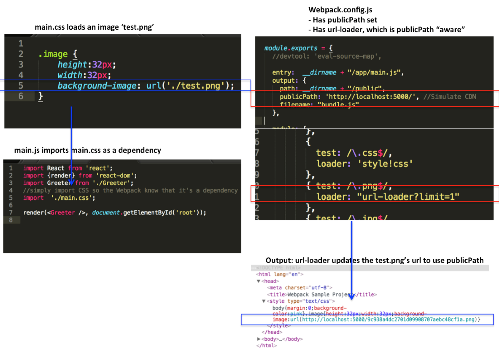

###### Front-End Develop SCHOOL

# Webpack Module Bundler

[](https://webpack.js.org/)

모던 웹 개발에 있어서 [Webpack](https://webpack.js.org/)은 매우 중요한 도구 중 하나로 자리 잡았습니다. 주로 자바스크립트를 위한 모듈 번들러이지만, HTML, CSS 뿐만 아니라 이미지 같은 프론트엔드 Assets을 변환시켜 줄 수 있습니다. 애플리케이션 HTTP 요청 갯수를 컨트롤 할 수 있게 만들 수 있으며, 다른 종류의 Assets(Pug, Sass, ES2015 등)를 사용 할 수 있게 도와줍니다.

-

### 1. Webpack v2 설치

`npm` 모듈 `webpack` 전역 설치

```sh
# 전역 설치: npm i -g webpack
$ npm install --global webpack

# 지역 설치: npm i -D webpack
$ npm install --save-dev webpack

# Webpack 버전 확인
$ npm show webpack@* version # 2.x 버전 확인 시: npm show webpack@2.* version

# Webpack v2.2.1 설치 예시
$ npm i -D webpack@2.2.1
```

-

### 2. Webpack CLI

명령어 환경에서 `webpack` 실행 명령어

```sh
# webpack {엔트리(진입) 파일} {번들링(묶음) 파일}
$ webpack entry.js bundle.js
```

`webpack` 결과 압축(Minification)

```sh
# webpack 명령어 옵션: -p, --optimize-minimize
$ webpack entry.js bundle.js -p
```

`webpack` 소스맵(Sourcemap)

```sh
# webpack 명령어 옵션: -d, --debug --devtool sourcemap --output-pathinfo
$ webpack entry.js bundle.js -d
```

`webpack` 관찰(Watch)

```sh
# webpack 명령어 옵션: -w, --watch
$ webpack entry.js bundle.js -w
```

NPM 스크립트(Scirpt)

- NPM Script 사용자 정의 전달인자 설정: https://docs.npmjs.com/cli/run-script

```json
"scripts": {
  "build": "webpack entry.js bundle.js",
  "watch": "npm run build -- --watch"
},
```

-

### 3. Webpack + CSS 로더

`webpack` CSS 패키징 (의존 모듈 설치)

- [style-loader](https://github.com/webpack/style-loader)
- [css-loader](https://github.com/webpack/css-loader)

> ※ [Webpack Loader List](http://webpack.github.io/docs/list-of-loaders.html)

```sh
# npm install --save-dev style-loader css-loader
$ npm i -D style-loader css-loader
```

`js/entry.js` 에서 CSS 파일 로드(상대 경로)

```js
// 번들링(Bundling, 묶음)을 수행할 CSS 파일 경로 설정
require('!style!css!../css/style.css');
```

> ※ `require()` 구문 안의 문자열이 다소 복잡한 이유는
> 파일을 로드할 로더(loader)를 설정해줘야 하기 때문.

-

### 4. Webpack + Sass

`webpack` Sass 패키징 (의존 모듈 설치)

- [node-sass](https://github.com/sass/node-sass)
- [sass-loader](https://github.com/jtangelder/sass-loader)

```sh
$ npm i -D node-sass sass-loader
```

`js/entry.js` 에서 Sass 파일 로드(상대 경로)

```js
require('!style!css!sass!../sass/style.sass');
```

-

### 4. Webpack 환경설정(Config) [@1.x](http://webpack.github.io/docs/configuration.html)/[@2.x](https://webpack.js.org/concepts/)

`webpack.config.js` 파일 생성

의존 모듈 [`webpack`, `path`] 로드

```js
const webpack = require('webpack');
const path    = require('path');
```

webpack 설정 모듈 정의

```js
module.exports = {};

// 또는

const config = {};
medule.exports = config;
```

#### 4-1. webpack 엔트리/아웃풋 파일 경로 설정

- [`entry`](https://webpack.js.org/concepts/entry-points/): 진입 파일 경로 설정
- [`output`](https://webpack.js.org/concepts/output/): 출력 파일 경로 설정
  - `path`: 출력 파일 폴더 설정 (절대 경로, 필수)
  - `filename`: 출력 파일 이름 설정
  - `publicPath`: 배포할 때, HTML, CSS 파일 내부의 Assets 경로를 업데이트 하기 위한 설정 (예: CDN 등)

`webpack.config.js`

```js
module.exports = {

  // 컨텍스트 설정
  'context': path.resolve(__dirname, 'src'),

  // 입력 파일 경로
  'entry': './app.js', // './src/app.js'

  // 출력 설정
  'output': {
    // 반드시 절대 경로 설정!
    'path': path.resolve(__dirname, 'dist'),
    // 출력 파일 이름
    'filename': 'bundle.js',
    // 배포 시, 경로 업데이트 설정
    // 'publicPath': 'http://user-server-domain.com/'
  }

};
```

###### publicPath 설정

예를 들어, CSS 파일에 경로가 설정되어 있는데 로컬 테스트 환경에서는 `./test.png`를 로드 할 수 있는 URL이 있을 수 있다. 하지만 배포 시에는 `test.png`는 CDN 이나 다른 지정된 경로로 실행 중 일 수 있다. 이런 경우 수동으로 `./test.png`의 url을 일일이 수정 해주어야 배포 모드에서 올바른 위치에 파일에 접근 할 수 있다. (불편) 이를 수동으로 수정하지 않고 Webpack `publicPath`를 사용하면 수많은 플러그인과 다수의 CSS, HTML파일 안에 URL들을 자동으로 업데이트 해준다. (필요할 경우 설정)




#### 4-2. webpack 모듈 설정

- `module`: webpack 모듈 설정
  - `loaders`: webpack 로더 설정
    - `test`: 파일 경로를 __정규 표현식__으로 설정
    - `loader`: 번들링에 사용되는 모듈 설정

`loaders` 설정은 CSS, JS, Images 등 다양한 타입의 파일을 `load` 또는 `import` 하게 도와주는 추가 node modules이다.

`webpack.config.js`

```js
module.exports = {
  // webpack 모듈 설정
  'module': {
    // webpack 로더 설정
    'loaders': [
      // Sass 모듈 로더 설정
      {
        'test': /\.(sass|scss)$/,
        // 여러 모듈을 연결하여 사용하는 체이닝 설정은 ! 로 구분하고, 오른쪽에서 왼쪽 방향으로 작업을 수행한다.
        'loader': 'style-loader!css-loader!sass-loader' // 'style!css!sass' 가능.
      }
    ]
  }

};
```

`js/entry.js` Sass 파일 로드 변경

```js
// Sass 파일 로드
require('../sass/style.sass');
```

__CLI__

```sh
# webpack.config.js 파일을 찾아 설정을 활용
$ webpack
```

#### 4-3. 관찰(Watch)/소스맵 설정

`webpack.config.js`

```js
module.exports = {

  'watch': true,

  'devtool': 'source-map'

};
```

-

### 5. Webpack Dev Server 설치

`8080` 포트로 실행되는 **Express(node.js)서버**. 서버는 내부적으로 Webpack을 호출.<br>
브라우저 리로딩(실시간 로딩), **Hot Module Replacement** 추가적인 기능 활용 가능.

`npm` 모듈 `webpack-dev-server` 전역 설치

```sh
$ npm i -g webpack-dev-server
```

#### 5-1. Webpack Dev Server 명령어

Webpack Dev Server 명령: 실행

```sh
# 페이지를 로딩하지 않는다.
$ webpack-dev-server
```

Webpack Dev Server 명령: 기본 브라우저로 바로 열림

```sh
# 기본 브라우저를 바로 연다.
$ webpack-dev-server --open
```

Webpack Dev Server 명령: 인라인 실행
> Inline the webpack-dev-server logic into the bundle.

```sh
# 전체 페이지를 로딩한다.
$ webpack-dev-server --inline
```

Webpack Dev Server 명령: 인라인 + 핫 모듈 리플레이스먼트 실행

> --inline, --hot 옵션은 webpack-dev-server 에서만 활용 가능.
> 반면 hide-modules 옵션은 CLI 환경에서만 사용 가능.

```sh
# 부분 또는 전체 페이지를 로딩한다.
$ webpack-dev-server --inline --hot
```

- `inline`: 전체 페이지에 대한 실시간 리로딩(“Live Reloading”) 옵션
- `hot`: 컴포넌트가 수정 될 경우 그 수정된 부분만 리로드 해주는 부분 모듈 리로딩(“Hot Module Reloading”) 옵션

두 개 옵션을 모두 지정할 경우 “Hot Module Reloading”이 발생하고, “Hot Module Reloading”이 안되면 전체 페이지를 로딩을 한다.

-

### 6. 멀티 파일 번들링

`'entry'`는 root 모듈 또는 시작 지점이 무엇인지 Webpack에게 알려준다. ( String | Array | Object 로 설정 가능 )

이미 살펴본 것처럼 1개 파일을 입력 설정할 경우는 String을 사용하고, 복수 파일일 경우 Array 또는 Object 중 하나를 사용한다.

서로 의존성이 없는 파일들을 입력 설정하고 싶다면 Array를 사용한다.

```js
module.exports = {
  // Array를 사용하여 복수 파일들을 입력 설정
  'entry': ['./js/entry.js', './js/another-entry.js']
};
```

반면 SPA(Single Page Application)이 아닌, MPA(Multi Page Application)를 개발하고자 한다면 Object 유형을 사용하여 다수의 번들 파일을 내보낼 수 있다.
아래 설정은 `index.js`와 `portfolio.js` 파일을 각각 만들어 낸다. 해당 파일은 `index.html`, `portfolio.html` 각 파일에서 호출 사용될 수 있다.

```js
module.exports = {
  'context': './src/js',
  // 'entry' key 설정이 번들링되는 파일 이름이 된다.
  'entry': {
    'index': './index.js',
    'portfolio': './portfolio.js'
  }
};
```

뿐만 아니라, Object 유형의 'entry' 설정 내부에 Array 타입 설정도 가능하다. 아래 설정을 사용하면 총 3개의 파일이 생성된다.
'vender' 설정은 jquery, lodash, axios 등 3개의 라이브러리 파일들을 `vender.js` 파일로 번들링하여 내보낸다.

```js
module.exports = {
  'context': './src/js',
  'entry': {
    'vender': ['jquery', 'lodash', 'axios'],
    'index': './index.js',
    'portfolio': './portfolio.js'
  }
};
```

-

### 7. Webpack + Babel (ECMAScript 2015)

ECMASCript 2015를 지원하지 않는 클라이언트 환경에서 ES2015를 사용하려면, [Babel](http://babeljs.io) 컴파일러를 사용하여 변환해야 한다. 이를 Webpack에서 사용하려면 다음의 모듈이 필요하다.

- [babel-core](https://github.com/babel/babel/tree/master/packages/babel-core)
- [babel-loader](https://github.com/babel/babel-loader)
- [babel-preset-es2015](https://github.com/babel/babel/tree/master/packages/babel-preset-es2015)

```sh
$ npm i -D babel-core babel-loader babel-preset-es2015
```

`webpack.config.js`

- `exclude`: 번들링 및 컴파일 제외 디렉토리를 정규 표현식으로 설정
- `cacheDirectory`: 디렉토리 캐시 설정
- `query`: `babel-core` 플러그인 설정
  - `presets`: `babel-preset-es2015` 설정

```js
module.exports = {

  'module': {
    'loaders': [
      {
        'test': /\.js$/,
        'loader': 'babel-loader', // ※ 'babel'도 가능
        'exclude': /node_modules/,
        'query': {
          'cacheDirectory': true,
          // {'modules': false} 설정: [Tree Shaking](https://webpack.js.org/guides/tree-shaking/) 사용,
          //                         bundle로 부터 나온 사용하지 않는 것들을 삭제 파일 크기를 줄이는 옵션
          'presets': ['es2015', {'modules': false}]
        }
      }
    ]
  }

};
```

#### 7-1. `*.es6` [파일 확장자 리졸브(Resolve) 설정](https://webpack.github.io/docs/configuration.html#resolve-extensions)

`js` 파일 확장자 대신 `es6` 확장자를 사용하고자 할 경우, 다음과 같이 설정한다.

- `resolve`: 결정 사항 설정
  - `extensions`: 파일 확장자 설정

Webpack 설정 파일은 아래와 같이 빈 문자열을 포함한 resolve extensions 속성을 가지고 있다.
빈 문자열은 `require('./myFile')`과 같은 빈 확장자를 import 하게 도와주는 역할이다.

`webpack.config.js`

```js
module.exports = {

  'resolve': {
    'extensions': ['', '.js', '.es6']
  }

};
```

-

### 8. Webpack + ESLint 프리로더(Pre Loader)

- [eslint](https://github.com/eslint/eslint)
- [eslint-loader](https://github.com/MoOx/eslint-loader)

```sh
$ npm i -D eslint eslint-loader
```


#### [ESLint 규칙](http://eslint.org/docs/rules/)

##### 속성 이름 규칙 설정

- `error` : 규칙 위반을 발견하면 오류 출력 (빨간색)
- `warn`  : 규칙 위반을 발견하면 경고 출력 (노란색)
- `off`   : 아무런 오류/경고 메시지를 출력하지 않음.

`.eslintrc.js` 파일 생성

```js
module.exports = {
  "env": {
    "node": true,    // Node.js에서 실행되는 코드를 정적 검증 설정
    "browser": true, // 웹 브라우저에서 실행되는 코드를 정적 검증 설정
    "es6": true      // ECMAScript 2015(ES6)로 작성된 코드를 정적 검증 설정
  },
  "extends": "eslint:recommended",
  "rules": {
    "no-console": 0,     // console 객체 사용 설정
    "indent": [          // 들여쓰기 설정
      "error",
      2
    ],
    "linebreak-style": [ // 줄바꿈 스타일 설정
      "error",
      "unix"
    ],
    "quotes": [          // 홑 따옴표 사용 설정
      "error",
      "single"
    ],
    "semi": [            // 세미콜론 항상 사용 설정
      "error",
      "always"           // "never"
    ]
  },
  // ES Modules 기능을 활성화하려면, "parserOptions"속성도 설정
  "parserOptions": {
    "sourceType": "module"
  }
};
```

`webpack.config.js`

`preLoaders` 속성은 `loaders` 전에 실행되어야 하는 로더들을 선언하는 부분

```js
module.exports = {

  'module': {
    'preLoaders': [
      {
        'test': /\.es6$/,
        'exclude': /node_modules/,
        'loader': 'eslint-loader'
      }
    ]
  }
};
```

-

### 9. Webpack + TypeScript

```sh
$ npm i -D typescript webpack-typescript
```

[※ TypeScript 설정 옵션](http://www.typescriptlang.org/docs/handbook/compiler-options.html)

`webpack.config.js`

```js
module.exports = {

  'module': {
    'loaders': [
      {
        'test': /\.ts$/,
        'exclude': /node_modules/,
        'loader': 'webpack-typescript?target=ES5' // ES3, ES5, ES6
      }
    ]
  }

  'resolve': {
    'extensions': ['', '.js', '.ts']
  }

};
```

-

### 10. Webpack 빌드

- [strip-loader](https://github.com/yahoo/strip-loader)

```sh
$ npm i -D strip-loader
```

#### 10-1. 빌드 전용 환경설정 파일

`webpack-build.config.js`

```js
/*! webpack-build.config.js © yamoo9.net, 2016 */
'use strict';

// strip-loader 모듈 로드
var WebpackStrip = require('strip-loader');

// webpack.config.js 파일 로드
var dev_config = require('./webpack.config');

// strip_loader 설정
var strip_loader = {
  test: [/\.js$/, /\.es6$/, /\.ts$/],
  exclude: /node_modules/,
  // 제거(strip)할 명령어 설정
  loader: WebpackStrip.loader('console.log', 'console.error')
};

// dev_config 모듈 로더에 strip_loader 설정
dev_config.module.loaders.push(strip_loader);

// dev_config 모듈 출력
module.exports = dev_config;
```

#### 10-2. 빌드 명령

```sh
$ webpack --config webpack-build.config.js -p
```

#### 10-3. ※ 빌드 과정에서 경고(Warning) 메시지 출력 시
> WARNING in bundle.js from UglifyJs

```sh
$ npm i -D webpack
```

`webpack.config.js`

```js
var webpack = require('webpack');

module.exports = {

  // UglifyJsPlugin을 사용하여 컴파일 한 스크립트를 압축할 때
  // 경고를 출력하지 않도록 설정
  'plugins': [
    new webpack.optimize.UglifyJsPlugin({
      'compress': {
        'warnings': false
      }
    })
  ]

};
```

-

### 11. 프로젝트 디렉토리 구조

```sh
.
├── build/
├── js/
├── public/
├── node_modules/
├── package.json
├── webpack-build.config.js
├── webpack.config.js
└── webpack.md
```

`webpack.config.js`

```js
// 경로(Path) 모듈 로드
var path = require('path');

module.exports = {
  // 콘텍스트 경로 설정
  'context': path.resolve('js'),
  'output': {
    // 출력 경로 설정
    'path': path.resolve('build/'),
    'entry': ['./app'],
    // 퍼블릭 경로 설정
    'publicPath': path.resolve('/public/assets/')
    'filename': 'bundle.js'
  },

  // webpack-dev-server 루트 경로 설정
  'devServer': {
    'contentBase': 'public'
  }
};
```

`index.html`

```html
<script src="/public/assets/bundle.js"></script>
```

-

### 12. CSS 번들파일 별도 분리

Plugins는 보통 결과물(bundle)에 작동하는 추가적인 node_modules 이다.

extract-text-webpack-plugin은 내부적으로 `css-loader`, `style-loader`를 사용하여
한 곳에 CSS 파일을 수집하고 외부 `style.css` 파일로 결과를 추출한다.


```sh
$ npm i -D extract-text-webpack-plugin
```

`webpack.config.js`

```js
// extract-text-webpack-plugin 플러그인 모듈 로드
var ExtractTextPlugin = require('extract-text-webpack-plugin');

module.exports = {

  'module': {
    'loaders': [
      {
        test: /\.(sass|scss)/,
        // 로더에 플러그인 적용
        'loader': ExtractTextPlugin.extract('style-loader', 'css-loader!sass-loader')
      }
    ]
  }

  'plugins': [
    // 플러그인 적용파일 설정
    new ExtractTextPlugin('style.css')
  ]

}
```

`index.html`

```html
<link rel="stylesheet" href="/public/assets/style.css">
```

-

### 13. Autoprefixer 모듈

- [autoprefixer](https://github.com/postcss/autoprefixer)
- [autoprefixer-loader](https://github.com/passy/autoprefixer-loader)

```sh
$ npm i -D autoprefixer-loader
```

`webpack.config.js`

```js
module.exports = {

  'module': {
    'loaders': [
      {
        test: /\.(sass|scss)/,
        // autoprefixer-loader 추가
        'loader': ExtractTextPlugin.extract('style-loader', 'css-loader!autoprefixer-loader!sass-loader')
        // autoprefixer-loader 옵션 설정
        // https://github.com/postcss/autoprefixer#browsers
        // https://github.com/ai/browserslist
        // 'css-loader!autoprefixer-loader?{browsers:["last 2 version", "Firefox 15"]}!sass-loader')
      }
    ]
  }

}
```

-

### 14. jQuery 라이브러리 모듈

```sh
$ npm i -D jquery
```

```js
// CommonJS 모듈 로드 방법
// var $ = require('jquery');

// ES2015 모듈 로드 방법
import $ from 'jquery';
```

-

### 15. 페이지 별, 번들 (멀티)

```js
var webpack = require('webpack');

module.exports = {

  entry: {
    'about'   : './about_page.js',   // <--
    'home'    : './home_page.js',    // <--
    'contact' : './contact_page.js'  // <--
  },
  output: {
    path: path.resolve('build/js/'),
    publicPath: '/public/assets/js/',
    filename: "[name].js" // <--
  }

  'plugins': [
    new webpack.optimize.CommonsChunkPlugin('shared.js')  // <--
  ]

};
```

-

### 16. 이미지/폰트 로더

이미지 파일, 폰트 파일을 모두 패키징.

- [url-loader](https://github.com/webpack/url-loader)
- [file-loader](https://github.com/webpack/file-loader)

```sh
$ npm i -D url-loader
```

1024bytes 보다 큰 이미지는 URL을 사용하고, 1024bytes 보다 작은 이미지는 DataURLs을 사용 하기 위한 `url-loader` 설정을 할 수 있다.
"limit"매개 변수를 전달하는 방법은 다음 두 가지가 있다.

`webpack.config.js`

```js
module.exports = {

  'module': {
    'loaders': [
      {
        'test': /\.(png|jpg|eot|woff)/,
        'exclude': /node_modules/,
        'loader': 'url-loader?limit=1024'
      },

      // 또는

      {
        'test': /\.(png|jpg|eot|woff)*/,
        'exclude': /node_modules/,
        'loader': 'url-loader',
        'query': {
          'limit': 1024
        }
      }
    ]
  }

}.
```

`entry.js`

```js
require('../images/webpack_logo.png');
```

### 참고 자료

- [Front End Center — Webpack from First Principles](https://www.youtube.com/watch?v=WQue1AN93YU)
- [Webpack 2 - A Full Tutorial](https://www.youtube.com/watch?v=eWmkBNBTbMM)
- [What's new in webpack 2](https://gist.github.com/sokra/27b24881210b56bbaff7)
- [Webpack의 혼란스런 사항들](https://github.com/FEDevelopers/tech.description/wiki/Webpack%EC%9D%98-%ED%98%BC%EB%9E%80%EC%8A%A4%EB%9F%B0-%EC%82%AC%ED%95%AD%EB%93%A4)
- [Webpack2와 모듈번들링을 위한 초보자 가이드](https://github.com/FEDevelopers/tech.description/wiki/Webpack2%EC%99%80-%EB%AA%A8%EB%93%88%EB%B2%88%EB%93%A4%EB%A7%81%EC%9D%84-%EC%9C%84%ED%95%9C-%EC%B4%88%EB%B3%B4%EC%9E%90-%EA%B0%80%EC%9D%B4%EB%93%9C)

