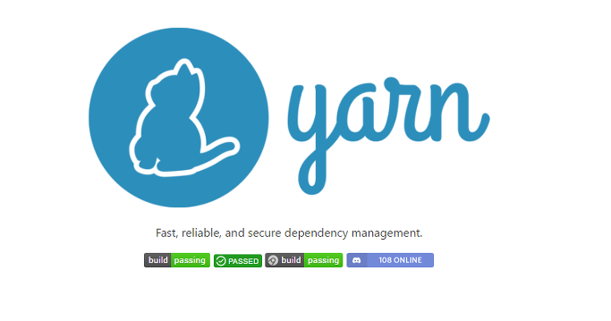

###### Front-End Develop SCHOOL

# Yarn



[Yarn](https://yarnpkg.com/)은 NPM 보다 빠른 다른 패키지 매니저로 오프라인 환경에도 대응하고 의존 모듈을 보다 잘 관리합니다. Yarn은 [2016년 10월에 출시](https://code.facebook.com/posts/1840075619545360)된 이후 패키지 관리자의 새로운 대안으로 JavaScript 커뮤니티에 급속도로 받아 들여지고 있습니다. Yarn을 사용하면 `npm install --save` 대신 `yarn add`를, `npm install --save-dev` 대신 `yarn add --dev` 명령으로 대신할 수 있습니다.

-

### 1. Yarn 설치

Yarn을 설치하려면 NPM을 사용합니다. <abbr title="Internet Explorer">IE</abbr>를 사용하여 Chrome을 설치하는 같은 것과 비슷하다고 이해하면 됩니다.

```sh
$ npm install --global yarn  # npm i -g yarn
$ yarn --version             # yarn -V
$ yarn -v


# 설치 후 버전확인 메시지 -------------------------

yarn install v0.19.1
info No lockfile found.
[1/4] 🔍  Resolving packages...
success Nothing to install.
success Saved lockfile.
✨  Done in 0.21s.
```

※ [NPM을 이용하지 않고 설치하는 방법](https://yarnpkg.com/en/docs/install)도 있습니다.

-

### 2. Yarn을 이용하여 프로젝트 디렉토리 초기화

`yarn init` 명령어를 실행하고 물어보는 질문에 대답하면 `package.json` 파일이 자동 생성됩니다.<br>
(`yarn init -y` 명령으로 모든 질문을 건너 띄고 자동으로 `package.json` 파일을 생성할 수도 있습니다)

```sh
$ yarn init  # yarn init -y


# 초기화 후 메시지 ------------------------------

yarn init v0.19.1
warning The yes flag has been set. This will automatically answer yes
to all questions which may have security implications.
success Saved package.json
✨  Done in 0.06s.
```

-

### 3. Yarn 스크립트 시작하기

먼저 `index.js` 파일에 아래와 같이 코드를 추가해봅니다.

```js
// index.js
console.log('Yarn은 새로운 Node.js 패키지 매니저입니다! NPM 보다 빠릅니다.');
```

명령어 창에서 아래 명령을 입력하면 `index.js`가 실행되어 화면에 메시지가 출력될 겁니다.

```sh
$ node .
```

이어서 `package.json` 파일에 아래 코드를 추가해봅니다.

```json
"scripts": {
  "start": "node ."
},
```

완성된 `package.json` 코드 전문은 아래와 같습니다.

```json
// package.json
{
  "name": "yarn",
  "version": "1.0.0",
  "main": "index.js",
  "scripts": {
    "start": "node ."
  },
  "repository": {},
  "license": "MIT"
}
```

마무리로 `yarn start` 명령을 실행해봅니다. 화면에 메시지가 정상적으로 출력되면 성공입니다!

```sh
$ yarn start
```

※ Git으로 프로젝트 관리 시에는 `.gitignore` 파일을 만들어 아래 코드를 추가합니다.

```sh
npm-debug.log
yarn-error.log
```

-

### 4. Yarn 패키지 설치/관리

`yarn.lock` 파일이 생성된 것을 볼 수 있는데 이 파일은 Github 저장소에 커밋해야 합니다. 이유는 팀 모든 구성원이 동일한 버전의 패키지를 이용하게 하기 위함입니다. 만약 Yarn보다는 NPM을 사용하려면 [shrinkwrap](https://blog.outsider.ne.kr/759)을 사용하세요.

#### 4.1 color 모듈 설치

```sh
$ yarn add --dev color  # yarn add -D color
```

※ [참고] 패키지 종속성은 `dependencies`와 `devDependencies` 2 종류가 있습니다. `dependencies`는 `devDependencies`보다 일반적인 것으로, 후자는 개발하는 동안 만 사용하는 패키지이며 프로덕션 환경에서는 사용하지 않습니다(일반적으로 빌드 관계의 패키지와 linter 등이 있습니다). `devDependencies`에 추가하려면 `yarn add --dev [package]` 명령을 실행합니다.

#### 4.2 color 모듈 사용

```js
// colorHex.js
const color       = require('color');
const yellow_hexa = color({'r':255, 'g': 255, 'b': 0}).hex();

console.log('yellow_hexa: ', yellow_hexa); // yellow_hexa: #FFFF00 출력
```

#### 4.3 설치한 color 모듈 제거

```sh
$ yarn remove color
```

-

### 5. CLI 명령어

[Yarn CLI Introduction](https://yarnpkg.com/en/docs/cli/)을 참고하여 명령어를 공부할 수 있습니다.

- [yarn add](https://yarnpkg.com/en/docs/cli/add)
- [yarn bin](https://yarnpkg.com/en/docs/cli/bin)
- [yarn cache](https://yarnpkg.com/en/docs/cli/cache)
- [yarn check](https://yarnpkg.com/en/docs/cli/check)
- [yarn clean](https://yarnpkg.com/en/docs/cli/clean)
- [yarn config](https://yarnpkg.com/en/docs/cli/config)
- [yarn generate-lock-entry](https://yarnpkg.com/en/docs/cli/generate-lock-entry)
- [yarn global](https://yarnpkg.com/en/docs/cli/global)
- [yarn info](https://yarnpkg.com/en/docs/cli/info)
- [yarn init](https://yarnpkg.com/en/docs/cli/init)
- [yarn install](https://yarnpkg.com/en/docs/cli/install)
- [yarn licenses](https://yarnpkg.com/en/docs/cli/licenses)
- [yarn link](https://yarnpkg.com/en/docs/cli/link)
- [yarn login](https://yarnpkg.com/en/docs/cli/login)
- [yarn logout](https://yarnpkg.com/en/docs/cli/logout)
- [yarn list](https://yarnpkg.com/en/docs/cli/list)
- [yarn outdated](https://yarnpkg.com/en/docs/cli/outdated)
- [yarn owner](https://yarnpkg.com/en/docs/cli/owner)
- [yarn pack](https://yarnpkg.com/en/docs/cli/pack)
- [yarn publish](https://yarnpkg.com/en/docs/cli/publish)
- [yarn remove](https://yarnpkg.com/en/docs/cli/remove)
- [yarn run](https://yarnpkg.com/en/docs/cli/run)
- [yarn self-update](https://yarnpkg.com/en/docs/cli/self-update)
- [yarn tag](https://yarnpkg.com/en/docs/cli/tag)
- [yarn team](https://yarnpkg.com/en/docs/cli/team)
- [yarn test](https://yarnpkg.com/en/docs/cli/test)
- [yarn unlink](https://yarnpkg.com/en/docs/cli/unlink)
- [yarn upgrade](https://yarnpkg.com/en/docs/cli/upgrade)
- [yarn version](https://yarnpkg.com/en/docs/cli/version)
- [yarn why](https://yarnpkg.com/en/docs/cli/why)
