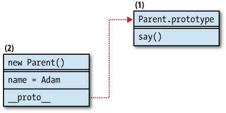
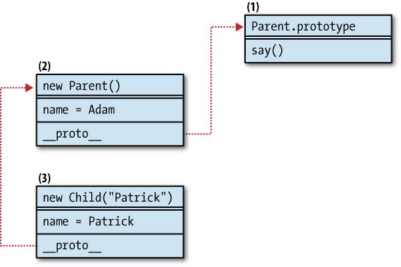

###### Front-End Develop SCHOOL

## Javascript Advanced

[← 레퍼런스로 돌아가기](README.md)

### 모던 자바스크립트 패턴

1. [Javascript 안티 패턴을 보완하는 방법](js-03-anti-pattern.md)
1. [Javascript 생성자(Constructor)와 리터럴(Literal)](js-04-constructor.md)
1. [Javascript 함수](js-05-function.md)
1. [Javascript 객체 생성 패턴](js-06-create-object-pattern.md)
1. Javascript 재사용 패턴

-

### Javascript 재사용 패턴

코드 재사용은 중요하면서도 흥미로운 주제이다. 이미 작성해놓은 기존 코드를 최대한 재활용하고, 새로 작성하는 코드는 최소화하려고 노력하는 것이 당연하기 때문이다. 기존의 코드가 훌륭하고, 테스트를 마쳤고, 유지보수/확장하기 좋고, 문서화되어 있는 경우라면 더더욱 그렇다.

코드를 재사용하는 방법 중 가장 대중적인 것은 상속(Inheritance)이다. 클래스 방식과 클래스가 아닌 방식을 각각 살펴보도록 하자. 상속을 구현하는 다양한 방법이 있지만, 궁극적인 목표는 코드를 재사용하는 것임을 잊지 말자. 상속은 목표에 도달하는 하나의 방법(수단)이지 유일한 방법은 아니다. 다른 객체와 합성하는 방법, 믹스-인 객체를 사용하는 방법, 상속 과정을 거치지 않고 필요한 기능만 빌려와 재사용하는 방법 등을 살펴볼 것이다. [GoF(Gang of Four)](http://www.blackwasp.co.uk/gofpatterns.aspx)의 충고를 가슴에 새겨두자.

> **"클래스 상속보다 객체 합성을 우선시하라."**<br>GoF(Gang of Four)

-

- [클래스 방식 vs 클래스가 아닌 방식](#%ED%81%B4%EB%9E%98%EC%8A%A4-%EB%B0%A9%EC%8B%9D-vs-%ED%81%B4%EB%9E%98%EC%8A%A4%EA%B0%80-%EC%95%84%EB%8B%8C-%EB%B0%A9%EC%8B%9D)
- [Javascript에서 클래스 방식의 상속을 흉내낸다면...](#javascript%EC%97%90%EC%84%9C-%ED%81%B4%EB%9E%98%EC%8A%A4-%EB%B0%A9%EC%8B%9D%EC%9D%98-%EC%83%81%EC%86%8D%EC%9D%84-%ED%9D%89%EB%82%B4%EB%82%B8%EB%8B%A4%EB%A9%B4)
- [클래스 방식의 상속 패턴 #1 - 기본 패턴](#%ED%81%B4%EB%9E%98%EC%8A%A4-%EB%B0%A9%EC%8B%9D%EC%9D%98-%EC%83%81%EC%86%8D-%ED%8C%A8%ED%84%B4-1--%EA%B8%B0%EB%B3%B8-%ED%8C%A8%ED%84%B4)
- [클래스 방식의 상속 패턴 #2 - 생성자 빌려쓰기](#%ED%81%B4%EB%9E%98%EC%8A%A4-%EB%B0%A9%EC%8B%9D%EC%9D%98-%EC%83%81%EC%86%8D-%ED%8C%A8%ED%84%B4-2--%EC%83%9D%EC%84%B1%EC%9E%90-%EB%B9%8C%EB%A0%A4%EC%93%B0%EA%B8%B0)
- [클래스 방식의 상속 패턴 #3 ─ 생성자 빌려쓰기 + 프로토타입 지정](#%ED%81%B4%EB%9E%98%EC%8A%A4-%EB%B0%A9%EC%8B%9D%EC%9D%98-%EC%83%81%EC%86%8D-%ED%8C%A8%ED%84%B4-3--%EC%83%9D%EC%84%B1%EC%9E%90-%EB%B9%8C%EB%A0%A4%EC%93%B0%EA%B8%B0--%ED%94%84%EB%A1%9C%ED%86%A0%ED%83%80%EC%9E%85-%EC%A7%80%EC%A0%95)
- [클래스 방식의 상속 패턴 #4 ─ 프로토타입 공유](#%ED%81%B4%EB%9E%98%EC%8A%A4-%EB%B0%A9%EC%8B%9D%EC%9D%98-%EC%83%81%EC%86%8D-%ED%8C%A8%ED%84%B4-4--%ED%94%84%EB%A1%9C%ED%86%A0%ED%83%80%EC%9E%85-%EA%B3%B5%EC%9C%A0)
- [클래스 방식의 상속 패턴 #5 ─ 임시 생성자](#%ED%81%B4%EB%9E%98%EC%8A%A4-%EB%B0%A9%EC%8B%9D%EC%9D%98-%EC%83%81%EC%86%8D-%ED%8C%A8%ED%84%B4-5--%EC%9E%84%EC%8B%9C-%EC%83%9D%EC%84%B1%EC%9E%90)
- [$class](#class)
- [프로토타입을 활용한 상속](#%ED%94%84%EB%A1%9C%ED%86%A0%ED%83%80%EC%9E%85%EC%9D%84-%ED%99%9C%EC%9A%A9%ED%95%9C-%EC%83%81%EC%86%8D)
- [속성 복사를 통한 상속 패턴](#%EC%86%8D%EC%84%B1-%EB%B3%B5%EC%82%AC%EB%A5%BC-%ED%86%B5%ED%95%9C-%EC%83%81%EC%86%8D-%ED%8C%A8%ED%84%B4)
- [믹스인](#%EB%AF%B9%EC%8A%A4%EC%9D%B8)
- [메소드 빌려쓰기](#%EB%A9%94%EC%86%8C%EB%93%9C-%EB%B9%8C%EB%A0%A4%EC%93%B0%EA%B8%B0)
- [요약](#%EC%9A%94%EC%95%BD)

---

#### 클래스 방식 vs 클래스가 아닌 방식

대다수 프로그래밍 언어는 객체의 설계도로 클래스(Class)라는 개념을 가지고 있다. JAVA와 같은 언어들에서는 모든 객체가 어떤 클래스의 인스턴스(Instance)이며, 클래스 없이는 객체를 생성할 수 없다. 하지만 Javascript에는 클래스라는 개념이 없기 때문에(ES 2015에는 클래스 개념이 도입되었다) 클래스의 인스턴스라는 개념도 잘 들어맞지 않는다. Javascript의 객체는 단순하게 키(Key)-값(Value) 쌍일 뿐이며, 언제든지 생성하고 변경할 수 있다.

하지만 Javascript의 생성자 함수(Constructor Function)와 `new` 연산자 문법은 클래스를 사용하는 문법과 매우 유사하다. JAVA에서 클래스를 사용하여 인스턴스(객체)를 생성하는 방법과 Javascript의 생성자 함수 사용법을 비교해보자.

```java
// JAVA
Person yamoo9 = new Person();
```

```js
// Javascript
var yamoo9 = new Person();
```

JAVA가 엄격한 유형의 언어이기 때문에 `yamoo9`을 `Person` 유형으로 선언해야만 한다는 점을 빼면 Javascript 문법과 별반 달라 보이지 않는다. Javascript 방식의 생성자 호출을 보면 `Person`이 클래스인 것 같지만, `Person`은 Javascript 함수에 불과하다는 사실을 잊지 말아야 한다. 문법 상의 유사성 때문에 많은 개발자들이 Javascript를 클래스 관점에서 생각하고 클래스를 전제한 상속 패턴을 발전시켜 왔다. 이러한 구현 방법을 "클래스 방식(모방)"이라고 부를 수 있을 것이다. 클래스에 대해 생각할 필요가 없는 나머지 모든 패턴은 "클래스가 아닌 방식"으로 하자.

프로젝트에 상속 패턴을 도입하는 데는 몇 가지 선택지가 있을 수 있다. 그러나 클래스가 전혀 관련되지 않는다는 사실을 팀원들이 정말로 불편해하는 게 아니라면, 가급적 클래스가 아닌 방식을 선택해보자.

[`Javascript 재사용 패턴 - 상위로 이동 ↑`](#javascript-%EC%9E%AC%EC%82%AC%EC%9A%A9-%ED%8C%A8%ED%84%B4)

-

#### Javascript에서 클래스 방식의 상속을 흉내낸다면...

클래스 방식의 상속을 구현할 때 목표는 `Child()` 생성자 함수로 생성된 객체들이 부모 생성자 함수인 `Parent()`의 속성을 물려받도록 설계하는 것이다. `Parent()` 생성자와 `Child()` 생성자를 정의한 후, 클래스 방식의 상속을 흉내내보자.

```js
var Parent, Child;

// 부모 생성자
Parent = function(name) {
	this.name = name || 'Adam';
};

// 생성자의 프로토타입 객체에 기능을 추가
Parent.prototype.say = function() {
	return this.name;
};

// 자식 생성자
Child = function(name) {
	// 아무런 내용이 없다.
};

// 부모 생성자의 속성을 자식 생성자가 상속받다.
inherit(Child, Parent);
```

부모, 자식 생성자가 있고 부모 생성자의 프로토타입에 `say()` 메소드를 추가했다. 그리고 상속을 처리하는 `inherit()` 함수를 호출했다. `inherit()` 함수는 Javascript 언어에 내장되어 있지 않아 직접 구현해야 한다. `inherit()` 함수를 재사용할 수 있는 헬퍼함수로 만드는 몇가지 방법을 살펴보자.

[`Javascript 재사용 패턴 - 상위로 이동 ↑`](#javascript-%EC%9E%AC%EC%82%AC%EC%9A%A9-%ED%8C%A8%ED%84%B4)

-

#### 클래스 방식의 상속 패턴 #1 ─ 기본 패턴

가장 널리 쓰이는 기본 방법은 `Parent()` 생성자를 사용해 객체를 생성한 다음, 이 객체를 `Child()` 프로토타입에 할당하는 것이다. 재사용 가능한 `inherit()` 함수의 첫 번째 구현 예제를 만들어 보자.

```js
function inherit(Child, Parent) {
	Child.prototype = new parent();
}
```

자식 생성자 Child()의 prototype 속성이 부모 생성자 함수가 아닌, 객체를 가리키게 하는 것이 중요하다. 즉 프로토타입이 부모 생성자 함수 자체가 아니라 부모 생성자 함수로 생성된 객체 인스턴스를 가리켜야 한다. 이 패턴이 제대로 동작하려면 `new` 연산자가 반드시 필요하다. 상속 과정을 거친 `Child()`를 사용해 객체를 생성하면 프로토타입을 통해 `Parent()` 인스턴스의 기능을 소유하게 된다.

```js
var kid = new Child();
kid.say(); // 'Adam'
```

-

##### 프로토타입 체인(추적)

이 패턴을 사용하면 부모 객체의 프로토타입에 추가된 속성(메소드 포함, `say()`)과 함께 부모 객체가 소유한 속성(this에 할당된 속성, `name`)도 함께 물려받게 된다.

이 상속 패턴에서 프로토타입 체인이 어떻게 동작하는지 단계별로 살펴보자. 논의상 편의를 위해 객체를 메모리 어딘가에 위치한 하나의 작은 블록으로 생각해보자. 이 블록에는 데이터와 함께 다른 블록에 대한 참조를 담을 수 있다. `new Parent()`를 사용해 객체를 생성하면 이러한 블록을 하나 만들게 된다.(아래 그림 2번 블록)

<br>
*Parent() 생성자의 프로토타입 체인*

이 블록에는 `name` 속성에 대한 데이터가 담겨져 있다. `(new Parent()).say()`의 형태로 `say()` 메소드에 접근 시도하면 2번 블록에는 해당 메소드가 없다. 하지만 `Parent()` 생성자 함수의 프로토타입 속성을 가리키는 `__proto__` (감춰진 속성)을 통해 `say()` 메소드를 알고 있는 1번 블록(`Parent.prototype`)에 접근할 수 있다.

내부적으로 일어나는 이 과정에 대해 걱정할 필요는 없지만, 이 과정이 어떻게 진행되는지, 그리고 접근하려는 또는 수정하려는 데이터가 어디에 있는지를 알아두는 것이 중요하다.

`inherit()` 함수를 사용하여 상속을 처리한 후, `var kid = new Child()` 구문으로 새로운 객체를 생성하면 어떤 일이 벌어지는지 알아보자.

<br>
*상속된 후의 프로토타입 체인*

`Child()` 생성자는 텅 비어 있고 `Child.prototype`에는 아무런 속성도 추가되어 있지 않아 있다. 따라서 `new Child()`로 생성된 객체 역시 `__proto__`라는 숨겨진 링크 빼고는 텅 비어 있다. 여기서 `__proto__`는 `inherit()` 함수 안에서 생성된 `new Parent()` 객체를 가리킨다.

그렇다면 `kid.say()`를 실행시키면 어떻게 될까? 3번 블록의 객체에는 그런 메소드가 없기 때문에 프로토타입 체인에 따라 2번 객체를 탐색한다. 하지만 2번 객체 또한 해당하는 메소드가 없으므로 프로토타입 체인은 한번 더 거슬러 올라가 1번 객체까지 도달하게 된다. 1번 객체에는 해당 메소드를 소유하고 있고, 메소드 안에는 `this.name`에 대한 참조가 들어가 있다. 참조된 값을 찾기 위해 다시 탐색을 시작해야 한다. 이 때 `this`는 3번 객체를 가리키는데 3번 객체는 `name`을 가지고 있지 않다. 2번 객체에서 찾아본 결과 `Adam`이라는 값을 얻게 된다. 그렇다면 마지막으로 한 단계 더 살펴보자.

```js
var kid = new Child();
kid.name = 'Patrick';
kid.say(); // 'Patrick'
```

<br>
*상속 후 자식 객체에 속성을 추가했을 때의 프로토타입 체인*

`kid.name` 값을 설정하면 2번 객체의 `name` 속성 값을 변경하는 것이 아니라 3번 kid 객체에서 직접 자신의 속성으로 생성하게 된다. `kid.say()`를 실행하면 앞서와 마찬가지로 3번 객체, 2번 객체, 그리고 1번 객체 순으로 `say()`메소드를 탐색한다. 이번에는 `this.name`(즉, `kid.name`)을 3번 객체에서 바로 찾을 수 있어 보다 빠르게 탐색 결과를 마무리 한다.

`delete kid.name` 구문으로 새롭게 작성한 속성을 삭제하면, 그 다음 탐색 시에 2번 객체의 `name` 속성까지 다시 거슬러 올라가게 된다.

-

##### 패턴 #1의 단점

이 패턴의 단점 중 하나는 부모 객체의 `this`에 추가된 객체 자신의 속성과 프로토타입 프로퍼티를 모두 물려받게 된다는 점이다. 대부분의 경우 객체 자신의 속성은 특정 인스턴스에 한정되어 재사용할 수 밖에 없기 때문에 불필요하다.

> 재사용 가능한 멤버는 프로토타입에 추가해야 하는 것이 구성요소(Components)를 만드는 일반 원칙이다.

`inherit()` 헬퍼 함수는 인자를 처리하지 못하는 문제도 있다. 즉 자식 생성자에 인자를 넘겨도 부모 생성자에게 전달하지 못한다.

```js
var yamoo9 = new Child('yamoo9');
yamoo9.say(); // 'Adam'
```

이런 결과를 기대하지는 않았을 것이다. 자식 객체가 부모 생성자에 인자를 전달하는 방법도 있겠지만, 이 방법은 자식 인스턴스를 생성할 때 마다 상속을 실행해야 하기에 부모 객체를 계속해서 재생성하는 셈이고 따라서 매우 비효율적이다.

[`Javascript 재사용 패턴 - 상위로 이동 ↑`](#javascript-%EC%9E%AC%EC%82%AC%EC%9A%A9-%ED%8C%A8%ED%84%B4)

-

#### 클래스 방식의 상속 패턴 #2 ─ 생성자 빌려쓰기

이어서 살펴볼 패턴은 자식에서 부모로 인자를 전달하지 못했던 패턴 #1의 문제를 해결한다. 이 패턴은 부모 생성자 함수의 `this`에 자식 객체를 바인딩한 다음, 자식 생성자가 받은 인자들을 모두 넘겨준다.

```js
var Child = function() {
	// Parent() 함수를 빌려써서 콘텍스트를 this로 설정 후,
    // 전달인자를 전달하여 실행시킨다.
	Parent.apply(this, arguments);
};
```

이렇게 하면 부모 생성자 함수 내부의 `this`에 추가된 속성만 물려 받게 된다. 프로토타입에 추가된 멤버는 상속되지 않는다. 생성자 빌려쓰기 패턴을 사용하면, 자식 객체는 상속된 멤버의 복사본을 받게 된다. 클래스 방식의 패턴 #1에서 자식 객체가 상속된 멤버의 참조를 물려받은 것과는 다르다. 그 차이점을 확인해보자.

```js
var Article, article;
// 부모 생성자
Article = function() {
	this.tags = ['css', 'js'];
};
// 생성자로부터 인스턴스 객체 생성
article = new Article();

// 클래스 방식의 상속 패턴 #1
var BlogPost, blog;
// BlogPost 프로토타입에 article 인스턴스 객체 참조
BlogPost.prototype = article;
// 생성자로부터 인스턴스 객체 생성
blog = new BlogPost();

// 클래스 방식의 상속 패턴 #2
var StaticPost, page;
StaticPost = function() {
	Article.apply(this, arguments);
};
// 생성자로부터 인스턴스 객체 생성
page = new StaticPost();

// 검증.
console.log( article.hasOwnProperty('tags') ); // true
console.log( blog.hasOwnProperty('tags') );    // false
console.log( page.hasOwnProperty('tags') );    // true
```

위 예제에서 부모인 `Article()`에 대한 상속은 두가지 방식으로 이루어진다. 기본 패턴을 적용한 `blog` 객체는 `tags`를 자기 자신의 속성으로 가진 것이 아니라 프로토타입을 통해 접근하기 때문에 `hasOwnProperty()`로 확인하면 `false` 값이 반환된다.

하지만 생성자를 빌려쓰는 방식으로 상속받은 `page` 객체는 부모의 `tags`멤버에 대한 참조가 아닌, 복사본을 얻게되므로 자기 자신의 `tags` 속성을 가진다. 상속된 `tags` 속성을 수정할 때의 차이점을 살펴보자.

```js
blog.tags.push('html');
page.tags.push('json');
console.log(article.tags.join(', '); // 'css, js, html';
```

`blog` 객체가 `tags` 속성을 수정하면 동시에 부모의 멤버도 수정된다. 본질적으로 `blog.tags`와 `article.tags`는 동일한 배열을 참조하고 있기 때문이다. 반면에 `page.tags`에 적용된 변경 사항은 부모인 `article`에 영향을 미치지 않는다. `page.tags`는 상속 과정에서 별개로 생성된 복사본이기 때문이다.

-

##### 프로토타입 체인

앞서 다룬 `Parent()`, `Child()` 생성자에 이 패턴을 적용했을 때 프로토타입 체인은 어떤 모습이 될지 살펴보자. 새로운 패턴을 적용하기 위해 `Child()`를 약간 수정할 것이다.

```js
var Parent, Child;
// 부모 생성자
Parent = function(name) {
	this.name = name || 'Adam';
};
// 부모 생성자 프로트타입 객체에 멤버 추가
Parent.prototype.say = function() {
	return this.name;
};

// 자식 생성자
Child = function() {
	Parent.apply(this, arguments);
};

// 자식 생상자로부터 객체 생성
var kid = new Child('Patrick');
// 자식 객체의 고유 속성이 설정된다. (참조가 아닌, 복제)
console.log( kid.name );  // Patrick
// 하지만 부모 생성자의 프로토타입 객체는 상속되지 않았다.
console.log( !!kid.say ); // false
```

<br>
*생성자 빌려쓰기 패턴을 적용한 경우, 연결고리가 유지되지 않는 프로토타입*

위 그림에서 새로 생성된 `Child()` 객체와 `Parent()` 사이에 링크가 존재하지 않는 것을 볼 수 있다. `Child.prototype`은 전혀 사용되지 않았기에 빈 객체이다.이 패턴을 적용하면 자기 자신의 `name` 속성을 가질 수 있지만, `say()`메소드는 상속받지 못한다. 따라서 `say()`를 호출하려고 하면 오류가 발생한다. 여기서의 상속은 부모가 가진 자신만의 속성을 자식의 속성으로 복사해주는 1회성 동작이며 `__proto__` 링크는 유지되지 않는다.

-

##### 생성자 빌려쓰기를 적용한 다중 상속

생성자 빌려쓰기 패턴을 사용하면 생성자를 하나 이상 빌려쓰는 다중 상속을 구현할 수 있다.

```js
var Cat, Bird, CatWings;

Cat = function() {
	this.legs = 4;
    this.say = function() {
    	return '냐옹';
    };
};

Bird = function() {
	this.legs = 2;
    this.fly = true;
};

CatWings = function() {
	Cat.apply(this);
	Bird.apply(this);
};

var catbird = new CatWings();
console.dir(catbird);

// CatWings 객체
// catbird = {
//  'legs': 2,
//  'fly': true,
//  'say': function() {}
// };
```

-

##### 생성자 빌려쓰기 패턴의 장단점

프로토타입이 전혀 상속되지 않는다는 점은 분명히 이 패턴의 한계라 할 수 있다. 앞서 말했듯이 재사용되는 메소드와 속성은 인스턴스 별로 재생성되지 않도록 프로토타입에 추가해야 하기 때문이다.

반면 부모 생성자 자신의 멤버에 대한 복사본을 가져올 수 있다는 것은 장점이다. 이 덕분에 자식이 실수로 부모의 속성을 덮어쓰는 위험을 방지할 수 있다.

그렇다면 자식이 프로토타입 속성을 상속받게 하려면 어떻게 해야 할까? 앞선 예제에서 `kid` 객체가 `say()` 메소드에 접근할 수 있으려면? 다음 패턴은 이 문제를 해결하는 방법이다.

[`Javascript 재사용 패턴 - 상위로 이동 ↑`](#javascript-%EC%9E%AC%EC%82%AC%EC%9A%A9-%ED%8C%A8%ED%84%B4)

-

#### 클래스 방식의 상속 패턴 #3 ─ 생성자 빌려쓰기 + 프로토타입 지정

앞서 다룬 두 패턴을 결합해보자. 먼저 부모 생성자를 빌려온 후, 자식의 프로토타입이 부모 생성자를 통해 생성된 인스턴스 객체를 가리키도록 지정한다.

```js
var Child = function(a, b, c, d) {
	// 부모 생성자 함수 빌려 쓰기
	Parent.apply(this, arguments);
};

// 자식 생성자 프로토타입에 부모 생성자 인스턴스 객체 참조
Child.prototype = new Parent();
```

이렇게 하면 자식 객체는 부모가 가진 자신만의 속성 복사본을 가지게 됨과 동시에, 부모의 프로토타입 멤버로 구현된 재사용 가능한 기능들을 모두 물려받게 된다. 자식이 부모 생성자에 인자를 넘길 수도 있다. JAVA에서 예상할 수 있는 동작 방식에 가장 근접한 패턴이라고 볼 수 있다. 즉 부모가 가진 모든 것을 상속하는 동시에, 부모의 속성을 덮어쓸 위험이 없어, 자신만의 속성을 마음놓고 수정할 수 있다.

물론 부모 생성자를 비효율적으로 두 번 호출하는 점은 단점일 수 있다. 우리가 살펴본 예제에서 `name`의 경우와 같이, 부모가 가진 자신만의 속성은 두 번 상속된다. 코드를 살펴보면서 몇 가지 테스트를 시도해보자.

```js
var Parent, Child;
// 부모 생성자
Parent = function(name) {
	this.name = name || 'Adam';
};
// 프로토타입에 기능을 추가한다.
Parent.prototype.say = function() {
	return this.name;
};
// 자식 생성자
Child = function(name) {
	Parent.apply(this, arguments);
};
Child.prototype = new Parent();

var kid = new Child('Patrick');
console.log( kid.name ); // Patrick
console.log( kid.say() ); // Patrick
delete kid.name;
console.log( kid.name ); // Adam
```

이전에 다룬 패턴과 달리 `say()` 메소드 또한 제대로 상속되는 것을 볼 수 있다. `name`이 두 번 상속된 것도 확인했다. 즉 자식이 복사본으로 가지고 있는 `name` 속성이 삭제되면 프로토타입 체인을 통해 부모 생성자의 `name` 속성에 접근한다. 아래 그림을 보면 객체 간 관계가 어떻게 작동하는지 볼 수 있다.

<br>
*부모 자신의 멤버도 상속되고 프로토타입 채인도 유지됨*

[`Javascript 재사용 패턴 - 상위로 이동 ↑`](#javascript-%EC%9E%AC%EC%82%AC%EC%9A%A9-%ED%8C%A8%ED%84%B4)

-

#### 클래스 방식의 상속 패턴 #4 ─ 프로토타입 공유

앞서 살펴본 클래스 방식의 상속 패턴에서 부모 생성자를 두 번 호출하는 것과 달리, 이번에 살펴볼 패턴은 부모 생성자를 한 번도 호출하지 않는다.

원칙적으로 재사용할 멤버는 `this`가 아니라 프로토타입에 추가되어야 한다. 따라서 상속되어야 하는 모든 것들도 프로토타입 안에 존재해야 한다. 그렇다면 부모의 프로토타입을 똑같이 자식의 프로토타입으로 지정하기만 하면 될 것이다.

```js
function inherit(Child, Parent) {
	Child.prototype = Parent.prototype;
}
```

모든 객체가 실제로 동일한 프로토타입을 공유하게 되므로 프로토타입 체인 검색은 짧고 간단해진다. 그러나 여기에도 단점은 있다. 상속 체인의 하단 아딘가에 있는 자식이나 손자가 프로토타입을 수정할 경우, 모든 부모의 손자뻘의 객체에 영향을 미치기 때문이다.

<br>
*동일한 프로토타입을 공유하는 관계*

부모와 자식 객체가 모두 동일한 프로토타입을 공유하며 `say()`메소드에도 똑같은 접근 권한을 가진다. 그러나 자식 객체는 `name` 속성을 물려받지 않는다.

[`Javascript 재사용 패턴 - 상위로 이동 ↑`](#javascript-%EC%9E%AC%EC%82%AC%EC%9A%A9-%ED%8C%A8%ED%84%B4)

-

#### 클래스 방식의 상속 패턴 #5 ─ 임시 생성자

다음 패턴은 프로토타입 체인의 이점은 유지하면서 동일한 프로토타입을 공유할 때의 문제를 해결하기 위해 부모와 자식의 프로토타입 사이에 직접적인 링크를 끊는다. 패턴의 구현은 빈 함수 `F()`가 부모와 자식 사이에서 프록시(Proxy) 기능을 맡는다. `F()`의 `prototype` 속성은 부모의 프로토타입을 가리킨다. 이 빈 함수의 인스턴스가 자식의 프로토타입이 된다.

```js
function inherit(Child, Parent) {
	function F(){}
    F.prototype = Parent.prototype;
    Child.prototype = new F();
}
```

이 패턴은 클래스 방식의 첫 번째 패턴인 깁노 패턴과 약간 다르게 동작한다. 자식이 프로토타입의 프로퍼티만 물려받기 때문이다.

<br>
*임시(프록시) 생성자 F()를 활용한 클래스 방식의 상속*

대부분의 경우 이 패턴은 문제가 되지 않는다. 프로토타입은 재사용 가능한 기능을 모아두는 장소이기 때문이다. 이 패턴에 따르면 부모 생성자에서 `this`에 추가한 멤버는 상속되지 않는다. 자식 객체를 생성하여 동작 방식을 점검해보자.

```js
var kid = new Child();
```

`kid.name`에 접근하면 `undefined`라는 값을 얻게 될 것이다. `name`은 부모 자신의 속성인데 상속 과정에서 `new Parent()`를 호출한 적이 없기 때문에 이 속성은 생성조차 되지 않았다. `kid.say()`에 접근하면 3번 블록에서는 찾을 수 없기 때문에 프로토타입 체인을 따라 탐색이 시작된다. 4번 블록 역시 이 메소드를 갖고 있지 않다. 1번 블록은 이 메소드를 갖고 있다. `Parent()`를 상속하는 모든 생성자와 이를 통해 생성되는 모든 객체들은 똑같이 이 지점에서 이 메소드를 사용하게 된다. 즉 메모리 상의 위치는 동일하다.

-

##### 상위 클래스 저장

이 패턴을 기반으로 하여 부모 원본에 대한 참조를 추가할 수도 있다. 다른 언어에서 상위 클래스에 대한 접근 경로를 가지는 것과 같은 기능으로 경우에 따라 매우 편리하게 쓸 수 있다. 이 속성은 `_super`라고 부를 것이다. `super`의 경우 예약어이고, `superclass`라는 용어를 사용하면 잘 모르는 개발자들이 자바스크립트에 클래스가 이다고 오해할 수 있기 때문이다. (ES 2015에는 클래스 개념이 추가된다) 개선안을 적용한 코드는 다음과 같다.

```js
function inherit(Child, Parent) {
	function F(){}
    F.prototype = Parent.prototype;
    Child.prototype = new F();
    Child._super = Parent.prototype;
}
```

-

##### 생성자 포인터 재설정

이미 거의 완벽에 가까운 클래스 방식의 상속 함수에 마지막으로 한 가지를 더 추가해보자. 나중을 위해 생성자 함수를 가리키는 포인터를 재설정하는 것이다.

생성자 포인터를 재설정하지 않으면 모든 자식 객체들의 생성자는 `Parent()`로 지정되어 있을 것이고, 이런 상황은 유용성이 떨어진다. 앞서 나온 `inherit()`을 사용하면 다음과 같은 동작 방식을 볼 수 있다.

```js
// 부모와 자식을 두고 상속 관계를 만든다.
function Parent(){}
function Child(){}
inherit(Child, Parent);

// 생성자를 확인한다.
var kid = new Child();
console.log( kid.constructor.name ); // 'Parent'
console.log( kid.constructor === Parent ); true
```

`constructor` 속성은 런타임 시에 객체 판별에 유용하다. 거의 정보성으로만 사용되는 속성이기 때문에 원하는 생성자 함수를 가리키도록 재설정해도 기능에는 영향을 미치지 않는다. 클래스 방식의 상속 패턴을 완결하는 최정 버전은 다음과 같다.

```js
function inherit(Child, Parent) {
	function F(){}
    F.prototype = Parent.prototype;
    Child.prototype = new F();
    Child._super = Parent.prototype;
    Child.prototype.constructor = Child;
}
```

Javascript 라이브러리 중에는 이처럼 클래스가 없는 언어에 클래스 방식의 상속을 구현해주는 헬퍼 함수가 존재하는 경우가 있다. 프로젝트에 클래스 방식의 상속이 적합하다고 판단된다면 이런 헬퍼 함수를 사용하면 된다.

> 이 패턴은 프록시 함수 또는 프록시 생성자 활용 패턴으로 불리기도 한다. 임시 생성자가 결국은 부모의 프로토타입을 가져오는 프록시로 사용되기 때문이다.

최종 버전에 대한 일반적인 최적화 방안은 상속이 필요할 때마다 임시(프록시) 생성자가 생성되지 않게 하는 것이다. 임시 생성자는 한 번만 만들어 두고 임시 생성자 의 프로토타입만 변경해도 충분하다. 즉시 실행 함수를 활용하면 프록시 함수를 클로저 안에 저장할 수있다.

```js
var inherit = (function(){
	var F = function(){};
	return function(Child, Parent){
    	F.prototype = Parent.prototype;
        Child.prototype = new F();
        Child._super = Parent.prototype;
        Child.prototype.constructor = Child;
    };
}());
```

[`Javascript 재사용 패턴 - 상위로 이동 ↑`](#javascript-%EC%9E%AC%EC%82%AC%EC%9A%A9-%ED%8C%A8%ED%84%B4)

-

#### $class

많은 Javascript 라이브러리가 새로운 문법 설탕(Sugar Syntax)을 도입하여 클래스를 흉내낸다. 각 구현은 다르지만 공통점을 뽑아보면 다음과 같은 것들이 있다.

- 클래스의 생성자라고 할 수 있는 메소드의 명명 규칙이 존재한다.<br>이 메소드들은 자동으로 호출되며 `initialize`, `_init` 등의 이름을 가진다.
- 클래스는 다른 클래스로부터 상속된다.
- 자식 클래스 내부에서 부모 클래스(상위 클래스)에 접근할 수 있는 경로가 존재한다.

자세한 세부 사항으로 들어가기 전에 Javascript에서 클래스를 모방한 구현 예제를 살펴보자. 사용자 입장에서 사용하는 방법을 먼저 다뤄보자.

```js
var Model = $class(null, {
	'__construct': function(what) {
    	console.log('Model\'s consructor');
        this.name = what;
    },
    'getName': function() {
    	return this.name;
    }
});
```

여기서 문법 설탕은 `$class()`라는 이름의 함수 형태로 등장한다. 다른 구현 사례를 보면 이 함수 대신 `$class()`라는 생성자 함수를 사용하거나 `Object.prototype`을 확장해서 사용하기도 하는데 여기서는 간단한 함수로 진행해보도록 하자.

이 함수는 두 개의 전달인자를 받는다. 하나는 상속할 부모 클래스이고, 다른 하나는 객체 리터럴 형식으로 표기된 새로운 클래스의 구현이다. PHP에서 가져온 명명 규칙을 적용하여 클래스의 생성자 메소드는 반드시 `__construct`로 이름을 정하기로 하자. 앞선 예제에서는 `Model` 이름의 새로운 클래스가 생성되었고 아무것도 상속 받지 않았다. (정확히는 내부적으로 Object를 상속 받은 상태이다) `Model` 클래스는 `__construct` 안에서 생성된 자신만의 속성인 `name`과 함께 `getName()` 메소드를 가진다. 클래스란? 결국 생성자 함수이기 때문에 다음 코드도 잘 동작한다. (보기에도 클래스의 인스턴스를 만드는 것과 비슷하게 생겼다)

```js
var model = new Model('Adam'); // "Models's constructor" 출력
console.log( model.getName() );  // 'Adam'
```

이어서 `Model` 클래스를 상속 받은 `SuperModel` 클래스를 만들어 보자.

```js
var SuperModel = $class(Model, {
	'__construct': function(what) {
    	console.log( "SuperModel's Constructor" );
    },
    'getName': function() {
    	var name = SuperModel._super.getName.call(this);
        return "나는 " + name;
    }
});
```

$class()에 전달되는 첫 번째 인자는 상속받을 Model 클래스이다. `getName()` 멤버를 잘 살펴보면 SuperModel의 `_super` 속성을 사용하여 부모 클래스의 `getName()` 멤버를 먼저 호출했다.

```js
var lee = new SuperModel('이민영');
lee.getName(); // '나는 이민영'
```

첫 번째 줄에서는 "Model's Constructor"가 출력된 다음 "SuperModel's Constructor"가 출력된다. 일부 언어에서 자식의 생성자가 호출될 때마다 자동으로 부모의 생성자가 호출되는 동작 방식까지 모방해 본 것이다. `instanceof` 연산자가 기대되는 결과를 반환하는지 테스트해보자.

```js
lee instanceof Model;      // true
lee instanceof SuperModel; // true
```

마지막으로 $class() 함수가 어떤 식으로 구현될 수 있는지 살펴보자.

```js
var $class = function(Parent, props) {

	var Child, F, i;

    // 1.
    // 새로운 생성자
    Child = function(){
    	if ( Child._super && Child._super.hasOwnProperty('__construct') ) {
        	Child._super._construct.apply(this, arguments);
        }
        if ( Child.prototype.hasOwnProperty('__construct') ) {
        	Child.prototype.__construct.apply(this, arguments);
        }
    };

    // 2.
    // 상속
    Parent = Parent || Object;
    F = function() {};
   	F.prototype = Parent.prototype;
    Child.prototype = new F();
    Child._super = Parent.prototype;
    Child.prototype.constructor = Child;

    // 3.
    // 구현 메소드 추가
    for (i in props) {
    	if ( props.hasOwnProperty(i) ) {
        	Child.prototype[i] = props[i];
        }
    }

    // 클래스 반환
    return Child;

};
```

$class() 구현은 3개의 항미로운 부분으로 나뉜다.

1. Child() 생성자 함수가 생성된다. 마지막에 이 함수가 반환되어 클래스로 사용될 것이다. `__construct` 메소드가 있다면 이 함수 안에서 호출된다. 그 전에 부모의 `__constrcut`가 있다면 `_super` 속성을 사용하여 호출한다. Model 클래스처럼 별도의 부모 클래스 없이 Object를 상속했다면 `_super`라는 속성은 정의되어 있지 않을 수 있다.
1. 두 번째 부분은 상속을 처리한다. 앞에서 다룬 클래스 방식의 최종 버전을 사용했다. 유일하게 새로운 점은 상속 받을 클래스에 Parent가 존재하지 않을 경우 Object가 지정되도록 한 것이다.
1. 마지막 부분에서는 루프를 돌면서 클래스를 실제로 정의하는 구현 메소드들(`__construct`, `getName` 등)을 Child 프로토타입에 추가한다.

이런 패턴은 언제 사용해야 하는가? 사실 이런 패턴은 피하는 것이 좋다. 기술적으로는 언어에 존재하지 않는 혼란스러운 개념들을 온통 끌고 들어오기 때문이다. 새로운 문법과 규칙이 추가되고, 이런 것을 학습하고 기억해야 한다. 여러분이나 여러분의 팀이 클래스 개념에는 익숙하지만 프로토타입 개념은 낯설게 생각할 경우 연구해 볼만하다. 이 패턴을 사용하면 프로토타입에 대해서는 완전히 잊어버릴 수 있다. 또 문법과 규칙을 비틀어 여러분이 좋아하는 다른 언어와 유사하게 만들어 준다.

[`Javascript 재사용 패턴 - 상위로 이동 ↑`](#javascript-%EC%9E%AC%EC%82%AC%EC%9A%A9-%ED%8C%A8%ED%84%B4)

-

#### 프로토타입을 활용한 상속

이어서 클래스를 사용하지 않는 패턴 중 "프로토타입을 활용한 상속" 패턴을 살펴보자. 이 패턴에서는 클래스를 찾아볼 수 없다. 객체가 객체를 상속받는다. 재사용하려는 객체가 하나 있고, 또 다른 객체를 만들어 이 첫 번째 객체의 기능을 가져온다고 생각하면 된다. 방식은 다음과 같다.

```js
// 상속할 객체
var parent = {
	'name': 'Papa'
};

// 새로운 객체
var child = makeObj(parent);

// 테스트
console.log( child.name ); // 'Papa'
```

이 코드를 보면 객체 리터럴로 생성한 parent라는 객체가 있고, parent와 동일한 속성(메소드 포함)을 가지는 또 다른 객체 child를 생성하려 한다. child 객체는 makeObj()라는 함수를 통해 생성했다. 이 함수를 어떻게 정의하는지 살펴보자. 클래스 방식의 최종 버전과 비슷하게 먼저 빈 임시 생성자 함수 F()를 사용한다. 그런 다음 F()의 프로토타입에 parent() 객체를 지정한다. 마지막으로 임시 생성자의 새로운 인스턴스를 반환한다.

```js
function makeObj(o) {
	var F = function(){};
    F.prototype = o;
    return new F();
}
```

아래 그림에서 프로토타입을 활용한 상속 패턴의 프로토타입 체인을 보여준다. 여기서 child 객체는 자기 자신의 프로퍼티를 가지지 않는 빈 객체이지만, `__proto__` 링크 덕에 parent의 모든 기능을 가지고 있다.

<br>
*프로토타입을 활용한 상속 패턴*

-

##### 논의

프로토타입을 활용한 상속 패턴에서 부모가 객체 리터럴로 생성되어야만 하는 것은 아니다. 생성자 함수를 통해 부모를 생성할 수도 있다. 이 경우 부모 객체 자신의 속성과 생성자 함수의 프로토타입에 포함된 속성 모두 상속된다는 점도 유의해야 한다.

```js
var Person, papa, kid;
// 부모 생성자
Person = function(name) {
	// 부모 생성자 자신의 속성
    this.name = name || 'Adam';
};

// 프로토타입에 추가된 속성
Person.prototype.getName = function() {
	return this.name;
};

// Person 인스턴스 객체를 생성
papa = new Person();

// papa 객체를 상속한 kid 객체 생성
kid = makeObj(papa);

// 부모의 속성과 프로토타입 속성이 모두 상속되었는지 확인
console.log( kid.getName() ); // 'Adam'
```

생성자 함수의 프로토타입 객체만 상속받을 수 있도록 이 패턴을 약간 변형해 보자. 부모 객체가 어떻게 생성되었는지와는 상관 없이 객체가 객체를 상속한다는 점에 유념하길. 앞서 다룬 예제를 살짝 수정해보자.

```js
var Person, kid;
// 부모 생성자
Person = function(name) {
	// 부모 생성자 자신의 속성
    this.name = name || 'Adam';
};

// 프로토타입에 추가된 속성
Person.prototype.getName = function() {
	return this.name;
};

// Person 생성자의 프로토타입 객체를 상속한 kid 객체 생성
kid = makeObj(Person.prototype);

console.log( typeof kid.getName ); // 'function'  [존재, 상속되었다.]
console.log( typeof kid.name );    // 'undefined' [미존재, 상속되지 않았다.]
```

-

##### ECMAScript 5에 추가된 프로토타입 상속 기능

ES5에서는 프로토타입을 활용한 상속 패턴을 언어에서 공식 지원한다. `Object.create()`가 이 패턴을 네이티브로 구현하고 있다. 즉 `makeObj()`와 같은 헬퍼 함수를 별도로 만들지 않아도 이 기능이 언어에 구현되어 있다는 이야기이다.

```js
var child = Object.create( parent );
```

`Object.create()`는 두 번째 선택적 매개변수로 객체를 받는다. 전달된 객체의 속성은 반환되는 child 객체 자신의 속성으로 추가된다. 한 번의 메소드 호출로 child 객체의 상속과 정의가 가능하므로 편리하게 사용할 수 있다.

```js
var child = Object.create( parent, {
	'age': { 'value': 2 } // ES5 서술자(Descriptor)
});

console.log( child.hasOwnProperty('age') ); // true
```

[`Javascript 재사용 패턴 - 상위로 이동 ↑`](#javascript-%EC%9E%AC%EC%82%AC%EC%9A%A9-%ED%8C%A8%ED%84%B4)

-

#### 속성 복사를 통한 상속 패턴

프로토타입을 활용한 또 다른 상속 패턴을 살펴보자. 속성 복사를 통한 상속 패턴은 객체가 다른 객체의 기능을 단순히 복사를 통해 가져온다. `extend()` 헬퍼 함수를 통해 구현 예시를 살펴보자.

```js
function extend(parent, child) {
	var i;
    child = child || {};
    for (i in parent) {
    	if ( parent.hasOwnProperty(i) ) {
        	child[i] = parent[i];
        }
    }
    return child;
}
```

구현은 보다시피 간단하다. 부모의 멤버들에 대해 반복 순환하면서 자식에 복사하는 것이다. 두 번째 인자인 child는 생략 가능하다. 인자가 생략되면 상속을 통해 기존 객체의 기능이 확장되는 대신 새로운 객체가 생성되어 반환된다.

```js
var parent = { 'name': 'Adam' },
	kid    = extend(parent);

console.log(kid); // 'Adam'
```

이러한 구현을 얕은 복사(Shallow Copy)라고 한다. 반대로 깊은 복사란? 복사하려는 속성이 객체나 배열인지 확인한 후 객체, 배열일 경우 중첩된 속성까지 재귀적으로 순회하여 복사하는 것을 말한다. Javascript에서 객체는 참조만 전달하면 되기 때문에 얕은 복사를 통해 상속을 실행한 경우, 자식 쪽에서 객체 유형인 속성 값을 수정하면 부모 속성도 수정되어 버린다. 함수 역시 객체이고 참조만 전달되기 때문에 메소드는 이런 방식으로 복사되는 것이 더 좋을 수 있다. 하지만 객체와 배열을 다룰 때는 예기치 못한 결과가 나올 수도 있다.

```js
var parent = {
	'counts': [1,2,3],
    'reads': {
    	'paper': true
    }
};

var kid = extend(parent);

console.log( kid.counts.push(4) );         // [1, 2, 3, 4]
console.log( parent.counts.toString() );   // '1, 2, 3, 4'
console.log( parent.reads === kid.reads ); // true
```

`extend()` 함수가 깊은 복사를 수행할 수 있도록 수정해보자. 속성의 유형이 객체인지 확인한 후, 객체가 맞으면 이 속성을 재귀적으로 복사하는 기능만 추가하면 된다. 객체가 정말 객체인지 아니면 배열인지에 대한 검증도 필요하다.

```js
function extendDeep(parent, child) {
	var i, toString = Object.prototype.toString;
	child = child || {};
    for ( i in parent ) {
    	if ( parent.hasOwnProperty(i) ) {
        	// 객체
            if ( typeof parent[i] === 'object' ) {
				child[i] = toString.call( parent[i] ) === '[object Array]' ? [] : {};
                extendDeep( parent[i], child[i] );
            } else {
	        	child[i] = parent[i];
            }
        }
    }
    return child;
}
```

새로운 구현 방법으로 객체가 진짜 복사되어 자식 객체가 부모를 덮어쓰지 않는지 확인해보자.

```js
var parent = {
	'counts': [1,2,3],
    'reads': {
    	'paper': true
    }
};

var kid = extendDeep(parent);

console.log( kid.counts.push(4) );         // [1, 2, 3, 4]
console.log( parent.counts.toString() );   // '1, 2, 3'

console.log( parent.reads === kid.reads ); // false
kid.reads.paper = !kid.reads.paper;
kid.reads.web = true;
console.log( parent.reads.paper ); // true
```

속성 복사 패턴은 매우 간단하고 널리 사용된다. 대중적으로 사용되는 인기 있는 jQuery의 `extend()` 메소드 또한 이 패턴을 사용한다. 다만 이 패턴은 프로토타입과는 전혀 무관함에 주의가 요구된다. 단지 객체와 속성만을 다루고 있다.

[`Javascript 재사용 패턴 - 상위로 이동 ↑`](#javascript-%EC%9E%AC%EC%82%AC%EC%9A%A9-%ED%8C%A8%ED%84%B4)

-

#### 믹스인

속성을 복사하는 아이디어를 한 단계 더 발전시켜 **믹스인** 패턴을 생각해보자. 하나의 객체를 복사하는 것이 아니라 여러 객체에서 복사해온 것을 한 객체 안에 섞어 넣을 수도 있을 것이다. 구현 방법은 간단하다. 함수에 인자로 전달된 객체들을 받아 반복하면서 모든 속성을 복사하면 된다.

```js
function mixin() {
	var arg, l=arguments.length, prop, child = {};
    for (arg=0; arg<l; arg+=1) {
    	for (prop in arguments[arg]) {
        	if ( arguments[arg].hasOwnProperty(prop) ) {
            	child[prop] = arguments[arg][prop];
            }
        }
    }
    return child;
}
```

믹스인 헬퍼 함수에 여러 개의 객체를 넘기면, 이 객체들의 모든 속성을 가진 새로운 객체가 반환될 것이다. 사용법은 다음과 같다.

```js
var cake = mixin(
	{ 'egg': 2, 'large': true },
	{ 'butter': 1, 'salted': true },
	{ 'flour': '3 cups' },
	{ 'sugar': 'sure!' }
);
```

> 믹스인 개념이 공식 지원되는 언어에 익숙하다면 부모에 수정을 가할 경우 자식에도 영향을 미치는 결과를 기대할지 모른다. 하지만 이 구현 방법에서는 그런 결과가 나오지 않는다. 단순히 반복해서 속성을 복사한 것일 뿐 부모와의 연결 고리는 끊긴 상태이다.

[`Javascript 재사용 패턴 - 상위로 이동 ↑`](#javascript-%EC%9E%AC%EC%82%AC%EC%9A%A9-%ED%8C%A8%ED%84%B4)

-

#### 메소드 빌려쓰기

어떤 객체에서 메소드 중 한, 두개만 마음에 드는 경우가 있다. 이 메소드들을 재사용하고 싶지만 이 객체와 부모-자식 관계까지 만들고 싶지 않다. 쓸 일이 없는 모든 메소드를 상속받지 않고 원하는 속성만 골라서 사용하고 싶다면 메소드 빌려쓰기 패턴을 사용하면 된다. 이 패턴은 함수 생성자의 프로토타입 객체 멤버인 `call()`, `apply()`를 활용한다. 이미 이 패턴을 앞에서 다룬 바 있다. `extendDeep()` 예제 구현에서도 이 패턴을 다뤘었다.

이미 알고 있는 것처럼 Javascript 함수는 객체이며 자신만의 메소드를 가지고 있다. `call()`, `apply()`는 이런 함수의 메소드 중 하나로 `call()`은 호출할 함수에 전달할 인자를 개별적으로 받고, `apply()`는 배열로 받는다는 점이 다르다. 이 메소드를 사용해 다른 객체의 기능을 빌려 사용할 수 있다.

```js
// call() 사용 예
obj.method.call( me, param1, param2, param3 );

// apply() 사용 예
obj.method.apply( me, [param1, param2, param3] );
```

재사용하면 좋을 method 멤버를 소유한 obj 객체가 있다고 가정하자. me에서 불필요한 기능까지 obj로부터 상속 받기 보다는 필요한 method 기능만 빌려 쓰는 것이 효율적이다. `call`, `apply`에 객체와 인자를 전달하면 빌려쓰려는 메소드 실행 시에 `this` 컨텍스트는 첫 번째 전달된 인자로 설정된다. 다시 마랳 인자로 전달한 객체가 잠시 동안 메소드의 주인인 것처럼 행세하게 되는 것이다. 마치 상속세를 내지 않고 상속을 받는 것과 같다. (여기서 상속세란? 필요없는 속성까지 물려받게 되는 것을 말한다)

-

##### 배열 메소드 빌려쓰기

이 패턴은 배열 미소드를 빌려오는 데 많이 사용된다. 배열은 유용한 메소드를 많이 갖고 있다. 따라서 함수 내부에서 참조 가능한 `arguments` 또는 HTMLCollection(NodeList)와 같은 유사 배열 객체들에 배열의 `slice()` 메소드를 빌려 사용할 수 있다.

```js
// 함수 정의
function lentMethod() {
	var args = [].slice.call(arguments, 1, 3);
    return args;
}
// 정의 함수 사용
lentMethod(1,2,3,4,5,6); // [2,3] 반환
```

이 예제에서는 배열의 메소드를 사용하기 위해 빈 배열을 생성했다. 좀 더 길게 쓰자면 `Array.prototype.slice.call()`을 사용하여 Array의 프로토타입에서 직접 메소드를 빌려올 수 있다. 이렇게 하면 코드가 약간 더 길어지지만 빈 배열을 만드는 작업 과정을 생략할 수 있다.

-

##### 빌려쓰기와 바인딩

`call()`, `apply()`를 사용하거나 단순한 할당으로 통해 메소드를 빌려오게 되면 빌려온 메소드 안에서 `this`가 가리키는 객체는 호출식에 따라 정해지게 된다. 그러나 어떤 경우에는 `this` 값을 고정시키거나, 특정 객체에 바인딩(연결)되도록 처음부터 정해놓는 것이 최선일 경우가 있다. 예를 들어 이해해보자. `alphago`라는 객체가 있고 `say()` 메소드를 가진다.

```js
var alphago = {
	'name': 'Alphago',
    'say': function (greet) {
    	return greet + ', ' + this.name;
    }
};

alphago.say('hi'); // 'hi, Alphago'
```

또 다른 객체 `betago`는 `say()` 메소드를 가지고 있지 않지만 `alphago`에서 빌려올 수 있다.

```js
var begato = {
	'name' : 'Betago'
};

alphago.say.call(begato, 'good morning'); // 'good morning, Betago'
```

위 예제에서는 `say()` 내부의 `this`가 `betago`를 가리키고 있기 때문에 `this.name`은 'Betago'가 된다. 그런데 이 함수 포인터가 전역 객체를 가리키게 될 경우는 어떻게 될까? 이 함수를 콜백 함수로 전달하는 경우는? 수 많은 이벤트와 콜백함수가 존재하는 클라이언트 측 프로그래밍에서는 이런 일이 자주 발생한다.

```js
// 함수를 변수에 할당하여 사용할 경우 this 컨텍스트는 window 전역 객체를 참조한다.
var say = alphago.say;
say('hello'); // 'hello, undefined'

// 콜백 함수 예
var gammago = {
	'name': 'gammago',
    'method': function (callback) {
    	return callback('Have a Good Time');
    }
};

gammago.method( alphago.say ); // 'Have a Good Time, undefined'
```

앞서 다룬 예는 모두 `say()` 메소드 안의 `this` 컨텍스트가 전역 객체인 `window`를 가리키고 있기 때문에 코드가 정상적으로 동작하지 않는다. 메소드와 객체를 연결(바인딩)하기 위해서는 다음과 같은 간단한 함수를 사용할 수 있다.

```js
function bind(object, method) {
	return function() {
    	var args = Array.prototype.slice.call(arguments);
    	return method.apply(object, args);
    };
}
```

`bind()` 헬퍼 함수는 object 객체와 method 메소드를 인자로 받은 후, 이들을 연결한 새로운 함수를 반환한다. 반환되는 새로운 함수는 클로저를 통해 object와 method에 접근할 수 있다. 따라서 `bind()`에서 함수를 반환한 다음에도 내부 함수는 원본 객체를 가리키는 object와 메소드를 가리케는 method에 접근 가능하다. `bind()`를 사용하여 새로운 함수를 생성해보자.

```js
var betagoSay = bind(betago, alphago.say);
betagoSay('Wow'); // 'Wow, Betago'
```

보다시피 `betagoSay()`는 전역 함수로 생성되었지만, `this`가 전역 객체를 가리키지 않고 `bind()`에 전달된 `betago` 객체를 가리킨다. `betagoSay()` 함수를 어떻게 호출하든 `this`는 항상 `betago`에 바인딩되어 있을 것이다. 클로저 하나가 추가로 사용된 것이 이 바인딩을 유지하는데 드는 비용이라고 할 수 있다.

-

##### ECMAScript 5에 추가된 Function.prototype.bind()

ES5에는 `Function.prototype`에 `bind()` 메소드가 추가되어 `apply()`, `call()`과 마찬가지로 손쉽게 사용할 수 있다.

```js
var newFn = obj.someFn.bind(my_obj, 1, 2, 3);
```

이 코드는 `my_obj`와 `someFn()`을 연결하며 `someFn()`에 넘겨줄 세 개의 인자도 먼저 채워놓았다. ES5를 지원하지 않는 환경에서 실행할 경우에는 `Function.prototype.bind()`를 정의하는 방법을 살펴보자.

```js
(function() {
	var slice = Array.prototype.slice;
	if (!typeof Function.prototype.bind) {
      Function.prototype.bind = function(context) {
          var _this = this,
              args = slice.call(arguments, 1);
          return function() {
          	return _this.apply( context, args.concat(slice.call(arguments)) );
          };
      };
  }
})();
```

위 구현 방법은 이미 눈에 익을 것이다. 먼저 부분적 애플리케이션을 활용했다. 또한 `bind()`에 전달된 인자와 `bind()`에서 반환된 새로운 함수가 나중에 호출될 때 전달 받는 인자 목록을 이어 붙이는 방법도 사용하고 있다. 사용법은 다음과 같다.

```js
var betagoSay2 = alphago.say.bind(betago);
betagoSay2('Bonjour'); // 'Bonjour, Betago'
```

이 예에서는 `bind()`에 연결할 객체 외에는 아무 것도 전달하지 않았다. 다음 예제에서는 부분적으로 적용할 인자를 전달한다.

```js
var betagoSay3 = alphago.say.bind(betago, 'Enchanté');
betagoSay3(); // 'Enchanté, Betago'
```

[`Javascript 재사용 패턴 - 상위로 이동 ↑`](#javascript-%EC%9E%AC%EC%82%AC%EC%9A%A9-%ED%8C%A8%ED%84%B4)

---

#### 요약

Javascript에는 상속에 관한 다양한 선택지가 존재한다. 이 다양한 패턴들을 학습하고 이해하면 언어 자체를 이해하는데 큰 도움이 된다. 상속을 실행하는 클래스 방식의 패턴 몇 가지와 클래스가 아닌 방식의 패턴 몇 가지를 살펴보았다.

하지만 상속은 개발 중에 자주 맞닥뜨리는 문제는 아닐지도 모른다. 사용하고 있는 라이브러리에 의해 또는 다른 어떤 방식으로든 이 문제가 이미 해결되었을 수도 있고, Javascript에서 길고 복잡한 상속 체인을 수립해야 하는 경우가 드물기 때문일 수도 있다. 정적이고 엄격한 유형의 언어에서는 상속이 코드를 재사용하는 유일한 방법이다. 반면 Javascript에서는 훨씬 간단하고 우아한 방법을 활용할 수 있으니 상속만이 코드 재사용의 전부는 아니다. 요컨대 메소드를 빌려오거나, 메소드와 객체를 연결하거나, 속성을 복사하거나, 여러 객체의 속성을 섞어 합성할 수도 있다.

목표는 코드를 재사용하는 것이고, 상속은 이 목표를 달성하는 여러가지 방법 중 하나에 불과하다는 점을 기억하라.

[`Javascript 재사용 패턴 - 상위로 이동 ↑`](#javascript-%EC%9E%AC%EC%82%AC%EC%9A%A9-%ED%8C%A8%ED%84%B4)