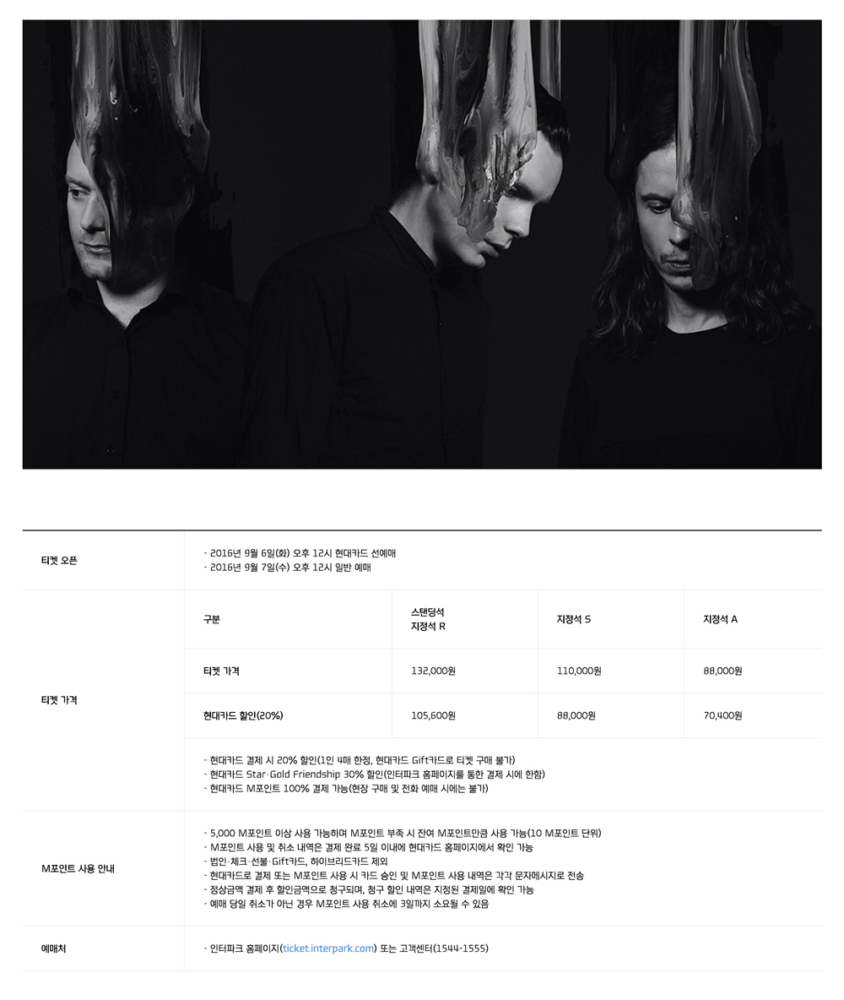

###### Front-End Develop SCHOOL

# 미니 프로젝트 ─ "접근성 높은 표를 디자인하라."

[테이블 디자인](../ASSETS/HC_Table.7z) 파일을 다운로드 받아 접근성을 준수한 테이블을 디자인 해봅니다. 
해당 테이블에 사용된 웹폰트는 [You and I Modern](../RESOURCES/Fonts/you_and_i_modern.zip)체입니다.

##### 1. 테이블 제작 시, WCAG "이해의 용이성" 원칙의 각 지침을 고려하여 올바른 표 디자인을 구현해봅니다.

##### 2. 아래 나열된 목록의 내용을 고려/준수하여 미니 프로젝트(과제)를 수행하세요.

- [웹표준 준수] HTML, CSS 문법은 유효한가?
- [접근성 고려] 사용자 입장에서 접근하는데 문제가 없는가? (음성 출력/키보드 접근 등)
- [의미 구조화] HTML 구조는 올바른 의미를 가지는가?
- [네이밍 규칙] HTML, CSS에 설정된 이름은 간결하며 읽기 용이한가?
- [스타일 모듈] CSS 스타일 디자인(설계)는 효율적으로 작성되었는가?
- [코드 최적화] 불 필요한 `
` 또는 `` 요소의 남용 및 무의미하게 중복되는 스타일 코드는 없었는가?
- [코드 리팩토링] 코드는 읽기 쉽고, 간결한가?

-

### 참고

- [demo.yamoo9.net/hyundaicard-table](http://demo.yamoo9.net/hyundaicard-table/)
- [w3.org/WAI/tutorials/tables](https://www.w3.org/WAI/tutorials/tables/)
