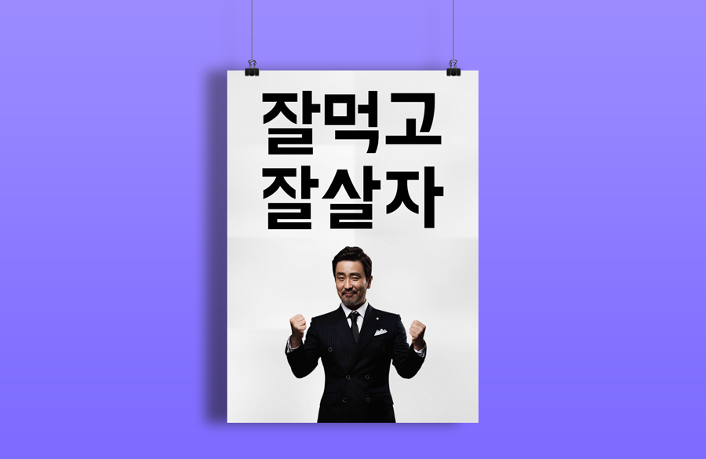
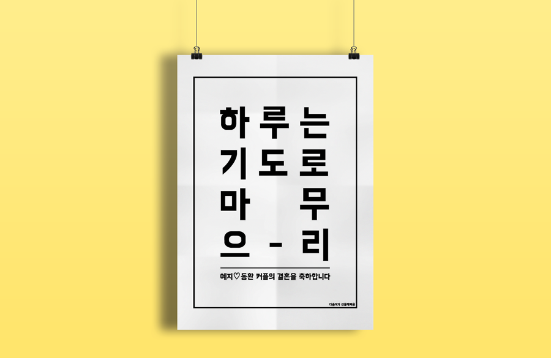
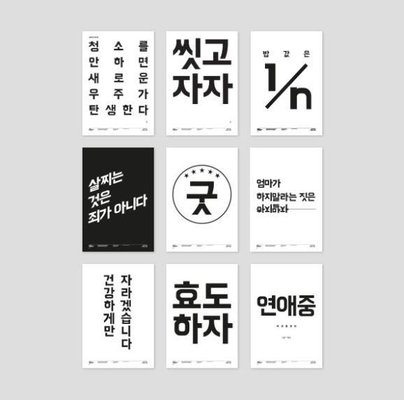

###### Front-End Develop SCHOOL

# Team Activity 4th, `2016.07.13`


-

### 한글 타이포그래피 인터랙티브 웹 포스터 디자인

**[60분]** [한글 타이포그래피 포스터 PSD](../Lecture/Assets/poster.psd) 시안을 다운로드 받은 후, HTML 문서 구조화(Markup) / 스타일링(Styling)을 수행한다.

**엑티비티 규칙**

- 각 팀의 멤버는 각자 PSD를 분석 후, 작업한다.
- 문장은 양쪽 정렬(Justify)을 구현하여야 하며, 각 글자는 개별적으로 애니메이션이 적용되도록 설계한다.
- 애니메이션 또는 트랜지션/트랜스폼을 사용하여 각 글자가 움직일 방향, 크기, 투명도 등을 고려한 후 작업에 들어간다.
- 수업 시간에 다룬 링크, 버튼 이펙트를 사용하여도 된다.
- 팀원간 협의하지 않는다. (협의는 리뷰 시간에!)





-

### 포스터에 웹 폰트 적용

**주아/한나체 웹폰트** ([한나 | 주아 | 도현체](http://www.woowahan.com/?page_id=3985))

```html
<!-- 주아/한나체 웹폰트 호출: https://github.com/singihae/Webfonts -->
<link href="https://cdn.rawgit.com/singihae/Webfonts/master/style.css" rel="stylesheet">

<!-- 주아/한나체 웹폰트 적용 -->
<style>
.jua {font-family:'BM JUA','배달의민족 주아',sans-serif;}
.hana{font-family:'BM HANNA','배달의민족 한나', sans-serif; }
</style>
```

**도현체 웹폰트**

["배달의민족 도현체"를 웹폰트로 적용하는 방법](http://wallel.com/267)





---

### Code Review

**[40분]** 각 팀원은 HTML 문서 구조화 한 결과를 코드 리뷰 후, 간결하고 올바른 문서 구조화에 관해 논의한다.

- [웹표준 준수] HTML, CSS 문법은 유효한가?
- [접근성 고려] 사용자 입장에서 접근하는데 문제가 없는가? (음성 출력/키보드 접근 등)
- [의미 구조화] HTML 구조는 올바른 의미를 가지는가?
- [스타일 모듈] CSS 스타일 디자인(설계)는 효율적으로 작성되었는가?
- [모오션 센스] CSS3 애니메이션/트렌지션은 적절하고 아름답게 사용되었나?
- [네이밍 규칙] HTML, CSS에 설정된 이름은 간결하며 읽기 용이한가?
- [코드 최적화] 불 필요한 `<div>` 또는 `<span>` 요소의 남용 및 무의미하게 중복되는 스타일 코드는 없었는가?
- [팀원간 소통] 코드는 읽기 쉽고, 간결한가?


-

### Code Refactoring

**[20분]** 논의된 결과를 토대로 팀원은 작성한 HTML, CSS 코드를 리팩토링 한 후, GitHub에 수행한 결과와 팀 논의 사항을 기록한다.

