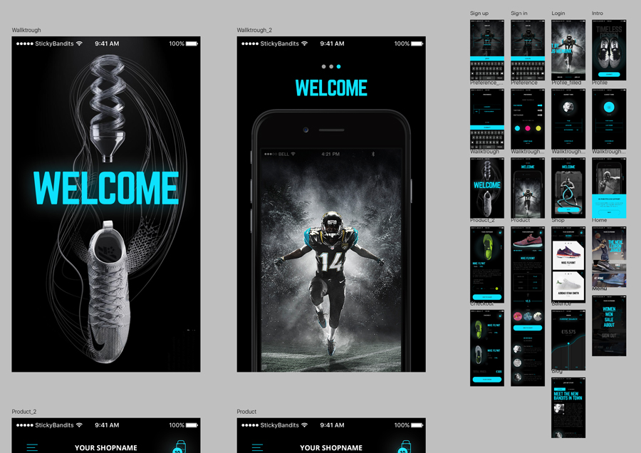

###### Front-End Develop SCHOOL

# Team Activity 8th, `2016.08.10`

-

### 모바일 Sport Shop UI Kit

**[120분]** [모바일 UI PSD 파일](../Lecture/Assets/SportShop.7z)을 다운로드 받아 HTML/CSS로 제작해본다.

**엑티비티 규칙**

- 각 팀은 지난 시간에 제작한 Sass 모듈(믹스인/함수/플레이스홀더)을 활용하여 모바일 UI 제작에 활용해본다.
- 팀원간 제작 과정에서 협의하지 않는다. (협의는 리뷰 시간에!)
- Sass를 활용하여 스타일을 작성한다.

-

### Code Review

**[40분]** 각 팀원은 HTML 문서 구조화 한 결과를 코드 리뷰 후, 간결하고 올바른 문서 구조화에 관해 논의한다.

- [웹표준 준수] HTML, CSS 문법은 유효한가?
- [접근성 고려] 사용자 입장에서 접근하는데 문제가 없는가? (음성 출력/키보드 접근 등)
- [의미 구조화] HTML 구조는 올바른 의미를 가지는가?
- [Sass 모듈] Sass 스타일 디자인(설계)는 효율적으로 작성되었는가?
- [모오션 센스] CSS3 애니메이션/트렌지션은 적절하고 아름답게 사용되었나?
- [네이밍 규칙] HTML, CSS에 설정된 이름은 간결하며 읽기 용이한가?
- [코드 최적화] 불 필요한 `
` 또는 `` 요소의 남용 및 무의미하게 중복되는 스타일 코드는 없었는가?
- [팀원간 소통] 코드는 읽기 쉽고, 간결한가?

-

### Code Refactoring

**[20분]** 논의된 결과를 토대로 팀원은 작성한 HTML, CSS 코드를 리팩토링 한 후, GitHub에 수행한 결과와 팀 논의 사항을 기록한다.

