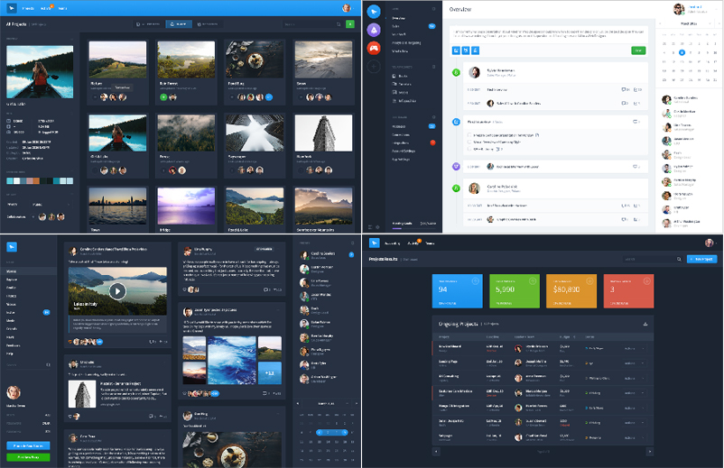

###### Front-End Develop SCHOOL

# Team Activity 9th, `2016.08.17`

-

### [토의] 모바일 Sport Shop UI Kit

**[60분]** 지난 팀 엑티비티 과제 『모바일 UI PSD』 구현 과정에 대해 토의하는 시간을 가져본다.

1. Code Review
1. Code Refactoring

**엑티비티 규칙**

각 팀은 지난 시간에 제작한 모바일 UI 제작에 대해 토의한다. 각 팀은 크게 아래와 같은 주제로 논의해본다.

1. 과제 접근 방법
1. 과제 구현 과정
1. 과제 수행시, 발생한 이슈
1. 발생한 이슈 해결 방법

-

#### 1. Code Review

**[40분]** 각 팀원은 HTML 문서 구조화 한 결과를 코드 리뷰 후, 간결하고 올바른 문서 구조화에 관해 논의한다.

- [웹표준 준수] HTML, CSS 문법은 유효한가?
- [접근성 고려] 사용자 입장에서 접근하는데 문제가 없는가? (음성 출력/키보드 접근 등)
- [의미 구조화] HTML 구조는 올바른 의미를 가지는가?
- [Sass 모듈] Sass 스타일 디자인(설계)는 효율적으로 작성되었는가?
- [모오션 센스] CSS3 애니메이션/트렌지션은 적절하고 아름답게 사용되었나?
- [네이밍 규칙] HTML, CSS에 설정된 이름은 간결하며 읽기 용이한가?
- [코드 최적화] 불 필요한 `
` 또는 `` 요소의 남용 및 무의미하게 중복되는 스타일 코드는 없었는가?
- [팀원간 소통] 코드는 읽기 쉽고, 간결한가?

-

#### 2. Code Refactoring

**[20분]** 논의된 결과를 토대로 팀원은 작성한 HTML, CSS 코드를 리팩토링 한 후, GitHub에 수행한 결과와 팀 논의 사항을 기록한다.

---

# 10번째 팀 엑티비티 과제

`2016.08.24`까지 완성할 팀 엑티비티 과제 (24일 결과물을 두고 토의) 
28개의 뷰 중 **팀 단위로 1~2개의 뷰를 선정 후, 제작 진행**.

## 대쉬보드(Dashboard) UI

서비스 관리자 화면(Back-End View UI)을 구현하는 과제.

- **다운로드** ⇒ [PSD](http://naver.me/GYvdmUzb) | [Sketch](http://naver.me/GYvdmUzb)
- **패스워드** ⇒ `FDS2016`

-

### 프로젝트에 사용된 폰트 다운로드 설치

[GitHub: Source Sans Pro](https://github.com/adobe-fonts/source-sans-pro)

-

### Google 웹폰트

[WebFont: Source Sans Pro](https://fonts.google.com/specimen/Source+Sans+Pro)
